```python
import pandas as pd
import numpy as np
import seaborn as sns
import matplotlib.pyplot as plt
import jinja2
from pycaret.regression import *
```


```python
#Reading csv file with pandas read_csv and equal it to df1 as variable name
df1 = pd.read_csv('2017.csv')
```


```python
#Dropping last column which is only contains NAN values then change our variable to df
df = df1.drop('Unnamed: 23', 1)
```


```python
#checking our dataset first 5 rows
df.head()
```


<div>
<style scoped>
    .dataframe tbody tr th:only-of-type {
        vertical-align: middle;
    }

    .dataframe tbody tr th {
        vertical-align: top;
    }

    .dataframe thead th {
        text-align: right;
    }
</style>
<table border="1" class="dataframe">
  <thead>
    <tr style="text-align: right;">
      <th></th>
      <th>Year</th>
      <th>Month</th>
      <th>Day</th>
      <th>Hour</th>
      <th>Minute</th>
      <th>Temperature</th>
      <th>Clearsky DHI</th>
      <th>Clearsky DNI</th>
      <th>Clearsky GHI</th>
      <th>Cloud Type</th>
      <th>Dew Point</th>
      <th>DHI</th>
      <th>DNI</th>
      <th>Fill Flag</th>
      <th>GHI</th>
      <th>Ozone</th>
      <th>Relative Humidity</th>
      <th>Solar Zenith Angle</th>
      <th>Surface Albedo</th>
      <th>Pressure</th>
      <th>Precipitable Water</th>
      <th>Wind Direction</th>
      <th>Wind Speed</th>
    </tr>
  </thead>
  <tbody>
    <tr>
      <th>0</th>
      <td>2017</td>
      <td>1</td>
      <td>1</td>
      <td>0</td>
      <td>30</td>
      <td>3.7</td>
      <td>0</td>
      <td>0</td>
      <td>0</td>
      <td>7</td>
      <td>2.4</td>
      <td>0</td>
      <td>0</td>
      <td>0</td>
      <td>0</td>
      <td>0.367</td>
      <td>91.03</td>
      <td>145.08</td>
      <td>0.87</td>
      <td>1020</td>
      <td>1.3</td>
      <td>310</td>
      <td>3.2</td>
    </tr>
    <tr>
      <th>1</th>
      <td>2017</td>
      <td>1</td>
      <td>1</td>
      <td>1</td>
      <td>30</td>
      <td>3.3</td>
      <td>0</td>
      <td>0</td>
      <td>0</td>
      <td>4</td>
      <td>1.9</td>
      <td>0</td>
      <td>0</td>
      <td>0</td>
      <td>0</td>
      <td>0.365</td>
      <td>90.70</td>
      <td>134.10</td>
      <td>0.87</td>
      <td>1020</td>
      <td>1.2</td>
      <td>309</td>
      <td>3.0</td>
    </tr>
    <tr>
      <th>2</th>
      <td>2017</td>
      <td>1</td>
      <td>1</td>
      <td>2</td>
      <td>30</td>
      <td>3.0</td>
      <td>0</td>
      <td>0</td>
      <td>0</td>
      <td>4</td>
      <td>1.5</td>
      <td>0</td>
      <td>0</td>
      <td>0</td>
      <td>0</td>
      <td>0.362</td>
      <td>89.67</td>
      <td>122.82</td>
      <td>0.87</td>
      <td>1020</td>
      <td>1.2</td>
      <td>305</td>
      <td>2.6</td>
    </tr>
    <tr>
      <th>3</th>
      <td>2017</td>
      <td>1</td>
      <td>1</td>
      <td>3</td>
      <td>30</td>
      <td>2.7</td>
      <td>0</td>
      <td>0</td>
      <td>0</td>
      <td>4</td>
      <td>1.0</td>
      <td>0</td>
      <td>0</td>
      <td>0</td>
      <td>0</td>
      <td>0.358</td>
      <td>88.72</td>
      <td>111.63</td>
      <td>0.87</td>
      <td>1021</td>
      <td>1.2</td>
      <td>295</td>
      <td>2.2</td>
    </tr>
    <tr>
      <th>4</th>
      <td>2017</td>
      <td>1</td>
      <td>1</td>
      <td>4</td>
      <td>30</td>
      <td>2.4</td>
      <td>0</td>
      <td>0</td>
      <td>0</td>
      <td>4</td>
      <td>0.6</td>
      <td>0</td>
      <td>0</td>
      <td>0</td>
      <td>0</td>
      <td>0.353</td>
      <td>87.90</td>
      <td>100.81</td>
      <td>0.87</td>
      <td>1021</td>
      <td>1.2</td>
      <td>280</td>
      <td>1.9</td>
    </tr>
  </tbody>
</table>
</div>


```python
#checking our dataset last 5 rows to be sure it sorted as hourly last rows contains 31/12/2017 23.30
df.tail()
```


<div>
<style scoped>
    .dataframe tbody tr th:only-of-type {
        vertical-align: middle;
    }

    .dataframe tbody tr th {
        vertical-align: top;
    }

    .dataframe thead th {
        text-align: right;
    }
</style>
<table border="1" class="dataframe">
  <thead>
    <tr style="text-align: right;">
      <th></th>
      <th>Year</th>
      <th>Month</th>
      <th>Day</th>
      <th>Hour</th>
      <th>Minute</th>
      <th>Temperature</th>
      <th>Clearsky DHI</th>
      <th>Clearsky DNI</th>
      <th>Clearsky GHI</th>
      <th>Cloud Type</th>
      <th>Dew Point</th>
      <th>DHI</th>
      <th>DNI</th>
      <th>Fill Flag</th>
      <th>GHI</th>
      <th>Ozone</th>
      <th>Relative Humidity</th>
      <th>Solar Zenith Angle</th>
      <th>Surface Albedo</th>
      <th>Pressure</th>
      <th>Precipitable Water</th>
      <th>Wind Direction</th>
      <th>Wind Speed</th>
    </tr>
  </thead>
  <tbody>
    <tr>
      <th>8755</th>
      <td>2017</td>
      <td>12</td>
      <td>31</td>
      <td>19</td>
      <td>30</td>
      <td>6.6</td>
      <td>0</td>
      <td>0</td>
      <td>0</td>
      <td>0</td>
      <td>5.1</td>
      <td>0</td>
      <td>0</td>
      <td>0</td>
      <td>0</td>
      <td>0.367</td>
      <td>90.03</td>
      <td>142.62</td>
      <td>0.11</td>
      <td>1016</td>
      <td>1.1</td>
      <td>220</td>
      <td>2.3</td>
    </tr>
    <tr>
      <th>8756</th>
      <td>2017</td>
      <td>12</td>
      <td>31</td>
      <td>20</td>
      <td>30</td>
      <td>6.5</td>
      <td>0</td>
      <td>0</td>
      <td>0</td>
      <td>0</td>
      <td>5.1</td>
      <td>0</td>
      <td>0</td>
      <td>0</td>
      <td>0</td>
      <td>0.363</td>
      <td>90.72</td>
      <td>152.84</td>
      <td>0.11</td>
      <td>1017</td>
      <td>1.2</td>
      <td>225</td>
      <td>2.4</td>
    </tr>
    <tr>
      <th>8757</th>
      <td>2017</td>
      <td>12</td>
      <td>31</td>
      <td>21</td>
      <td>30</td>
      <td>6.5</td>
      <td>0</td>
      <td>0</td>
      <td>0</td>
      <td>0</td>
      <td>5.1</td>
      <td>0</td>
      <td>0</td>
      <td>0</td>
      <td>0</td>
      <td>0.358</td>
      <td>90.81</td>
      <td>160.35</td>
      <td>0.11</td>
      <td>1016</td>
      <td>1.2</td>
      <td>228</td>
      <td>2.6</td>
    </tr>
    <tr>
      <th>8758</th>
      <td>2017</td>
      <td>12</td>
      <td>31</td>
      <td>22</td>
      <td>30</td>
      <td>6.4</td>
      <td>0</td>
      <td>0</td>
      <td>0</td>
      <td>0</td>
      <td>5.1</td>
      <td>0</td>
      <td>0</td>
      <td>0</td>
      <td>0</td>
      <td>0.352</td>
      <td>91.40</td>
      <td>161.30</td>
      <td>0.11</td>
      <td>1016</td>
      <td>1.3</td>
      <td>231</td>
      <td>2.8</td>
    </tr>
    <tr>
      <th>8759</th>
      <td>2017</td>
      <td>12</td>
      <td>31</td>
      <td>23</td>
      <td>30</td>
      <td>6.3</td>
      <td>0</td>
      <td>0</td>
      <td>0</td>
      <td>0</td>
      <td>5.0</td>
      <td>0</td>
      <td>0</td>
      <td>0</td>
      <td>0</td>
      <td>0.348</td>
      <td>91.50</td>
      <td>154.91</td>
      <td>0.11</td>
      <td>1016</td>
      <td>1.3</td>
      <td>233</td>
      <td>2.9</td>
    </tr>
  </tbody>
</table>
</div>


```python
df.columns
```


    Index(['Year', 'Month', 'Day', 'Hour', 'Minute', 'Temperature', 'Clearsky DHI',
           'Clearsky DNI', 'Clearsky GHI', 'Cloud Type', 'Dew Point', 'DHI', 'DNI',
           'Fill Flag', 'GHI', 'Ozone', 'Relative Humidity', 'Solar Zenith Angle',
           'Surface Albedo', 'Pressure', 'Precipitable Water', 'Wind Direction',
           'Wind Speed'],
          dtype='object')


```python
#Visualize summary of null values.
plt.figure(figsize=(12,4))
sns.heatmap(df.isnull(),cbar=False,cmap='viridis',yticklabels=False)
plt.title('Missing value in the dataset')
```


    Text(0.5, 1.0, 'Missing value in the dataset')


    
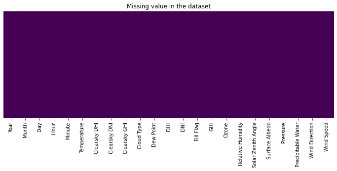
    


```python
df.shape
```


    (8760, 23)


```python
#  We removed 0 values of DNI our target value, its pointless to keep them, cause we dont need night times when sun light doesnt exist
df = df_no_zero = df.loc[df['DNI']!= 0 ]
assert len(df_no_zero['DNI'])==len(df_no_zero['GHI'])
```


```python
#Our data consist 3167 rows and 23 columns
df.shape 
```


    (3167, 23)


```python
#we created loop which is get row's year,month,day,hour and minute columns and make 1 column name is date_time
cols = ["Year","Month","Day","Hour","Minute"]
df["date_time"] = df[cols].apply(lambda row: "-".join(row.values.astype(str)), axis=1)
```


```python
#Giving date_time column format
#dropping our 5 columns cause we already got column name date_time contain this info
#setting date_time index
df['date_time'] = pd.to_datetime(df['date_time'], format='%Y-%m-%d-%H-%M')
df=df.drop(["Year","Month","Day","Hour","Minute"],axis = 1)
df=df.set_index('date_time')
```


```python
df.sort_index(axis = 1)
```


<div>
<style scoped>
    .dataframe tbody tr th:only-of-type {
        vertical-align: middle;
    }

    .dataframe tbody tr th {
        vertical-align: top;
    }

    .dataframe thead th {
        text-align: right;
    }
</style>
<table border="1" class="dataframe">
  <thead>
    <tr style="text-align: right;">
      <th></th>
      <th>Clearsky DHI</th>
      <th>Clearsky DNI</th>
      <th>Clearsky GHI</th>
      <th>Cloud Type</th>
      <th>DHI</th>
      <th>DNI</th>
      <th>Dew Point</th>
      <th>Fill Flag</th>
      <th>GHI</th>
      <th>Ozone</th>
      <th>Precipitable Water</th>
      <th>Pressure</th>
      <th>Relative Humidity</th>
      <th>Solar Zenith Angle</th>
      <th>Surface Albedo</th>
      <th>Temperature</th>
      <th>Wind Direction</th>
      <th>Wind Speed</th>
    </tr>
    <tr>
      <th>date_time</th>
      <th></th>
      <th></th>
      <th></th>
      <th></th>
      <th></th>
      <th></th>
      <th></th>
      <th></th>
      <th></th>
      <th></th>
      <th></th>
      <th></th>
      <th></th>
      <th></th>
      <th></th>
      <th></th>
      <th></th>
      <th></th>
    </tr>
  </thead>
  <tbody>
    <tr>
      <th>2017-01-01 09:30:00</th>
      <td>130</td>
      <td>720</td>
      <td>439</td>
      <td>4</td>
      <td>186</td>
      <td>170</td>
      <td>-0.1</td>
      <td>0</td>
      <td>259</td>
      <td>0.335</td>
      <td>1.0</td>
      <td>1021</td>
      <td>75.46</td>
      <td>64.60</td>
      <td>0.87</td>
      <td>3.8</td>
      <td>229</td>
      <td>2.6</td>
    </tr>
    <tr>
      <th>2017-01-01 10:30:00</th>
      <td>128</td>
      <td>738</td>
      <td>449</td>
      <td>4</td>
      <td>167</td>
      <td>354</td>
      <td>-0.1</td>
      <td>0</td>
      <td>320</td>
      <td>0.334</td>
      <td>0.9</td>
      <td>1021</td>
      <td>74.36</td>
      <td>64.24</td>
      <td>0.87</td>
      <td>4.1</td>
      <td>226</td>
      <td>2.7</td>
    </tr>
    <tr>
      <th>2017-01-01 11:30:00</th>
      <td>115</td>
      <td>720</td>
      <td>398</td>
      <td>4</td>
      <td>151</td>
      <td>324</td>
      <td>0.0</td>
      <td>0</td>
      <td>278</td>
      <td>0.333</td>
      <td>0.9</td>
      <td>1020</td>
      <td>73.58</td>
      <td>66.83</td>
      <td>0.87</td>
      <td>4.3</td>
      <td>223</td>
      <td>2.8</td>
    </tr>
    <tr>
      <th>2017-01-01 12:30:00</th>
      <td>91</td>
      <td>672</td>
      <td>298</td>
      <td>4</td>
      <td>113</td>
      <td>14</td>
      <td>0.0</td>
      <td>0</td>
      <td>118</td>
      <td>0.331</td>
      <td>0.8</td>
      <td>1020</td>
      <td>73.54</td>
      <td>72.05</td>
      <td>0.87</td>
      <td>4.3</td>
      <td>222</td>
      <td>2.8</td>
    </tr>
    <tr>
      <th>2017-01-02 06:30:00</th>
      <td>42</td>
      <td>528</td>
      <td>122</td>
      <td>0</td>
      <td>42</td>
      <td>528</td>
      <td>-0.9</td>
      <td>0</td>
      <td>122</td>
      <td>0.296</td>
      <td>0.6</td>
      <td>1020</td>
      <td>82.48</td>
      <td>81.36</td>
      <td>0.12</td>
      <td>1.8</td>
      <td>194</td>
      <td>3.7</td>
    </tr>
    <tr>
      <th>...</th>
      <td>...</td>
      <td>...</td>
      <td>...</td>
      <td>...</td>
      <td>...</td>
      <td>...</td>
      <td>...</td>
      <td>...</td>
      <td>...</td>
      <td>...</td>
      <td>...</td>
      <td>...</td>
      <td>...</td>
      <td>...</td>
      <td>...</td>
      <td>...</td>
      <td>...</td>
      <td>...</td>
    </tr>
    <tr>
      <th>2017-12-29 09:30:00</th>
      <td>86</td>
      <td>750</td>
      <td>406</td>
      <td>7</td>
      <td>185</td>
      <td>148</td>
      <td>8.6</td>
      <td>0</td>
      <td>249</td>
      <td>0.321</td>
      <td>2.1</td>
      <td>1006</td>
      <td>78.19</td>
      <td>64.79</td>
      <td>0.12</td>
      <td>12.3</td>
      <td>169</td>
      <td>4.6</td>
    </tr>
    <tr>
      <th>2017-12-30 08:30:00</th>
      <td>79</td>
      <td>721</td>
      <td>350</td>
      <td>7</td>
      <td>143</td>
      <td>22</td>
      <td>8.1</td>
      <td>0</td>
      <td>151</td>
      <td>0.341</td>
      <td>1.9</td>
      <td>1006</td>
      <td>79.58</td>
      <td>67.96</td>
      <td>0.11</td>
      <td>11.5</td>
      <td>140</td>
      <td>1.4</td>
    </tr>
    <tr>
      <th>2017-12-30 09:30:00</th>
      <td>85</td>
      <td>760</td>
      <td>409</td>
      <td>7</td>
      <td>183</td>
      <td>205</td>
      <td>8.4</td>
      <td>0</td>
      <td>270</td>
      <td>0.340</td>
      <td>1.9</td>
      <td>1005</td>
      <td>77.80</td>
      <td>64.74</td>
      <td>0.11</td>
      <td>12.2</td>
      <td>120</td>
      <td>1.3</td>
    </tr>
    <tr>
      <th>2017-12-31 13:30:00</th>
      <td>63</td>
      <td>403</td>
      <td>137</td>
      <td>1</td>
      <td>63</td>
      <td>403</td>
      <td>5.3</td>
      <td>0</td>
      <td>137</td>
      <td>0.407</td>
      <td>1.4</td>
      <td>1016</td>
      <td>85.83</td>
      <td>79.50</td>
      <td>0.11</td>
      <td>7.5</td>
      <td>304</td>
      <td>1.5</td>
    </tr>
    <tr>
      <th>2017-12-31 14:30:00</th>
      <td>15</td>
      <td>77</td>
      <td>17</td>
      <td>1</td>
      <td>15</td>
      <td>77</td>
      <td>5.2</td>
      <td>0</td>
      <td>17</td>
      <td>0.409</td>
      <td>1.4</td>
      <td>1016</td>
      <td>86.47</td>
      <td>88.15</td>
      <td>0.11</td>
      <td>7.3</td>
      <td>295</td>
      <td>1.3</td>
    </tr>
  </tbody>
</table>
<p>3167 rows × 18 columns</p>
</div>


```python
#lets check our columns
df.columns
```


    Index(['Temperature', 'Clearsky DHI', 'Clearsky DNI', 'Clearsky GHI',
           'Cloud Type', 'Dew Point', 'DHI', 'DNI', 'Fill Flag', 'GHI', 'Ozone',
           'Relative Humidity', 'Solar Zenith Angle', 'Surface Albedo', 'Pressure',
           'Precipitable Water', 'Wind Direction', 'Wind Speed'],
          dtype='object')


```python
df.shape
```


    (3167, 18)


```python
'''DNI is Direct Normal Irradiance while GHI and DHI are diffused
They measured by different sensor DNI measured by Pyrheliometer while other two measured by pyranometer
 Cause of reasons, we'll drop Clearsky DNI (before we start) almost identical with DNI column.
 '''
```


    "DNI is Direct Normal Irradiance while GHI and DHI are diffused\nThey measured by different sensor DNI measured by Pyrheliometer while other two measured by pyranometer\n Cause of reasons, we'll drop Clearsky DNI (before we start) almost identical with DNI column.\n "


```python
df = df.drop('Clearsky DNI', 1)
```


```python
df.shape
```


    (3167, 17)


```python
#Describe dataframe
df.describe()
```


<div>
<style scoped>
    .dataframe tbody tr th:only-of-type {
        vertical-align: middle;
    }

    .dataframe tbody tr th {
        vertical-align: top;
    }

    .dataframe thead th {
        text-align: right;
    }
</style>
<table border="1" class="dataframe">
  <thead>
    <tr style="text-align: right;">
      <th></th>
      <th>Temperature</th>
      <th>Clearsky DHI</th>
      <th>Clearsky GHI</th>
      <th>Cloud Type</th>
      <th>Dew Point</th>
      <th>DHI</th>
      <th>DNI</th>
      <th>Fill Flag</th>
      <th>GHI</th>
      <th>Ozone</th>
      <th>Relative Humidity</th>
      <th>Solar Zenith Angle</th>
      <th>Surface Albedo</th>
      <th>Pressure</th>
      <th>Precipitable Water</th>
      <th>Wind Direction</th>
      <th>Wind Speed</th>
    </tr>
  </thead>
  <tbody>
    <tr>
      <th>count</th>
      <td>3167.000000</td>
      <td>3167.000000</td>
      <td>3167.000000</td>
      <td>3167.000000</td>
      <td>3167.000000</td>
      <td>3167.000000</td>
      <td>3167.000000</td>
      <td>3167.000000</td>
      <td>3167.000000</td>
      <td>3167.000000</td>
      <td>3167.000000</td>
      <td>3167.000000</td>
      <td>3167.000000</td>
      <td>3167.000000</td>
      <td>3167.000000</td>
      <td>3167.000000</td>
      <td>3167.000000</td>
    </tr>
    <tr>
      <th>mean</th>
      <td>19.187528</td>
      <td>116.820019</td>
      <td>505.155352</td>
      <td>1.431955</td>
      <td>12.519230</td>
      <td>149.421219</td>
      <td>473.062835</td>
      <td>0.173350</td>
      <td>428.693716</td>
      <td>0.316864</td>
      <td>66.489795</td>
      <td>55.844026</td>
      <td>0.145122</td>
      <td>1012.403221</td>
      <td>2.108810</td>
      <td>133.063783</td>
      <td>3.154657</td>
    </tr>
    <tr>
      <th>std</th>
      <td>6.791943</td>
      <td>55.232694</td>
      <td>279.651610</td>
      <td>2.271600</td>
      <td>5.849655</td>
      <td>98.009137</td>
      <td>308.579565</td>
      <td>0.725371</td>
      <td>268.163288</td>
      <td>0.032649</td>
      <td>11.604468</td>
      <td>19.024250</td>
      <td>0.080748</td>
      <td>5.258753</td>
      <td>0.852973</td>
      <td>106.961068</td>
      <td>1.611753</td>
    </tr>
    <tr>
      <th>min</th>
      <td>0.200000</td>
      <td>4.000000</td>
      <td>4.000000</td>
      <td>0.000000</td>
      <td>-5.700000</td>
      <td>3.000000</td>
      <td>1.000000</td>
      <td>0.000000</td>
      <td>4.000000</td>
      <td>0.256000</td>
      <td>24.960000</td>
      <td>18.380000</td>
      <td>0.100000</td>
      <td>998.000000</td>
      <td>0.400000</td>
      <td>0.000000</td>
      <td>0.400000</td>
    </tr>
    <tr>
      <th>25%</th>
      <td>14.000000</td>
      <td>80.000000</td>
      <td>272.500000</td>
      <td>0.000000</td>
      <td>8.200000</td>
      <td>82.000000</td>
      <td>171.000000</td>
      <td>0.000000</td>
      <td>201.000000</td>
      <td>0.290000</td>
      <td>58.340000</td>
      <td>40.330000</td>
      <td>0.130000</td>
      <td>1009.000000</td>
      <td>1.500000</td>
      <td>42.000000</td>
      <td>1.900000</td>
    </tr>
    <tr>
      <th>50%</th>
      <td>19.700000</td>
      <td>113.000000</td>
      <td>512.000000</td>
      <td>0.000000</td>
      <td>13.000000</td>
      <td>124.000000</td>
      <td>502.000000</td>
      <td>0.000000</td>
      <td>392.000000</td>
      <td>0.311000</td>
      <td>66.070000</td>
      <td>57.480000</td>
      <td>0.140000</td>
      <td>1012.000000</td>
      <td>2.000000</td>
      <td>77.000000</td>
      <td>2.900000</td>
    </tr>
    <tr>
      <th>75%</th>
      <td>25.000000</td>
      <td>149.000000</td>
      <td>752.000000</td>
      <td>2.000000</td>
      <td>17.500000</td>
      <td>187.000000</td>
      <td>768.000000</td>
      <td>0.000000</td>
      <td>644.000000</td>
      <td>0.343000</td>
      <td>74.860000</td>
      <td>70.825000</td>
      <td>0.140000</td>
      <td>1015.000000</td>
      <td>2.700000</td>
      <td>229.000000</td>
      <td>4.200000</td>
    </tr>
    <tr>
      <th>max</th>
      <td>34.200000</td>
      <td>414.000000</td>
      <td>996.000000</td>
      <td>12.000000</td>
      <td>24.700000</td>
      <td>473.000000</td>
      <td>976.000000</td>
      <td>5.000000</td>
      <td>996.000000</td>
      <td>0.418000</td>
      <td>98.930000</td>
      <td>88.990000</td>
      <td>0.870000</td>
      <td>1030.000000</td>
      <td>4.400000</td>
      <td>360.000000</td>
      <td>7.800000</td>
    </tr>
  </tbody>
</table>
</div>


```python
#preview of our target through whole year
df['DNI'].plot(figsize=(12,6), title= 'DNI')
plt.ylabel("DNI W/m2")
```


    Text(0, 0.5, 'DNI W/m2')


    
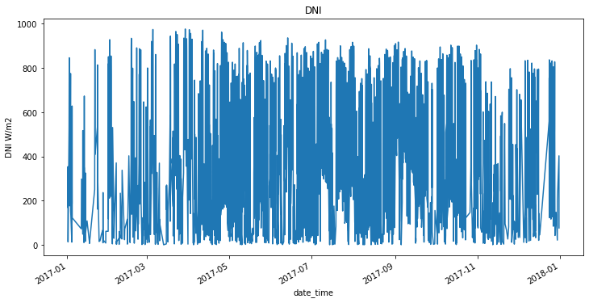
    


```python
#same preview with dots and different color for  clearify our vision
color_pal = ['#F8766D','#D39200','#93AA00','#00BA38','#00C19F','#00B9E3','#619CFF','#DB72FB']
df['DNI'].plot(style='.',figsize=(15,5),color=color_pal[0],title='DNI')
plt.ylabel("DNI W/m2")
plt.show()
```


    
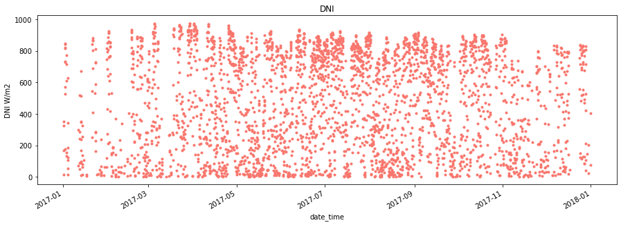
    


```python
#Correlation between all features
corr = df.corr()
sns.heatmap(corr,cmap="YlGnBu", linewidths=.5)
```


    <AxesSubplot:>


    
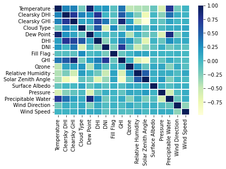
    


```python
''' Explained relationship GHI and DNI in paper;
In theory we can find GHI with equation which include DNI and DHI
Global Horizontal Irradiance (GHI) = Direct Normal Irradiance (DNI)* cos(solar zenith angle)+Diffused Horizontal Irradiance (DHI)
'''
```


    ' Explained relationship GHI and DNI in paper;\nIn theory we can find GHI with equation which include DNI and DHI\nGlobal Horizontal Irradiance (GHI) = Direct Normal Irradiance (DNI)* cos(solar zenith angle)+Diffused Horizontal Irradiance (DHI)\n'


```python
df.corr()["DNI"].sort_values().plot(kind="bar", figsize=(8,8))
```


    <AxesSubplot:>


    
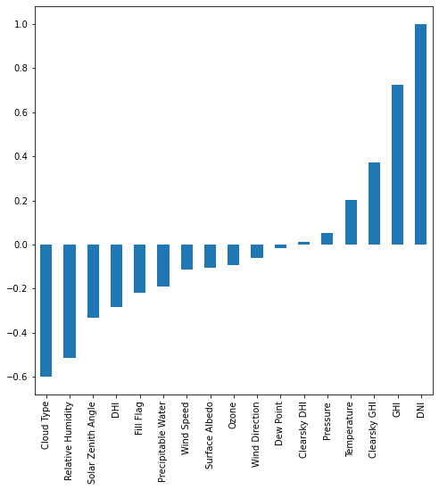
    


```python
#so pattern between GHI and DHI with hex plot.
_ = sns.jointplot(x = "GHI", y="DNI", data=df, kind = 'hex')
```


    
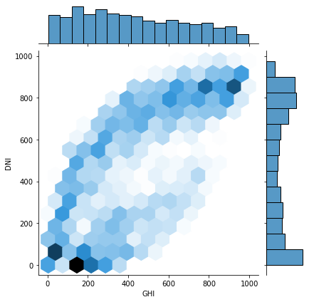
    


```python
#Lets glance our dataset incase is  there any pattern between features? 
g = sns.PairGrid(df)
g.map_diag(sns.histplot)
_ = g.map_offdiag(sns.scatterplot)
```


    

    


```python
'''Every data points for every columns
If you can't see it, I don't know any other solution, download it as an image and inspect it'''
```


    "Every data points for every columns\nIf you can't see it, I don't know any other solution, download it as an image and inspect it"


```python
#I used pycaret to try many different combinations as possible
#Its using Sklearn library, Used sklearn library too but this is last version for submit
```


```python
#reg as regresion, setup adjust our dataset, split train and test, cross-validation, normalize,scale.
#We can choose what we'll do. Firstly lets start default options.
#Our target value DNI sı we just choose it then execute
reg = setup(data=df,
           target='DNI', session_id = 123)
```


<style  type="text/css" >
</style><table id="T_9b06c_" ><thead>    <tr>        <th class="blank level0" ></th>        <th class="col_heading level0 col0" >Description</th>        <th class="col_heading level0 col1" >Value</th>    </tr></thead><tbody>
                <tr>
                        <th id="T_9b06c_level0_row0" class="row_heading level0 row0" >0</th>
                        <td id="T_9b06c_row0_col0" class="data row0 col0" >session_id</td>
                        <td id="T_9b06c_row0_col1" class="data row0 col1" >123</td>
            </tr>
            <tr>
                        <th id="T_9b06c_level0_row1" class="row_heading level0 row1" >1</th>
                        <td id="T_9b06c_row1_col0" class="data row1 col0" >Target</td>
                        <td id="T_9b06c_row1_col1" class="data row1 col1" >DNI</td>
            </tr>
            <tr>
                        <th id="T_9b06c_level0_row2" class="row_heading level0 row2" >2</th>
                        <td id="T_9b06c_row2_col0" class="data row2 col0" >Original Data</td>
                        <td id="T_9b06c_row2_col1" class="data row2 col1" >(3167, 17)</td>
            </tr>
            <tr>
                        <th id="T_9b06c_level0_row3" class="row_heading level0 row3" >3</th>
                        <td id="T_9b06c_row3_col0" class="data row3 col0" >Missing Values</td>
                        <td id="T_9b06c_row3_col1" class="data row3 col1" >False</td>
            </tr>
            <tr>
                        <th id="T_9b06c_level0_row4" class="row_heading level0 row4" >4</th>
                        <td id="T_9b06c_row4_col0" class="data row4 col0" >Numeric Features</td>
                        <td id="T_9b06c_row4_col1" class="data row4 col1" >14</td>
            </tr>
            <tr>
                        <th id="T_9b06c_level0_row5" class="row_heading level0 row5" >5</th>
                        <td id="T_9b06c_row5_col0" class="data row5 col0" >Categorical Features</td>
                        <td id="T_9b06c_row5_col1" class="data row5 col1" >2</td>
            </tr>
            <tr>
                        <th id="T_9b06c_level0_row6" class="row_heading level0 row6" >6</th>
                        <td id="T_9b06c_row6_col0" class="data row6 col0" >Ordinal Features</td>
                        <td id="T_9b06c_row6_col1" class="data row6 col1" >False</td>
            </tr>
            <tr>
                        <th id="T_9b06c_level0_row7" class="row_heading level0 row7" >7</th>
                        <td id="T_9b06c_row7_col0" class="data row7 col0" >High Cardinality Features</td>
                        <td id="T_9b06c_row7_col1" class="data row7 col1" >False</td>
            </tr>
            <tr>
                        <th id="T_9b06c_level0_row8" class="row_heading level0 row8" >8</th>
                        <td id="T_9b06c_row8_col0" class="data row8 col0" >High Cardinality Method</td>
                        <td id="T_9b06c_row8_col1" class="data row8 col1" >None</td>
            </tr>
            <tr>
                        <th id="T_9b06c_level0_row9" class="row_heading level0 row9" >9</th>
                        <td id="T_9b06c_row9_col0" class="data row9 col0" >Transformed Train Set</td>
                        <td id="T_9b06c_row9_col1" class="data row9 col1" >(2216, 27)</td>
            </tr>
            <tr>
                        <th id="T_9b06c_level0_row10" class="row_heading level0 row10" >10</th>
                        <td id="T_9b06c_row10_col0" class="data row10 col0" >Transformed Test Set</td>
                        <td id="T_9b06c_row10_col1" class="data row10 col1" >(951, 27)</td>
            </tr>
            <tr>
                        <th id="T_9b06c_level0_row11" class="row_heading level0 row11" >11</th>
                        <td id="T_9b06c_row11_col0" class="data row11 col0" >Shuffle Train-Test</td>
                        <td id="T_9b06c_row11_col1" class="data row11 col1" >True</td>
            </tr>
            <tr>
                        <th id="T_9b06c_level0_row12" class="row_heading level0 row12" >12</th>
                        <td id="T_9b06c_row12_col0" class="data row12 col0" >Stratify Train-Test</td>
                        <td id="T_9b06c_row12_col1" class="data row12 col1" >False</td>
            </tr>
            <tr>
                        <th id="T_9b06c_level0_row13" class="row_heading level0 row13" >13</th>
                        <td id="T_9b06c_row13_col0" class="data row13 col0" >Fold Generator</td>
                        <td id="T_9b06c_row13_col1" class="data row13 col1" >KFold</td>
            </tr>
            <tr>
                        <th id="T_9b06c_level0_row14" class="row_heading level0 row14" >14</th>
                        <td id="T_9b06c_row14_col0" class="data row14 col0" >Fold Number</td>
                        <td id="T_9b06c_row14_col1" class="data row14 col1" >10</td>
            </tr>
            <tr>
                        <th id="T_9b06c_level0_row15" class="row_heading level0 row15" >15</th>
                        <td id="T_9b06c_row15_col0" class="data row15 col0" >CPU Jobs</td>
                        <td id="T_9b06c_row15_col1" class="data row15 col1" >-1</td>
            </tr>
            <tr>
                        <th id="T_9b06c_level0_row16" class="row_heading level0 row16" >16</th>
                        <td id="T_9b06c_row16_col0" class="data row16 col0" >Use GPU</td>
                        <td id="T_9b06c_row16_col1" class="data row16 col1" >False</td>
            </tr>
            <tr>
                        <th id="T_9b06c_level0_row17" class="row_heading level0 row17" >17</th>
                        <td id="T_9b06c_row17_col0" class="data row17 col0" >Log Experiment</td>
                        <td id="T_9b06c_row17_col1" class="data row17 col1" >False</td>
            </tr>
            <tr>
                        <th id="T_9b06c_level0_row18" class="row_heading level0 row18" >18</th>
                        <td id="T_9b06c_row18_col0" class="data row18 col0" >Experiment Name</td>
                        <td id="T_9b06c_row18_col1" class="data row18 col1" >reg-default-name</td>
            </tr>
            <tr>
                        <th id="T_9b06c_level0_row19" class="row_heading level0 row19" >19</th>
                        <td id="T_9b06c_row19_col0" class="data row19 col0" >USI</td>
                        <td id="T_9b06c_row19_col1" class="data row19 col1" >b978</td>
            </tr>
            <tr>
                        <th id="T_9b06c_level0_row20" class="row_heading level0 row20" >20</th>
                        <td id="T_9b06c_row20_col0" class="data row20 col0" >Imputation Type</td>
                        <td id="T_9b06c_row20_col1" class="data row20 col1" >simple</td>
            </tr>
            <tr>
                        <th id="T_9b06c_level0_row21" class="row_heading level0 row21" >21</th>
                        <td id="T_9b06c_row21_col0" class="data row21 col0" >Iterative Imputation Iteration</td>
                        <td id="T_9b06c_row21_col1" class="data row21 col1" >None</td>
            </tr>
            <tr>
                        <th id="T_9b06c_level0_row22" class="row_heading level0 row22" >22</th>
                        <td id="T_9b06c_row22_col0" class="data row22 col0" >Numeric Imputer</td>
                        <td id="T_9b06c_row22_col1" class="data row22 col1" >mean</td>
            </tr>
            <tr>
                        <th id="T_9b06c_level0_row23" class="row_heading level0 row23" >23</th>
                        <td id="T_9b06c_row23_col0" class="data row23 col0" >Iterative Imputation Numeric Model</td>
                        <td id="T_9b06c_row23_col1" class="data row23 col1" >None</td>
            </tr>
            <tr>
                        <th id="T_9b06c_level0_row24" class="row_heading level0 row24" >24</th>
                        <td id="T_9b06c_row24_col0" class="data row24 col0" >Categorical Imputer</td>
                        <td id="T_9b06c_row24_col1" class="data row24 col1" >constant</td>
            </tr>
            <tr>
                        <th id="T_9b06c_level0_row25" class="row_heading level0 row25" >25</th>
                        <td id="T_9b06c_row25_col0" class="data row25 col0" >Iterative Imputation Categorical Model</td>
                        <td id="T_9b06c_row25_col1" class="data row25 col1" >None</td>
            </tr>
            <tr>
                        <th id="T_9b06c_level0_row26" class="row_heading level0 row26" >26</th>
                        <td id="T_9b06c_row26_col0" class="data row26 col0" >Unknown Categoricals Handling</td>
                        <td id="T_9b06c_row26_col1" class="data row26 col1" >least_frequent</td>
            </tr>
            <tr>
                        <th id="T_9b06c_level0_row27" class="row_heading level0 row27" >27</th>
                        <td id="T_9b06c_row27_col0" class="data row27 col0" >Normalize</td>
                        <td id="T_9b06c_row27_col1" class="data row27 col1" >False</td>
            </tr>
            <tr>
                        <th id="T_9b06c_level0_row28" class="row_heading level0 row28" >28</th>
                        <td id="T_9b06c_row28_col0" class="data row28 col0" >Normalize Method</td>
                        <td id="T_9b06c_row28_col1" class="data row28 col1" >None</td>
            </tr>
            <tr>
                        <th id="T_9b06c_level0_row29" class="row_heading level0 row29" >29</th>
                        <td id="T_9b06c_row29_col0" class="data row29 col0" >Transformation</td>
                        <td id="T_9b06c_row29_col1" class="data row29 col1" >False</td>
            </tr>
            <tr>
                        <th id="T_9b06c_level0_row30" class="row_heading level0 row30" >30</th>
                        <td id="T_9b06c_row30_col0" class="data row30 col0" >Transformation Method</td>
                        <td id="T_9b06c_row30_col1" class="data row30 col1" >None</td>
            </tr>
            <tr>
                        <th id="T_9b06c_level0_row31" class="row_heading level0 row31" >31</th>
                        <td id="T_9b06c_row31_col0" class="data row31 col0" >PCA</td>
                        <td id="T_9b06c_row31_col1" class="data row31 col1" >False</td>
            </tr>
            <tr>
                        <th id="T_9b06c_level0_row32" class="row_heading level0 row32" >32</th>
                        <td id="T_9b06c_row32_col0" class="data row32 col0" >PCA Method</td>
                        <td id="T_9b06c_row32_col1" class="data row32 col1" >None</td>
            </tr>
            <tr>
                        <th id="T_9b06c_level0_row33" class="row_heading level0 row33" >33</th>
                        <td id="T_9b06c_row33_col0" class="data row33 col0" >PCA Components</td>
                        <td id="T_9b06c_row33_col1" class="data row33 col1" >None</td>
            </tr>
            <tr>
                        <th id="T_9b06c_level0_row34" class="row_heading level0 row34" >34</th>
                        <td id="T_9b06c_row34_col0" class="data row34 col0" >Ignore Low Variance</td>
                        <td id="T_9b06c_row34_col1" class="data row34 col1" >False</td>
            </tr>
            <tr>
                        <th id="T_9b06c_level0_row35" class="row_heading level0 row35" >35</th>
                        <td id="T_9b06c_row35_col0" class="data row35 col0" >Combine Rare Levels</td>
                        <td id="T_9b06c_row35_col1" class="data row35 col1" >False</td>
            </tr>
            <tr>
                        <th id="T_9b06c_level0_row36" class="row_heading level0 row36" >36</th>
                        <td id="T_9b06c_row36_col0" class="data row36 col0" >Rare Level Threshold</td>
                        <td id="T_9b06c_row36_col1" class="data row36 col1" >None</td>
            </tr>
            <tr>
                        <th id="T_9b06c_level0_row37" class="row_heading level0 row37" >37</th>
                        <td id="T_9b06c_row37_col0" class="data row37 col0" >Numeric Binning</td>
                        <td id="T_9b06c_row37_col1" class="data row37 col1" >False</td>
            </tr>
            <tr>
                        <th id="T_9b06c_level0_row38" class="row_heading level0 row38" >38</th>
                        <td id="T_9b06c_row38_col0" class="data row38 col0" >Remove Outliers</td>
                        <td id="T_9b06c_row38_col1" class="data row38 col1" >False</td>
            </tr>
            <tr>
                        <th id="T_9b06c_level0_row39" class="row_heading level0 row39" >39</th>
                        <td id="T_9b06c_row39_col0" class="data row39 col0" >Outliers Threshold</td>
                        <td id="T_9b06c_row39_col1" class="data row39 col1" >None</td>
            </tr>
            <tr>
                        <th id="T_9b06c_level0_row40" class="row_heading level0 row40" >40</th>
                        <td id="T_9b06c_row40_col0" class="data row40 col0" >Remove Multicollinearity</td>
                        <td id="T_9b06c_row40_col1" class="data row40 col1" >False</td>
            </tr>
            <tr>
                        <th id="T_9b06c_level0_row41" class="row_heading level0 row41" >41</th>
                        <td id="T_9b06c_row41_col0" class="data row41 col0" >Multicollinearity Threshold</td>
                        <td id="T_9b06c_row41_col1" class="data row41 col1" >None</td>
            </tr>
            <tr>
                        <th id="T_9b06c_level0_row42" class="row_heading level0 row42" >42</th>
                        <td id="T_9b06c_row42_col0" class="data row42 col0" >Clustering</td>
                        <td id="T_9b06c_row42_col1" class="data row42 col1" >False</td>
            </tr>
            <tr>
                        <th id="T_9b06c_level0_row43" class="row_heading level0 row43" >43</th>
                        <td id="T_9b06c_row43_col0" class="data row43 col0" >Clustering Iteration</td>
                        <td id="T_9b06c_row43_col1" class="data row43 col1" >None</td>
            </tr>
            <tr>
                        <th id="T_9b06c_level0_row44" class="row_heading level0 row44" >44</th>
                        <td id="T_9b06c_row44_col0" class="data row44 col0" >Polynomial Features</td>
                        <td id="T_9b06c_row44_col1" class="data row44 col1" >False</td>
            </tr>
            <tr>
                        <th id="T_9b06c_level0_row45" class="row_heading level0 row45" >45</th>
                        <td id="T_9b06c_row45_col0" class="data row45 col0" >Polynomial Degree</td>
                        <td id="T_9b06c_row45_col1" class="data row45 col1" >None</td>
            </tr>
            <tr>
                        <th id="T_9b06c_level0_row46" class="row_heading level0 row46" >46</th>
                        <td id="T_9b06c_row46_col0" class="data row46 col0" >Trignometry Features</td>
                        <td id="T_9b06c_row46_col1" class="data row46 col1" >False</td>
            </tr>
            <tr>
                        <th id="T_9b06c_level0_row47" class="row_heading level0 row47" >47</th>
                        <td id="T_9b06c_row47_col0" class="data row47 col0" >Polynomial Threshold</td>
                        <td id="T_9b06c_row47_col1" class="data row47 col1" >None</td>
            </tr>
            <tr>
                        <th id="T_9b06c_level0_row48" class="row_heading level0 row48" >48</th>
                        <td id="T_9b06c_row48_col0" class="data row48 col0" >Group Features</td>
                        <td id="T_9b06c_row48_col1" class="data row48 col1" >False</td>
            </tr>
            <tr>
                        <th id="T_9b06c_level0_row49" class="row_heading level0 row49" >49</th>
                        <td id="T_9b06c_row49_col0" class="data row49 col0" >Feature Selection</td>
                        <td id="T_9b06c_row49_col1" class="data row49 col1" >False</td>
            </tr>
            <tr>
                        <th id="T_9b06c_level0_row50" class="row_heading level0 row50" >50</th>
                        <td id="T_9b06c_row50_col0" class="data row50 col0" >Features Selection Threshold</td>
                        <td id="T_9b06c_row50_col1" class="data row50 col1" >None</td>
            </tr>
            <tr>
                        <th id="T_9b06c_level0_row51" class="row_heading level0 row51" >51</th>
                        <td id="T_9b06c_row51_col0" class="data row51 col0" >Feature Interaction</td>
                        <td id="T_9b06c_row51_col1" class="data row51 col1" >False</td>
            </tr>
            <tr>
                        <th id="T_9b06c_level0_row52" class="row_heading level0 row52" >52</th>
                        <td id="T_9b06c_row52_col0" class="data row52 col0" >Feature Ratio</td>
                        <td id="T_9b06c_row52_col1" class="data row52 col1" >False</td>
            </tr>
            <tr>
                        <th id="T_9b06c_level0_row53" class="row_heading level0 row53" >53</th>
                        <td id="T_9b06c_row53_col0" class="data row53 col0" >Interaction Threshold</td>
                        <td id="T_9b06c_row53_col1" class="data row53 col1" >None</td>
            </tr>
            <tr>
                        <th id="T_9b06c_level0_row54" class="row_heading level0 row54" >54</th>
                        <td id="T_9b06c_row54_col0" class="data row54 col0" >Transform Target</td>
                        <td id="T_9b06c_row54_col1" class="data row54 col1" >False</td>
            </tr>
            <tr>
                        <th id="T_9b06c_level0_row55" class="row_heading level0 row55" >55</th>
                        <td id="T_9b06c_row55_col0" class="data row55 col0" >Transform Target Method</td>
                        <td id="T_9b06c_row55_col1" class="data row55 col1" >box-cox</td>
            </tr>
    </tbody></table>


```python
#Compare 19 regression models with each other.The most successful is Catboost Regressor 
best = compare_models(exclude=['huber'])
```


<style  type="text/css" >
    #T_f2aee_ th {
          text-align: left;
    }#T_f2aee_row0_col0,#T_f2aee_row0_col5,#T_f2aee_row0_col6,#T_f2aee_row1_col0,#T_f2aee_row1_col1,#T_f2aee_row1_col2,#T_f2aee_row1_col3,#T_f2aee_row1_col4,#T_f2aee_row2_col0,#T_f2aee_row2_col1,#T_f2aee_row2_col2,#T_f2aee_row2_col3,#T_f2aee_row2_col4,#T_f2aee_row2_col5,#T_f2aee_row2_col6,#T_f2aee_row3_col0,#T_f2aee_row3_col1,#T_f2aee_row3_col2,#T_f2aee_row3_col3,#T_f2aee_row3_col4,#T_f2aee_row3_col5,#T_f2aee_row3_col6,#T_f2aee_row4_col0,#T_f2aee_row4_col1,#T_f2aee_row4_col2,#T_f2aee_row4_col3,#T_f2aee_row4_col4,#T_f2aee_row4_col5,#T_f2aee_row4_col6,#T_f2aee_row5_col0,#T_f2aee_row5_col1,#T_f2aee_row5_col2,#T_f2aee_row5_col3,#T_f2aee_row5_col4,#T_f2aee_row5_col5,#T_f2aee_row5_col6,#T_f2aee_row6_col0,#T_f2aee_row6_col1,#T_f2aee_row6_col2,#T_f2aee_row6_col3,#T_f2aee_row6_col4,#T_f2aee_row6_col5,#T_f2aee_row6_col6,#T_f2aee_row7_col0,#T_f2aee_row7_col1,#T_f2aee_row7_col2,#T_f2aee_row7_col3,#T_f2aee_row7_col4,#T_f2aee_row7_col5,#T_f2aee_row7_col6,#T_f2aee_row8_col0,#T_f2aee_row8_col1,#T_f2aee_row8_col2,#T_f2aee_row8_col3,#T_f2aee_row8_col4,#T_f2aee_row8_col5,#T_f2aee_row8_col6,#T_f2aee_row9_col0,#T_f2aee_row9_col1,#T_f2aee_row9_col2,#T_f2aee_row9_col3,#T_f2aee_row9_col4,#T_f2aee_row9_col5,#T_f2aee_row9_col6,#T_f2aee_row10_col0,#T_f2aee_row10_col1,#T_f2aee_row10_col2,#T_f2aee_row10_col3,#T_f2aee_row10_col4,#T_f2aee_row10_col5,#T_f2aee_row10_col6,#T_f2aee_row11_col0,#T_f2aee_row11_col1,#T_f2aee_row11_col2,#T_f2aee_row11_col3,#T_f2aee_row11_col4,#T_f2aee_row11_col5,#T_f2aee_row11_col6,#T_f2aee_row12_col0,#T_f2aee_row12_col1,#T_f2aee_row12_col2,#T_f2aee_row12_col3,#T_f2aee_row12_col4,#T_f2aee_row12_col5,#T_f2aee_row12_col6,#T_f2aee_row13_col0,#T_f2aee_row13_col1,#T_f2aee_row13_col2,#T_f2aee_row13_col3,#T_f2aee_row13_col4,#T_f2aee_row13_col5,#T_f2aee_row13_col6,#T_f2aee_row14_col0,#T_f2aee_row14_col1,#T_f2aee_row14_col2,#T_f2aee_row14_col3,#T_f2aee_row14_col4,#T_f2aee_row14_col5,#T_f2aee_row14_col6,#T_f2aee_row15_col0,#T_f2aee_row15_col1,#T_f2aee_row15_col2,#T_f2aee_row15_col3,#T_f2aee_row15_col4,#T_f2aee_row15_col5,#T_f2aee_row15_col6,#T_f2aee_row16_col0,#T_f2aee_row16_col1,#T_f2aee_row16_col2,#T_f2aee_row16_col3,#T_f2aee_row16_col4,#T_f2aee_row16_col5,#T_f2aee_row16_col6,#T_f2aee_row17_col0,#T_f2aee_row17_col1,#T_f2aee_row17_col2,#T_f2aee_row17_col3,#T_f2aee_row17_col4,#T_f2aee_row17_col5,#T_f2aee_row17_col6{
            text-align:  left;
            text-align:  left;
        }#T_f2aee_row0_col1,#T_f2aee_row0_col2,#T_f2aee_row0_col3,#T_f2aee_row0_col4,#T_f2aee_row1_col5,#T_f2aee_row1_col6{
            text-align:  left;
            text-align:  left;
            background-color:  yellow;
        }#T_f2aee_row0_col7,#T_f2aee_row1_col7,#T_f2aee_row2_col7,#T_f2aee_row3_col7,#T_f2aee_row4_col7,#T_f2aee_row5_col7,#T_f2aee_row6_col7,#T_f2aee_row7_col7,#T_f2aee_row8_col7,#T_f2aee_row12_col7,#T_f2aee_row13_col7{
            text-align:  left;
            text-align:  left;
            background-color:  lightgrey;
        }#T_f2aee_row9_col7,#T_f2aee_row10_col7,#T_f2aee_row11_col7,#T_f2aee_row14_col7,#T_f2aee_row15_col7,#T_f2aee_row16_col7,#T_f2aee_row17_col7{
            text-align:  left;
            text-align:  left;
            background-color:  yellow;
            background-color:  lightgrey;
        }</style><table id="T_f2aee_" ><thead>    <tr>        <th class="blank level0" ></th>        <th class="col_heading level0 col0" >Model</th>        <th class="col_heading level0 col1" >MAE</th>        <th class="col_heading level0 col2" >MSE</th>        <th class="col_heading level0 col3" >RMSE</th>        <th class="col_heading level0 col4" >R2</th>        <th class="col_heading level0 col5" >RMSLE</th>        <th class="col_heading level0 col6" >MAPE</th>        <th class="col_heading level0 col7" >TT (Sec)</th>    </tr></thead><tbody>
                <tr>
                        <th id="T_f2aee_level0_row0" class="row_heading level0 row0" >catboost</th>
                        <td id="T_f2aee_row0_col0" class="data row0 col0" >CatBoost Regressor</td>
                        <td id="T_f2aee_row0_col1" class="data row0 col1" >12.3110</td>
                        <td id="T_f2aee_row0_col2" class="data row0 col2" >363.7669</td>
                        <td id="T_f2aee_row0_col3" class="data row0 col3" >18.9540</td>
                        <td id="T_f2aee_row0_col4" class="data row0 col4" >0.9961</td>
                        <td id="T_f2aee_row0_col5" class="data row0 col5" >0.2936</td>
                        <td id="T_f2aee_row0_col6" class="data row0 col6" >0.2205</td>
                        <td id="T_f2aee_row0_col7" class="data row0 col7" >0.5800</td>
            </tr>
            <tr>
                        <th id="T_f2aee_level0_row1" class="row_heading level0 row1" >lightgbm</th>
                        <td id="T_f2aee_row1_col0" class="data row1 col0" >Light Gradient Boosting Machine</td>
                        <td id="T_f2aee_row1_col1" class="data row1 col1" >15.9991</td>
                        <td id="T_f2aee_row1_col2" class="data row1 col2" >631.6069</td>
                        <td id="T_f2aee_row1_col3" class="data row1 col3" >24.8034</td>
                        <td id="T_f2aee_row1_col4" class="data row1 col4" >0.9933</td>
                        <td id="T_f2aee_row1_col5" class="data row1 col5" >0.2879</td>
                        <td id="T_f2aee_row1_col6" class="data row1 col6" >0.2012</td>
                        <td id="T_f2aee_row1_col7" class="data row1 col7" >0.0880</td>
            </tr>
            <tr>
                        <th id="T_f2aee_level0_row2" class="row_heading level0 row2" >et</th>
                        <td id="T_f2aee_row2_col0" class="data row2 col0" >Extra Trees Regressor</td>
                        <td id="T_f2aee_row2_col1" class="data row2 col1" >14.1738</td>
                        <td id="T_f2aee_row2_col2" class="data row2 col2" >647.0485</td>
                        <td id="T_f2aee_row2_col3" class="data row2 col3" >24.8763</td>
                        <td id="T_f2aee_row2_col4" class="data row2 col4" >0.9931</td>
                        <td id="T_f2aee_row2_col5" class="data row2 col5" >0.3024</td>
                        <td id="T_f2aee_row2_col6" class="data row2 col6" >0.2460</td>
                        <td id="T_f2aee_row2_col7" class="data row2 col7" >0.0820</td>
            </tr>
            <tr>
                        <th id="T_f2aee_level0_row3" class="row_heading level0 row3" >xgboost</th>
                        <td id="T_f2aee_row3_col0" class="data row3 col0" >Extreme Gradient Boosting</td>
                        <td id="T_f2aee_row3_col1" class="data row3 col1" >17.5723</td>
                        <td id="T_f2aee_row3_col2" class="data row3 col2" >750.4218</td>
                        <td id="T_f2aee_row3_col3" class="data row3 col3" >27.1984</td>
                        <td id="T_f2aee_row3_col4" class="data row3 col4" >0.9920</td>
                        <td id="T_f2aee_row3_col5" class="data row3 col5" >0.2926</td>
                        <td id="T_f2aee_row3_col6" class="data row3 col6" >0.2214</td>
                        <td id="T_f2aee_row3_col7" class="data row3 col7" >0.0680</td>
            </tr>
            <tr>
                        <th id="T_f2aee_level0_row4" class="row_heading level0 row4" >rf</th>
                        <td id="T_f2aee_row4_col0" class="data row4 col0" >Random Forest Regressor</td>
                        <td id="T_f2aee_row4_col1" class="data row4 col1" >18.9759</td>
                        <td id="T_f2aee_row4_col2" class="data row4 col2" >1050.4441</td>
                        <td id="T_f2aee_row4_col3" class="data row4 col3" >31.8556</td>
                        <td id="T_f2aee_row4_col4" class="data row4 col4" >0.9889</td>
                        <td id="T_f2aee_row4_col5" class="data row4 col5" >0.2901</td>
                        <td id="T_f2aee_row4_col6" class="data row4 col6" >0.2347</td>
                        <td id="T_f2aee_row4_col7" class="data row4 col7" >0.1190</td>
            </tr>
            <tr>
                        <th id="T_f2aee_level0_row5" class="row_heading level0 row5" >gbr</th>
                        <td id="T_f2aee_row5_col0" class="data row5 col0" >Gradient Boosting Regressor</td>
                        <td id="T_f2aee_row5_col1" class="data row5 col1" >25.5720</td>
                        <td id="T_f2aee_row5_col2" class="data row5 col2" >1292.7406</td>
                        <td id="T_f2aee_row5_col3" class="data row5 col3" >35.7853</td>
                        <td id="T_f2aee_row5_col4" class="data row5 col4" >0.9863</td>
                        <td id="T_f2aee_row5_col5" class="data row5 col5" >0.4412</td>
                        <td id="T_f2aee_row5_col6" class="data row5 col6" >0.5055</td>
                        <td id="T_f2aee_row5_col7" class="data row5 col7" >0.0590</td>
            </tr>
            <tr>
                        <th id="T_f2aee_level0_row6" class="row_heading level0 row6" >knn</th>
                        <td id="T_f2aee_row6_col0" class="data row6 col0" >K Neighbors Regressor</td>
                        <td id="T_f2aee_row6_col1" class="data row6 col1" >26.6940</td>
                        <td id="T_f2aee_row6_col2" class="data row6 col2" >1529.9492</td>
                        <td id="T_f2aee_row6_col3" class="data row6 col3" >38.9692</td>
                        <td id="T_f2aee_row6_col4" class="data row6 col4" >0.9838</td>
                        <td id="T_f2aee_row6_col5" class="data row6 col5" >0.3358</td>
                        <td id="T_f2aee_row6_col6" class="data row6 col6" >0.3076</td>
                        <td id="T_f2aee_row6_col7" class="data row6 col7" >0.0070</td>
            </tr>
            <tr>
                        <th id="T_f2aee_level0_row7" class="row_heading level0 row7" >dt</th>
                        <td id="T_f2aee_row7_col0" class="data row7 col0" >Decision Tree Regressor</td>
                        <td id="T_f2aee_row7_col1" class="data row7 col1" >28.9364</td>
                        <td id="T_f2aee_row7_col2" class="data row7 col2" >2068.3577</td>
                        <td id="T_f2aee_row7_col3" class="data row7 col3" >45.0949</td>
                        <td id="T_f2aee_row7_col4" class="data row7 col4" >0.9780</td>
                        <td id="T_f2aee_row7_col5" class="data row7 col5" >0.3451</td>
                        <td id="T_f2aee_row7_col6" class="data row7 col6" >0.2382</td>
                        <td id="T_f2aee_row7_col7" class="data row7 col7" >0.0070</td>
            </tr>
            <tr>
                        <th id="T_f2aee_level0_row8" class="row_heading level0 row8" >ada</th>
                        <td id="T_f2aee_row8_col0" class="data row8 col0" >AdaBoost Regressor</td>
                        <td id="T_f2aee_row8_col1" class="data row8 col1" >65.3998</td>
                        <td id="T_f2aee_row8_col2" class="data row8 col2" >6034.3981</td>
                        <td id="T_f2aee_row8_col3" class="data row8 col3" >77.5783</td>
                        <td id="T_f2aee_row8_col4" class="data row8 col4" >0.9363</td>
                        <td id="T_f2aee_row8_col5" class="data row8 col5" >0.8123</td>
                        <td id="T_f2aee_row8_col6" class="data row8 col6" >1.8502</td>
                        <td id="T_f2aee_row8_col7" class="data row8 col7" >0.0350</td>
            </tr>
            <tr>
                        <th id="T_f2aee_level0_row9" class="row_heading level0 row9" >lr</th>
                        <td id="T_f2aee_row9_col0" class="data row9 col0" >Linear Regression</td>
                        <td id="T_f2aee_row9_col1" class="data row9 col1" >61.8843</td>
                        <td id="T_f2aee_row9_col2" class="data row9 col2" >6454.6605</td>
                        <td id="T_f2aee_row9_col3" class="data row9 col3" >80.1516</td>
                        <td id="T_f2aee_row9_col4" class="data row9 col4" >0.9319</td>
                        <td id="T_f2aee_row9_col5" class="data row9 col5" >0.7252</td>
                        <td id="T_f2aee_row9_col6" class="data row9 col6" >1.3844</td>
                        <td id="T_f2aee_row9_col7" class="data row9 col7" >0.0050</td>
            </tr>
            <tr>
                        <th id="T_f2aee_level0_row10" class="row_heading level0 row10" >ridge</th>
                        <td id="T_f2aee_row10_col0" class="data row10 col0" >Ridge Regression</td>
                        <td id="T_f2aee_row10_col1" class="data row10 col1" >61.8052</td>
                        <td id="T_f2aee_row10_col2" class="data row10 col2" >6461.3656</td>
                        <td id="T_f2aee_row10_col3" class="data row10 col3" >80.2019</td>
                        <td id="T_f2aee_row10_col4" class="data row10 col4" >0.9319</td>
                        <td id="T_f2aee_row10_col5" class="data row10 col5" >0.7181</td>
                        <td id="T_f2aee_row10_col6" class="data row10 col6" >1.3728</td>
                        <td id="T_f2aee_row10_col7" class="data row10 col7" >0.0050</td>
            </tr>
            <tr>
                        <th id="T_f2aee_level0_row11" class="row_heading level0 row11" >br</th>
                        <td id="T_f2aee_row11_col0" class="data row11 col0" >Bayesian Ridge</td>
                        <td id="T_f2aee_row11_col1" class="data row11 col1" >61.8214</td>
                        <td id="T_f2aee_row11_col2" class="data row11 col2" >6466.1754</td>
                        <td id="T_f2aee_row11_col3" class="data row11 col3" >80.2324</td>
                        <td id="T_f2aee_row11_col4" class="data row11 col4" >0.9318</td>
                        <td id="T_f2aee_row11_col5" class="data row11 col5" >0.7208</td>
                        <td id="T_f2aee_row11_col6" class="data row11 col6" >1.3727</td>
                        <td id="T_f2aee_row11_col7" class="data row11 col7" >0.0050</td>
            </tr>
            <tr>
                        <th id="T_f2aee_level0_row12" class="row_heading level0 row12" >lasso</th>
                        <td id="T_f2aee_row12_col0" class="data row12 col0" >Lasso Regression</td>
                        <td id="T_f2aee_row12_col1" class="data row12 col1" >63.6472</td>
                        <td id="T_f2aee_row12_col2" class="data row12 col2" >6718.7253</td>
                        <td id="T_f2aee_row12_col3" class="data row12 col3" >81.7907</td>
                        <td id="T_f2aee_row12_col4" class="data row12 col4" >0.9292</td>
                        <td id="T_f2aee_row12_col5" class="data row12 col5" >0.7001</td>
                        <td id="T_f2aee_row12_col6" class="data row12 col6" >1.4510</td>
                        <td id="T_f2aee_row12_col7" class="data row12 col7" >0.0100</td>
            </tr>
            <tr>
                        <th id="T_f2aee_level0_row13" class="row_heading level0 row13" >en</th>
                        <td id="T_f2aee_row13_col0" class="data row13 col0" >Elastic Net</td>
                        <td id="T_f2aee_row13_col1" class="data row13 col1" >78.4919</td>
                        <td id="T_f2aee_row13_col2" class="data row13 col2" >9322.4408</td>
                        <td id="T_f2aee_row13_col3" class="data row13 col3" >96.3643</td>
                        <td id="T_f2aee_row13_col4" class="data row13 col4" >0.9018</td>
                        <td id="T_f2aee_row13_col5" class="data row13 col5" >0.8159</td>
                        <td id="T_f2aee_row13_col6" class="data row13 col6" >2.0248</td>
                        <td id="T_f2aee_row13_col7" class="data row13 col7" >0.0080</td>
            </tr>
            <tr>
                        <th id="T_f2aee_level0_row14" class="row_heading level0 row14" >omp</th>
                        <td id="T_f2aee_row14_col0" class="data row14 col0" >Orthogonal Matching Pursuit</td>
                        <td id="T_f2aee_row14_col1" class="data row14 col1" >98.4253</td>
                        <td id="T_f2aee_row14_col2" class="data row14 col2" >14153.8357</td>
                        <td id="T_f2aee_row14_col3" class="data row14 col3" >118.8170</td>
                        <td id="T_f2aee_row14_col4" class="data row14 col4" >0.8507</td>
                        <td id="T_f2aee_row14_col5" class="data row14 col5" >0.9226</td>
                        <td id="T_f2aee_row14_col6" class="data row14 col6" >2.8924</td>
                        <td id="T_f2aee_row14_col7" class="data row14 col7" >0.0050</td>
            </tr>
            <tr>
                        <th id="T_f2aee_level0_row15" class="row_heading level0 row15" >par</th>
                        <td id="T_f2aee_row15_col0" class="data row15 col0" >Passive Aggressive Regressor</td>
                        <td id="T_f2aee_row15_col1" class="data row15 col1" >101.4035</td>
                        <td id="T_f2aee_row15_col2" class="data row15 col2" >16351.5759</td>
                        <td id="T_f2aee_row15_col3" class="data row15 col3" >122.9854</td>
                        <td id="T_f2aee_row15_col4" class="data row15 col4" >0.8293</td>
                        <td id="T_f2aee_row15_col5" class="data row15 col5" >0.8225</td>
                        <td id="T_f2aee_row15_col6" class="data row15 col6" >2.0997</td>
                        <td id="T_f2aee_row15_col7" class="data row15 col7" >0.0050</td>
            </tr>
            <tr>
                        <th id="T_f2aee_level0_row16" class="row_heading level0 row16" >llar</th>
                        <td id="T_f2aee_row16_col0" class="data row16 col0" >Lasso Least Angle Regression</td>
                        <td id="T_f2aee_row16_col1" class="data row16 col1" >109.6085</td>
                        <td id="T_f2aee_row16_col2" class="data row16 col2" >17876.2252</td>
                        <td id="T_f2aee_row16_col3" class="data row16 col3" >133.6385</td>
                        <td id="T_f2aee_row16_col4" class="data row16 col4" >0.8110</td>
                        <td id="T_f2aee_row16_col5" class="data row16 col5" >0.9855</td>
                        <td id="T_f2aee_row16_col6" class="data row16 col6" >3.0882</td>
                        <td id="T_f2aee_row16_col7" class="data row16 col7" >0.0050</td>
            </tr>
            <tr>
                        <th id="T_f2aee_level0_row17" class="row_heading level0 row17" >lar</th>
                        <td id="T_f2aee_row17_col0" class="data row17 col0" >Least Angle Regression</td>
                        <td id="T_f2aee_row17_col1" class="data row17 col1" >289.6029</td>
                        <td id="T_f2aee_row17_col2" class="data row17 col2" >40374936.3898</td>
                        <td id="T_f2aee_row17_col3" class="data row17 col3" >2225.0301</td>
                        <td id="T_f2aee_row17_col4" class="data row17 col4" >-407.0206</td>
                        <td id="T_f2aee_row17_col5" class="data row17 col5" >1.0104</td>
                        <td id="T_f2aee_row17_col6" class="data row17 col6" >36.7765</td>
                        <td id="T_f2aee_row17_col7" class="data row17 col7" >0.0050</td>
            </tr>
    </tbody></table>


```python
print(best.get_params())
```

    {'loss_function': 'RMSE', 'border_count': 254, 'verbose': False, 'task_type': 'CPU', 'random_state': 123}
    


```python

```


```python
#hyperparameter guides, when we create model we can give this params to our model
evaluate_model(best)
```


    interactive(children=(ToggleButtons(description='Plot Type:', icons=('',), options=(('Hyperparameters', 'param…


```python
#Residuals
plot_model(best)
```


    
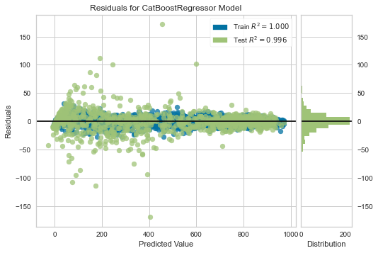
    


```python
#Errors
plot_model(best, plot ='error')
```


    
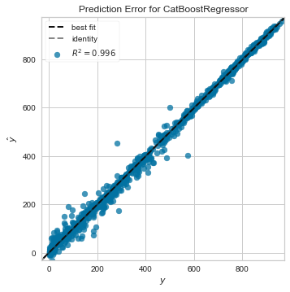
    


```python
#All features and their value. As you can see a lot of them has got 0 contribution or like 0
#So we are aiming reduce number of inputs. But first lets use other combination on our data
plot_model(best, plot='feature_all')
```


    
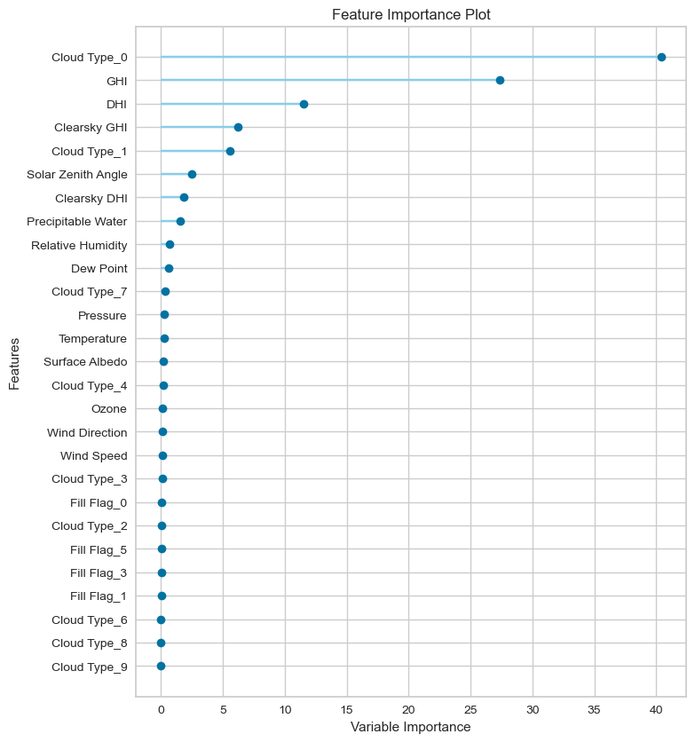
    


```python
#Lets copy our dataframe to avoid confusion
df1 = df.copy()
```


```python
#Normalized dataset didnt improve our results.
reg = setup(data=df1,
           target='DNI',
           use_gpu = True,
           normalize=True,
           session_id = 123)
```


<style  type="text/css" >
#T_b1cb7_row16_col1,#T_b1cb7_row27_col1{
            background-color:  lightgreen;
        }</style><table id="T_b1cb7_" ><thead>    <tr>        <th class="blank level0" ></th>        <th class="col_heading level0 col0" >Description</th>        <th class="col_heading level0 col1" >Value</th>    </tr></thead><tbody>
                <tr>
                        <th id="T_b1cb7_level0_row0" class="row_heading level0 row0" >0</th>
                        <td id="T_b1cb7_row0_col0" class="data row0 col0" >session_id</td>
                        <td id="T_b1cb7_row0_col1" class="data row0 col1" >123</td>
            </tr>
            <tr>
                        <th id="T_b1cb7_level0_row1" class="row_heading level0 row1" >1</th>
                        <td id="T_b1cb7_row1_col0" class="data row1 col0" >Target</td>
                        <td id="T_b1cb7_row1_col1" class="data row1 col1" >DNI</td>
            </tr>
            <tr>
                        <th id="T_b1cb7_level0_row2" class="row_heading level0 row2" >2</th>
                        <td id="T_b1cb7_row2_col0" class="data row2 col0" >Original Data</td>
                        <td id="T_b1cb7_row2_col1" class="data row2 col1" >(3167, 17)</td>
            </tr>
            <tr>
                        <th id="T_b1cb7_level0_row3" class="row_heading level0 row3" >3</th>
                        <td id="T_b1cb7_row3_col0" class="data row3 col0" >Missing Values</td>
                        <td id="T_b1cb7_row3_col1" class="data row3 col1" >False</td>
            </tr>
            <tr>
                        <th id="T_b1cb7_level0_row4" class="row_heading level0 row4" >4</th>
                        <td id="T_b1cb7_row4_col0" class="data row4 col0" >Numeric Features</td>
                        <td id="T_b1cb7_row4_col1" class="data row4 col1" >14</td>
            </tr>
            <tr>
                        <th id="T_b1cb7_level0_row5" class="row_heading level0 row5" >5</th>
                        <td id="T_b1cb7_row5_col0" class="data row5 col0" >Categorical Features</td>
                        <td id="T_b1cb7_row5_col1" class="data row5 col1" >2</td>
            </tr>
            <tr>
                        <th id="T_b1cb7_level0_row6" class="row_heading level0 row6" >6</th>
                        <td id="T_b1cb7_row6_col0" class="data row6 col0" >Ordinal Features</td>
                        <td id="T_b1cb7_row6_col1" class="data row6 col1" >False</td>
            </tr>
            <tr>
                        <th id="T_b1cb7_level0_row7" class="row_heading level0 row7" >7</th>
                        <td id="T_b1cb7_row7_col0" class="data row7 col0" >High Cardinality Features</td>
                        <td id="T_b1cb7_row7_col1" class="data row7 col1" >False</td>
            </tr>
            <tr>
                        <th id="T_b1cb7_level0_row8" class="row_heading level0 row8" >8</th>
                        <td id="T_b1cb7_row8_col0" class="data row8 col0" >High Cardinality Method</td>
                        <td id="T_b1cb7_row8_col1" class="data row8 col1" >None</td>
            </tr>
            <tr>
                        <th id="T_b1cb7_level0_row9" class="row_heading level0 row9" >9</th>
                        <td id="T_b1cb7_row9_col0" class="data row9 col0" >Transformed Train Set</td>
                        <td id="T_b1cb7_row9_col1" class="data row9 col1" >(2216, 27)</td>
            </tr>
            <tr>
                        <th id="T_b1cb7_level0_row10" class="row_heading level0 row10" >10</th>
                        <td id="T_b1cb7_row10_col0" class="data row10 col0" >Transformed Test Set</td>
                        <td id="T_b1cb7_row10_col1" class="data row10 col1" >(951, 27)</td>
            </tr>
            <tr>
                        <th id="T_b1cb7_level0_row11" class="row_heading level0 row11" >11</th>
                        <td id="T_b1cb7_row11_col0" class="data row11 col0" >Shuffle Train-Test</td>
                        <td id="T_b1cb7_row11_col1" class="data row11 col1" >True</td>
            </tr>
            <tr>
                        <th id="T_b1cb7_level0_row12" class="row_heading level0 row12" >12</th>
                        <td id="T_b1cb7_row12_col0" class="data row12 col0" >Stratify Train-Test</td>
                        <td id="T_b1cb7_row12_col1" class="data row12 col1" >False</td>
            </tr>
            <tr>
                        <th id="T_b1cb7_level0_row13" class="row_heading level0 row13" >13</th>
                        <td id="T_b1cb7_row13_col0" class="data row13 col0" >Fold Generator</td>
                        <td id="T_b1cb7_row13_col1" class="data row13 col1" >KFold</td>
            </tr>
            <tr>
                        <th id="T_b1cb7_level0_row14" class="row_heading level0 row14" >14</th>
                        <td id="T_b1cb7_row14_col0" class="data row14 col0" >Fold Number</td>
                        <td id="T_b1cb7_row14_col1" class="data row14 col1" >10</td>
            </tr>
            <tr>
                        <th id="T_b1cb7_level0_row15" class="row_heading level0 row15" >15</th>
                        <td id="T_b1cb7_row15_col0" class="data row15 col0" >CPU Jobs</td>
                        <td id="T_b1cb7_row15_col1" class="data row15 col1" >-1</td>
            </tr>
            <tr>
                        <th id="T_b1cb7_level0_row16" class="row_heading level0 row16" >16</th>
                        <td id="T_b1cb7_row16_col0" class="data row16 col0" >Use GPU</td>
                        <td id="T_b1cb7_row16_col1" class="data row16 col1" >True</td>
            </tr>
            <tr>
                        <th id="T_b1cb7_level0_row17" class="row_heading level0 row17" >17</th>
                        <td id="T_b1cb7_row17_col0" class="data row17 col0" >Log Experiment</td>
                        <td id="T_b1cb7_row17_col1" class="data row17 col1" >False</td>
            </tr>
            <tr>
                        <th id="T_b1cb7_level0_row18" class="row_heading level0 row18" >18</th>
                        <td id="T_b1cb7_row18_col0" class="data row18 col0" >Experiment Name</td>
                        <td id="T_b1cb7_row18_col1" class="data row18 col1" >reg-default-name</td>
            </tr>
            <tr>
                        <th id="T_b1cb7_level0_row19" class="row_heading level0 row19" >19</th>
                        <td id="T_b1cb7_row19_col0" class="data row19 col0" >USI</td>
                        <td id="T_b1cb7_row19_col1" class="data row19 col1" >3ca9</td>
            </tr>
            <tr>
                        <th id="T_b1cb7_level0_row20" class="row_heading level0 row20" >20</th>
                        <td id="T_b1cb7_row20_col0" class="data row20 col0" >Imputation Type</td>
                        <td id="T_b1cb7_row20_col1" class="data row20 col1" >simple</td>
            </tr>
            <tr>
                        <th id="T_b1cb7_level0_row21" class="row_heading level0 row21" >21</th>
                        <td id="T_b1cb7_row21_col0" class="data row21 col0" >Iterative Imputation Iteration</td>
                        <td id="T_b1cb7_row21_col1" class="data row21 col1" >None</td>
            </tr>
            <tr>
                        <th id="T_b1cb7_level0_row22" class="row_heading level0 row22" >22</th>
                        <td id="T_b1cb7_row22_col0" class="data row22 col0" >Numeric Imputer</td>
                        <td id="T_b1cb7_row22_col1" class="data row22 col1" >mean</td>
            </tr>
            <tr>
                        <th id="T_b1cb7_level0_row23" class="row_heading level0 row23" >23</th>
                        <td id="T_b1cb7_row23_col0" class="data row23 col0" >Iterative Imputation Numeric Model</td>
                        <td id="T_b1cb7_row23_col1" class="data row23 col1" >None</td>
            </tr>
            <tr>
                        <th id="T_b1cb7_level0_row24" class="row_heading level0 row24" >24</th>
                        <td id="T_b1cb7_row24_col0" class="data row24 col0" >Categorical Imputer</td>
                        <td id="T_b1cb7_row24_col1" class="data row24 col1" >constant</td>
            </tr>
            <tr>
                        <th id="T_b1cb7_level0_row25" class="row_heading level0 row25" >25</th>
                        <td id="T_b1cb7_row25_col0" class="data row25 col0" >Iterative Imputation Categorical Model</td>
                        <td id="T_b1cb7_row25_col1" class="data row25 col1" >None</td>
            </tr>
            <tr>
                        <th id="T_b1cb7_level0_row26" class="row_heading level0 row26" >26</th>
                        <td id="T_b1cb7_row26_col0" class="data row26 col0" >Unknown Categoricals Handling</td>
                        <td id="T_b1cb7_row26_col1" class="data row26 col1" >least_frequent</td>
            </tr>
            <tr>
                        <th id="T_b1cb7_level0_row27" class="row_heading level0 row27" >27</th>
                        <td id="T_b1cb7_row27_col0" class="data row27 col0" >Normalize</td>
                        <td id="T_b1cb7_row27_col1" class="data row27 col1" >True</td>
            </tr>
            <tr>
                        <th id="T_b1cb7_level0_row28" class="row_heading level0 row28" >28</th>
                        <td id="T_b1cb7_row28_col0" class="data row28 col0" >Normalize Method</td>
                        <td id="T_b1cb7_row28_col1" class="data row28 col1" >zscore</td>
            </tr>
            <tr>
                        <th id="T_b1cb7_level0_row29" class="row_heading level0 row29" >29</th>
                        <td id="T_b1cb7_row29_col0" class="data row29 col0" >Transformation</td>
                        <td id="T_b1cb7_row29_col1" class="data row29 col1" >False</td>
            </tr>
            <tr>
                        <th id="T_b1cb7_level0_row30" class="row_heading level0 row30" >30</th>
                        <td id="T_b1cb7_row30_col0" class="data row30 col0" >Transformation Method</td>
                        <td id="T_b1cb7_row30_col1" class="data row30 col1" >None</td>
            </tr>
            <tr>
                        <th id="T_b1cb7_level0_row31" class="row_heading level0 row31" >31</th>
                        <td id="T_b1cb7_row31_col0" class="data row31 col0" >PCA</td>
                        <td id="T_b1cb7_row31_col1" class="data row31 col1" >False</td>
            </tr>
            <tr>
                        <th id="T_b1cb7_level0_row32" class="row_heading level0 row32" >32</th>
                        <td id="T_b1cb7_row32_col0" class="data row32 col0" >PCA Method</td>
                        <td id="T_b1cb7_row32_col1" class="data row32 col1" >None</td>
            </tr>
            <tr>
                        <th id="T_b1cb7_level0_row33" class="row_heading level0 row33" >33</th>
                        <td id="T_b1cb7_row33_col0" class="data row33 col0" >PCA Components</td>
                        <td id="T_b1cb7_row33_col1" class="data row33 col1" >None</td>
            </tr>
            <tr>
                        <th id="T_b1cb7_level0_row34" class="row_heading level0 row34" >34</th>
                        <td id="T_b1cb7_row34_col0" class="data row34 col0" >Ignore Low Variance</td>
                        <td id="T_b1cb7_row34_col1" class="data row34 col1" >False</td>
            </tr>
            <tr>
                        <th id="T_b1cb7_level0_row35" class="row_heading level0 row35" >35</th>
                        <td id="T_b1cb7_row35_col0" class="data row35 col0" >Combine Rare Levels</td>
                        <td id="T_b1cb7_row35_col1" class="data row35 col1" >False</td>
            </tr>
            <tr>
                        <th id="T_b1cb7_level0_row36" class="row_heading level0 row36" >36</th>
                        <td id="T_b1cb7_row36_col0" class="data row36 col0" >Rare Level Threshold</td>
                        <td id="T_b1cb7_row36_col1" class="data row36 col1" >None</td>
            </tr>
            <tr>
                        <th id="T_b1cb7_level0_row37" class="row_heading level0 row37" >37</th>
                        <td id="T_b1cb7_row37_col0" class="data row37 col0" >Numeric Binning</td>
                        <td id="T_b1cb7_row37_col1" class="data row37 col1" >False</td>
            </tr>
            <tr>
                        <th id="T_b1cb7_level0_row38" class="row_heading level0 row38" >38</th>
                        <td id="T_b1cb7_row38_col0" class="data row38 col0" >Remove Outliers</td>
                        <td id="T_b1cb7_row38_col1" class="data row38 col1" >False</td>
            </tr>
            <tr>
                        <th id="T_b1cb7_level0_row39" class="row_heading level0 row39" >39</th>
                        <td id="T_b1cb7_row39_col0" class="data row39 col0" >Outliers Threshold</td>
                        <td id="T_b1cb7_row39_col1" class="data row39 col1" >None</td>
            </tr>
            <tr>
                        <th id="T_b1cb7_level0_row40" class="row_heading level0 row40" >40</th>
                        <td id="T_b1cb7_row40_col0" class="data row40 col0" >Remove Multicollinearity</td>
                        <td id="T_b1cb7_row40_col1" class="data row40 col1" >False</td>
            </tr>
            <tr>
                        <th id="T_b1cb7_level0_row41" class="row_heading level0 row41" >41</th>
                        <td id="T_b1cb7_row41_col0" class="data row41 col0" >Multicollinearity Threshold</td>
                        <td id="T_b1cb7_row41_col1" class="data row41 col1" >None</td>
            </tr>
            <tr>
                        <th id="T_b1cb7_level0_row42" class="row_heading level0 row42" >42</th>
                        <td id="T_b1cb7_row42_col0" class="data row42 col0" >Clustering</td>
                        <td id="T_b1cb7_row42_col1" class="data row42 col1" >False</td>
            </tr>
            <tr>
                        <th id="T_b1cb7_level0_row43" class="row_heading level0 row43" >43</th>
                        <td id="T_b1cb7_row43_col0" class="data row43 col0" >Clustering Iteration</td>
                        <td id="T_b1cb7_row43_col1" class="data row43 col1" >None</td>
            </tr>
            <tr>
                        <th id="T_b1cb7_level0_row44" class="row_heading level0 row44" >44</th>
                        <td id="T_b1cb7_row44_col0" class="data row44 col0" >Polynomial Features</td>
                        <td id="T_b1cb7_row44_col1" class="data row44 col1" >False</td>
            </tr>
            <tr>
                        <th id="T_b1cb7_level0_row45" class="row_heading level0 row45" >45</th>
                        <td id="T_b1cb7_row45_col0" class="data row45 col0" >Polynomial Degree</td>
                        <td id="T_b1cb7_row45_col1" class="data row45 col1" >None</td>
            </tr>
            <tr>
                        <th id="T_b1cb7_level0_row46" class="row_heading level0 row46" >46</th>
                        <td id="T_b1cb7_row46_col0" class="data row46 col0" >Trignometry Features</td>
                        <td id="T_b1cb7_row46_col1" class="data row46 col1" >False</td>
            </tr>
            <tr>
                        <th id="T_b1cb7_level0_row47" class="row_heading level0 row47" >47</th>
                        <td id="T_b1cb7_row47_col0" class="data row47 col0" >Polynomial Threshold</td>
                        <td id="T_b1cb7_row47_col1" class="data row47 col1" >None</td>
            </tr>
            <tr>
                        <th id="T_b1cb7_level0_row48" class="row_heading level0 row48" >48</th>
                        <td id="T_b1cb7_row48_col0" class="data row48 col0" >Group Features</td>
                        <td id="T_b1cb7_row48_col1" class="data row48 col1" >False</td>
            </tr>
            <tr>
                        <th id="T_b1cb7_level0_row49" class="row_heading level0 row49" >49</th>
                        <td id="T_b1cb7_row49_col0" class="data row49 col0" >Feature Selection</td>
                        <td id="T_b1cb7_row49_col1" class="data row49 col1" >False</td>
            </tr>
            <tr>
                        <th id="T_b1cb7_level0_row50" class="row_heading level0 row50" >50</th>
                        <td id="T_b1cb7_row50_col0" class="data row50 col0" >Features Selection Threshold</td>
                        <td id="T_b1cb7_row50_col1" class="data row50 col1" >None</td>
            </tr>
            <tr>
                        <th id="T_b1cb7_level0_row51" class="row_heading level0 row51" >51</th>
                        <td id="T_b1cb7_row51_col0" class="data row51 col0" >Feature Interaction</td>
                        <td id="T_b1cb7_row51_col1" class="data row51 col1" >False</td>
            </tr>
            <tr>
                        <th id="T_b1cb7_level0_row52" class="row_heading level0 row52" >52</th>
                        <td id="T_b1cb7_row52_col0" class="data row52 col0" >Feature Ratio</td>
                        <td id="T_b1cb7_row52_col1" class="data row52 col1" >False</td>
            </tr>
            <tr>
                        <th id="T_b1cb7_level0_row53" class="row_heading level0 row53" >53</th>
                        <td id="T_b1cb7_row53_col0" class="data row53 col0" >Interaction Threshold</td>
                        <td id="T_b1cb7_row53_col1" class="data row53 col1" >None</td>
            </tr>
            <tr>
                        <th id="T_b1cb7_level0_row54" class="row_heading level0 row54" >54</th>
                        <td id="T_b1cb7_row54_col0" class="data row54 col0" >Transform Target</td>
                        <td id="T_b1cb7_row54_col1" class="data row54 col1" >False</td>
            </tr>
            <tr>
                        <th id="T_b1cb7_level0_row55" class="row_heading level0 row55" >55</th>
                        <td id="T_b1cb7_row55_col0" class="data row55 col0" >Transform Target Method</td>
                        <td id="T_b1cb7_row55_col1" class="data row55 col1" >box-cox</td>
            </tr>
    </tbody></table>


```python
#Error values increased
best = compare_models(exclude=['huber'])
```


<style  type="text/css" >
    #T_2e3bc_ th {
          text-align: left;
    }#T_2e3bc_row0_col0,#T_2e3bc_row0_col5,#T_2e3bc_row0_col6,#T_2e3bc_row1_col0,#T_2e3bc_row1_col1,#T_2e3bc_row1_col2,#T_2e3bc_row1_col3,#T_2e3bc_row1_col4,#T_2e3bc_row2_col0,#T_2e3bc_row2_col1,#T_2e3bc_row2_col2,#T_2e3bc_row2_col3,#T_2e3bc_row2_col4,#T_2e3bc_row2_col5,#T_2e3bc_row2_col6,#T_2e3bc_row3_col0,#T_2e3bc_row3_col1,#T_2e3bc_row3_col2,#T_2e3bc_row3_col3,#T_2e3bc_row3_col4,#T_2e3bc_row3_col5,#T_2e3bc_row3_col6,#T_2e3bc_row4_col0,#T_2e3bc_row4_col1,#T_2e3bc_row4_col2,#T_2e3bc_row4_col3,#T_2e3bc_row4_col4,#T_2e3bc_row4_col5,#T_2e3bc_row4_col6,#T_2e3bc_row5_col0,#T_2e3bc_row5_col1,#T_2e3bc_row5_col2,#T_2e3bc_row5_col3,#T_2e3bc_row5_col4,#T_2e3bc_row5_col5,#T_2e3bc_row5_col6,#T_2e3bc_row6_col0,#T_2e3bc_row6_col1,#T_2e3bc_row6_col2,#T_2e3bc_row6_col3,#T_2e3bc_row6_col4,#T_2e3bc_row6_col5,#T_2e3bc_row6_col6,#T_2e3bc_row7_col0,#T_2e3bc_row7_col1,#T_2e3bc_row7_col2,#T_2e3bc_row7_col3,#T_2e3bc_row7_col4,#T_2e3bc_row7_col5,#T_2e3bc_row7_col6,#T_2e3bc_row8_col0,#T_2e3bc_row8_col1,#T_2e3bc_row8_col2,#T_2e3bc_row8_col3,#T_2e3bc_row8_col4,#T_2e3bc_row8_col5,#T_2e3bc_row8_col6,#T_2e3bc_row9_col0,#T_2e3bc_row9_col1,#T_2e3bc_row9_col2,#T_2e3bc_row9_col3,#T_2e3bc_row9_col4,#T_2e3bc_row9_col5,#T_2e3bc_row9_col6,#T_2e3bc_row10_col0,#T_2e3bc_row10_col1,#T_2e3bc_row10_col2,#T_2e3bc_row10_col3,#T_2e3bc_row10_col4,#T_2e3bc_row10_col5,#T_2e3bc_row10_col6,#T_2e3bc_row11_col0,#T_2e3bc_row11_col1,#T_2e3bc_row11_col2,#T_2e3bc_row11_col3,#T_2e3bc_row11_col4,#T_2e3bc_row11_col5,#T_2e3bc_row11_col6,#T_2e3bc_row12_col0,#T_2e3bc_row12_col1,#T_2e3bc_row12_col2,#T_2e3bc_row12_col3,#T_2e3bc_row12_col4,#T_2e3bc_row12_col5,#T_2e3bc_row12_col6,#T_2e3bc_row13_col0,#T_2e3bc_row13_col1,#T_2e3bc_row13_col2,#T_2e3bc_row13_col3,#T_2e3bc_row13_col4,#T_2e3bc_row13_col5,#T_2e3bc_row13_col6,#T_2e3bc_row14_col0,#T_2e3bc_row14_col1,#T_2e3bc_row14_col2,#T_2e3bc_row14_col3,#T_2e3bc_row14_col4,#T_2e3bc_row14_col5,#T_2e3bc_row14_col6,#T_2e3bc_row15_col0,#T_2e3bc_row15_col1,#T_2e3bc_row15_col2,#T_2e3bc_row15_col3,#T_2e3bc_row15_col4,#T_2e3bc_row15_col5,#T_2e3bc_row15_col6,#T_2e3bc_row16_col0,#T_2e3bc_row16_col1,#T_2e3bc_row16_col2,#T_2e3bc_row16_col3,#T_2e3bc_row16_col4,#T_2e3bc_row16_col5,#T_2e3bc_row16_col6,#T_2e3bc_row17_col0,#T_2e3bc_row17_col1,#T_2e3bc_row17_col2,#T_2e3bc_row17_col3,#T_2e3bc_row17_col4,#T_2e3bc_row17_col5,#T_2e3bc_row17_col6{
            text-align:  left;
            text-align:  left;
        }#T_2e3bc_row0_col1,#T_2e3bc_row0_col2,#T_2e3bc_row0_col3,#T_2e3bc_row0_col4,#T_2e3bc_row1_col5,#T_2e3bc_row1_col6{
            text-align:  left;
            text-align:  left;
            background-color:  yellow;
        }#T_2e3bc_row0_col7,#T_2e3bc_row1_col7,#T_2e3bc_row2_col7,#T_2e3bc_row3_col7,#T_2e3bc_row4_col7,#T_2e3bc_row5_col7,#T_2e3bc_row6_col7,#T_2e3bc_row7_col7,#T_2e3bc_row8_col7,#T_2e3bc_row9_col7,#T_2e3bc_row11_col7,#T_2e3bc_row12_col7,#T_2e3bc_row13_col7,#T_2e3bc_row15_col7,#T_2e3bc_row16_col7,#T_2e3bc_row17_col7{
            text-align:  left;
            text-align:  left;
            background-color:  lightgrey;
        }#T_2e3bc_row10_col7,#T_2e3bc_row14_col7{
            text-align:  left;
            text-align:  left;
            background-color:  yellow;
            background-color:  lightgrey;
        }</style><table id="T_2e3bc_" ><thead>    <tr>        <th class="blank level0" ></th>        <th class="col_heading level0 col0" >Model</th>        <th class="col_heading level0 col1" >MAE</th>        <th class="col_heading level0 col2" >MSE</th>        <th class="col_heading level0 col3" >RMSE</th>        <th class="col_heading level0 col4" >R2</th>        <th class="col_heading level0 col5" >RMSLE</th>        <th class="col_heading level0 col6" >MAPE</th>        <th class="col_heading level0 col7" >TT (Sec)</th>    </tr></thead><tbody>
                <tr>
                        <th id="T_2e3bc_level0_row0" class="row_heading level0 row0" >catboost</th>
                        <td id="T_2e3bc_row0_col0" class="data row0 col0" >CatBoost Regressor</td>
                        <td id="T_2e3bc_row0_col1" class="data row0 col1" >12.3107</td>
                        <td id="T_2e3bc_row0_col2" class="data row0 col2" >363.7592</td>
                        <td id="T_2e3bc_row0_col3" class="data row0 col3" >18.9545</td>
                        <td id="T_2e3bc_row0_col4" class="data row0 col4" >0.9961</td>
                        <td id="T_2e3bc_row0_col5" class="data row0 col5" >0.2936</td>
                        <td id="T_2e3bc_row0_col6" class="data row0 col6" >0.2206</td>
                        <td id="T_2e3bc_row0_col7" class="data row0 col7" >1.6220</td>
            </tr>
            <tr>
                        <th id="T_2e3bc_level0_row1" class="row_heading level0 row1" >lightgbm</th>
                        <td id="T_2e3bc_row1_col0" class="data row1 col0" >Light Gradient Boosting Machine</td>
                        <td id="T_2e3bc_row1_col1" class="data row1 col1" >16.0757</td>
                        <td id="T_2e3bc_row1_col2" class="data row1 col2" >625.2413</td>
                        <td id="T_2e3bc_row1_col3" class="data row1 col3" >24.7209</td>
                        <td id="T_2e3bc_row1_col4" class="data row1 col4" >0.9934</td>
                        <td id="T_2e3bc_row1_col5" class="data row1 col5" >0.2836</td>
                        <td id="T_2e3bc_row1_col6" class="data row1 col6" >0.2084</td>
                        <td id="T_2e3bc_row1_col7" class="data row1 col7" >0.0950</td>
            </tr>
            <tr>
                        <th id="T_2e3bc_level0_row2" class="row_heading level0 row2" >et</th>
                        <td id="T_2e3bc_row2_col0" class="data row2 col0" >Extra Trees Regressor</td>
                        <td id="T_2e3bc_row2_col1" class="data row2 col1" >14.1738</td>
                        <td id="T_2e3bc_row2_col2" class="data row2 col2" >647.0485</td>
                        <td id="T_2e3bc_row2_col3" class="data row2 col3" >24.8763</td>
                        <td id="T_2e3bc_row2_col4" class="data row2 col4" >0.9931</td>
                        <td id="T_2e3bc_row2_col5" class="data row2 col5" >0.3024</td>
                        <td id="T_2e3bc_row2_col6" class="data row2 col6" >0.2460</td>
                        <td id="T_2e3bc_row2_col7" class="data row2 col7" >0.5540</td>
            </tr>
            <tr>
                        <th id="T_2e3bc_level0_row3" class="row_heading level0 row3" >xgboost</th>
                        <td id="T_2e3bc_row3_col0" class="data row3 col0" >Extreme Gradient Boosting</td>
                        <td id="T_2e3bc_row3_col1" class="data row3 col1" >18.0340</td>
                        <td id="T_2e3bc_row3_col2" class="data row3 col2" >795.2774</td>
                        <td id="T_2e3bc_row3_col3" class="data row3 col3" >27.8879</td>
                        <td id="T_2e3bc_row3_col4" class="data row3 col4" >0.9916</td>
                        <td id="T_2e3bc_row3_col5" class="data row3 col5" >0.2986</td>
                        <td id="T_2e3bc_row3_col6" class="data row3 col6" >0.2346</td>
                        <td id="T_2e3bc_row3_col7" class="data row3 col7" >0.6680</td>
            </tr>
            <tr>
                        <th id="T_2e3bc_level0_row4" class="row_heading level0 row4" >rf</th>
                        <td id="T_2e3bc_row4_col0" class="data row4 col0" >Random Forest Regressor</td>
                        <td id="T_2e3bc_row4_col1" class="data row4 col1" >19.0043</td>
                        <td id="T_2e3bc_row4_col2" class="data row4 col2" >1050.3556</td>
                        <td id="T_2e3bc_row4_col3" class="data row4 col3" >31.8610</td>
                        <td id="T_2e3bc_row4_col4" class="data row4 col4" >0.9889</td>
                        <td id="T_2e3bc_row4_col5" class="data row4 col5" >0.2902</td>
                        <td id="T_2e3bc_row4_col6" class="data row4 col6" >0.2349</td>
                        <td id="T_2e3bc_row4_col7" class="data row4 col7" >0.5530</td>
            </tr>
            <tr>
                        <th id="T_2e3bc_level0_row5" class="row_heading level0 row5" >gbr</th>
                        <td id="T_2e3bc_row5_col0" class="data row5 col0" >Gradient Boosting Regressor</td>
                        <td id="T_2e3bc_row5_col1" class="data row5 col1" >25.5788</td>
                        <td id="T_2e3bc_row5_col2" class="data row5 col2" >1292.3814</td>
                        <td id="T_2e3bc_row5_col3" class="data row5 col3" >35.7804</td>
                        <td id="T_2e3bc_row5_col4" class="data row5 col4" >0.9863</td>
                        <td id="T_2e3bc_row5_col5" class="data row5 col5" >0.4411</td>
                        <td id="T_2e3bc_row5_col6" class="data row5 col6" >0.5055</td>
                        <td id="T_2e3bc_row5_col7" class="data row5 col7" >0.4570</td>
            </tr>
            <tr>
                        <th id="T_2e3bc_level0_row6" class="row_heading level0 row6" >dt</th>
                        <td id="T_2e3bc_row6_col0" class="data row6 col0" >Decision Tree Regressor</td>
                        <td id="T_2e3bc_row6_col1" class="data row6 col1" >28.9643</td>
                        <td id="T_2e3bc_row6_col2" class="data row6 col2" >2068.5943</td>
                        <td id="T_2e3bc_row6_col3" class="data row6 col3" >45.0994</td>
                        <td id="T_2e3bc_row6_col4" class="data row6 col4" >0.9780</td>
                        <td id="T_2e3bc_row6_col5" class="data row6 col5" >0.3454</td>
                        <td id="T_2e3bc_row6_col6" class="data row6 col6" >0.2382</td>
                        <td id="T_2e3bc_row6_col7" class="data row6 col7" >0.0240</td>
            </tr>
            <tr>
                        <th id="T_2e3bc_level0_row7" class="row_heading level0 row7" >ada</th>
                        <td id="T_2e3bc_row7_col0" class="data row7 col0" >AdaBoost Regressor</td>
                        <td id="T_2e3bc_row7_col1" class="data row7 col1" >65.5375</td>
                        <td id="T_2e3bc_row7_col2" class="data row7 col2" >6072.5349</td>
                        <td id="T_2e3bc_row7_col3" class="data row7 col3" >77.8107</td>
                        <td id="T_2e3bc_row7_col4" class="data row7 col4" >0.9359</td>
                        <td id="T_2e3bc_row7_col5" class="data row7 col5" >0.8081</td>
                        <td id="T_2e3bc_row7_col6" class="data row7 col6" >1.8296</td>
                        <td id="T_2e3bc_row7_col7" class="data row7 col7" >0.2490</td>
            </tr>
            <tr>
                        <th id="T_2e3bc_level0_row8" class="row_heading level0 row8" >br</th>
                        <td id="T_2e3bc_row8_col0" class="data row8 col0" >Bayesian Ridge</td>
                        <td id="T_2e3bc_row8_col1" class="data row8 col1" >61.9071</td>
                        <td id="T_2e3bc_row8_col2" class="data row8 col2" >6453.6427</td>
                        <td id="T_2e3bc_row8_col3" class="data row8 col3" >80.1474</td>
                        <td id="T_2e3bc_row8_col4" class="data row8 col4" >0.9320</td>
                        <td id="T_2e3bc_row8_col5" class="data row8 col5" >0.7218</td>
                        <td id="T_2e3bc_row8_col6" class="data row8 col6" >1.3852</td>
                        <td id="T_2e3bc_row8_col7" class="data row8 col7" >0.0090</td>
            </tr>
            <tr>
                        <th id="T_2e3bc_level0_row9" class="row_heading level0 row9" >lr</th>
                        <td id="T_2e3bc_row9_col0" class="data row9 col0" >Linear Regression</td>
                        <td id="T_2e3bc_row9_col1" class="data row9 col1" >61.8843</td>
                        <td id="T_2e3bc_row9_col2" class="data row9 col2" >6454.6578</td>
                        <td id="T_2e3bc_row9_col3" class="data row9 col3" >80.1516</td>
                        <td id="T_2e3bc_row9_col4" class="data row9 col4" >0.9319</td>
                        <td id="T_2e3bc_row9_col5" class="data row9 col5" >0.7252</td>
                        <td id="T_2e3bc_row9_col6" class="data row9 col6" >1.3844</td>
                        <td id="T_2e3bc_row9_col7" class="data row9 col7" >0.0070</td>
            </tr>
            <tr>
                        <th id="T_2e3bc_level0_row10" class="row_heading level0 row10" >ridge</th>
                        <td id="T_2e3bc_row10_col0" class="data row10 col0" >Ridge Regression</td>
                        <td id="T_2e3bc_row10_col1" class="data row10 col1" >62.0070</td>
                        <td id="T_2e3bc_row10_col2" class="data row10 col2" >6463.8573</td>
                        <td id="T_2e3bc_row10_col3" class="data row10 col3" >80.2132</td>
                        <td id="T_2e3bc_row10_col4" class="data row10 col4" >0.9319</td>
                        <td id="T_2e3bc_row10_col5" class="data row10 col5" >0.7215</td>
                        <td id="T_2e3bc_row10_col6" class="data row10 col6" >1.3868</td>
                        <td id="T_2e3bc_row10_col7" class="data row10 col7" >0.0060</td>
            </tr>
            <tr>
                        <th id="T_2e3bc_level0_row11" class="row_heading level0 row11" >lasso</th>
                        <td id="T_2e3bc_row11_col0" class="data row11 col0" >Lasso Regression</td>
                        <td id="T_2e3bc_row11_col1" class="data row11 col1" >66.7936</td>
                        <td id="T_2e3bc_row11_col2" class="data row11 col2" >7208.4826</td>
                        <td id="T_2e3bc_row11_col3" class="data row11 col3" >84.7154</td>
                        <td id="T_2e3bc_row11_col4" class="data row11 col4" >0.9241</td>
                        <td id="T_2e3bc_row11_col5" class="data row11 col5" >0.7019</td>
                        <td id="T_2e3bc_row11_col6" class="data row11 col6" >1.4296</td>
                        <td id="T_2e3bc_row11_col7" class="data row11 col7" >0.0130</td>
            </tr>
            <tr>
                        <th id="T_2e3bc_level0_row12" class="row_heading level0 row12" >par</th>
                        <td id="T_2e3bc_row12_col0" class="data row12 col0" >Passive Aggressive Regressor</td>
                        <td id="T_2e3bc_row12_col1" class="data row12 col1" >62.4942</td>
                        <td id="T_2e3bc_row12_col2" class="data row12 col2" >7818.3572</td>
                        <td id="T_2e3bc_row12_col3" class="data row12 col3" >88.0285</td>
                        <td id="T_2e3bc_row12_col4" class="data row12 col4" >0.9176</td>
                        <td id="T_2e3bc_row12_col5" class="data row12 col5" >0.7165</td>
                        <td id="T_2e3bc_row12_col6" class="data row12 col6" >1.5494</td>
                        <td id="T_2e3bc_row12_col7" class="data row12 col7" >0.0100</td>
            </tr>
            <tr>
                        <th id="T_2e3bc_level0_row13" class="row_heading level0 row13" >knn</th>
                        <td id="T_2e3bc_row13_col0" class="data row13 col0" >K Neighbors Regressor</td>
                        <td id="T_2e3bc_row13_col1" class="data row13 col1" >61.6135</td>
                        <td id="T_2e3bc_row13_col2" class="data row13 col2" >8506.6685</td>
                        <td id="T_2e3bc_row13_col3" class="data row13 col3" >91.6065</td>
                        <td id="T_2e3bc_row13_col4" class="data row13 col4" >0.9103</td>
                        <td id="T_2e3bc_row13_col5" class="data row13 col5" >0.7760</td>
                        <td id="T_2e3bc_row13_col6" class="data row13 col6" >1.7532</td>
                        <td id="T_2e3bc_row13_col7" class="data row13 col7" >0.3350</td>
            </tr>
            <tr>
                        <th id="T_2e3bc_level0_row14" class="row_heading level0 row14" >omp</th>
                        <td id="T_2e3bc_row14_col0" class="data row14 col0" >Orthogonal Matching Pursuit</td>
                        <td id="T_2e3bc_row14_col1" class="data row14 col1" >98.4253</td>
                        <td id="T_2e3bc_row14_col2" class="data row14 col2" >14153.8355</td>
                        <td id="T_2e3bc_row14_col3" class="data row14 col3" >118.8170</td>
                        <td id="T_2e3bc_row14_col4" class="data row14 col4" >0.8507</td>
                        <td id="T_2e3bc_row14_col5" class="data row14 col5" >0.9226</td>
                        <td id="T_2e3bc_row14_col6" class="data row14 col6" >2.8924</td>
                        <td id="T_2e3bc_row14_col7" class="data row14 col7" >0.0060</td>
            </tr>
            <tr>
                        <th id="T_2e3bc_level0_row15" class="row_heading level0 row15" >llar</th>
                        <td id="T_2e3bc_row15_col0" class="data row15 col0" >Lasso Least Angle Regression</td>
                        <td id="T_2e3bc_row15_col1" class="data row15 col1" >109.6085</td>
                        <td id="T_2e3bc_row15_col2" class="data row15 col2" >17876.2268</td>
                        <td id="T_2e3bc_row15_col3" class="data row15 col3" >133.6385</td>
                        <td id="T_2e3bc_row15_col4" class="data row15 col4" >0.8110</td>
                        <td id="T_2e3bc_row15_col5" class="data row15 col5" >0.9855</td>
                        <td id="T_2e3bc_row15_col6" class="data row15 col6" >3.0882</td>
                        <td id="T_2e3bc_row15_col7" class="data row15 col7" >0.0070</td>
            </tr>
            <tr>
                        <th id="T_2e3bc_level0_row16" class="row_heading level0 row16" >en</th>
                        <td id="T_2e3bc_row16_col0" class="data row16 col0" >Elastic Net</td>
                        <td id="T_2e3bc_row16_col1" class="data row16 col1" >119.8168</td>
                        <td id="T_2e3bc_row16_col2" class="data row16 col2" >20101.4275</td>
                        <td id="T_2e3bc_row16_col3" class="data row16 col3" >141.6517</td>
                        <td id="T_2e3bc_row16_col4" class="data row16 col4" >0.7880</td>
                        <td id="T_2e3bc_row16_col5" class="data row16 col5" >1.0552</td>
                        <td id="T_2e3bc_row16_col6" class="data row16 col6" >3.9596</td>
                        <td id="T_2e3bc_row16_col7" class="data row16 col7" >0.0070</td>
            </tr>
            <tr>
                        <th id="T_2e3bc_level0_row17" class="row_heading level0 row17" >lar</th>
                        <td id="T_2e3bc_row17_col0" class="data row17 col0" >Least Angle Regression</td>
                        <td id="T_2e3bc_row17_col1" class="data row17 col1" >287.0248</td>
                        <td id="T_2e3bc_row17_col2" class="data row17 col2" >38612201.3180</td>
                        <td id="T_2e3bc_row17_col3" class="data row17 col3" >2181.1326</td>
                        <td id="T_2e3bc_row17_col4" class="data row17 col4" >-389.2113</td>
                        <td id="T_2e3bc_row17_col5" class="data row17 col5" >1.0122</td>
                        <td id="T_2e3bc_row17_col6" class="data row17 col6" >36.0480</td>
                        <td id="T_2e3bc_row17_col7" class="data row17 col7" >0.0110</td>
            </tr>
    </tbody></table>


```python
catboost = create_model('catboost')
```


<style  type="text/css" >
#T_54a36_row10_col0,#T_54a36_row10_col1,#T_54a36_row10_col2,#T_54a36_row10_col3,#T_54a36_row10_col4,#T_54a36_row10_col5{
            background:  yellow;
        }</style><table id="T_54a36_" ><thead>    <tr>        <th class="blank level0" ></th>        <th class="col_heading level0 col0" >MAE</th>        <th class="col_heading level0 col1" >MSE</th>        <th class="col_heading level0 col2" >RMSE</th>        <th class="col_heading level0 col3" >R2</th>        <th class="col_heading level0 col4" >RMSLE</th>        <th class="col_heading level0 col5" >MAPE</th>    </tr></thead><tbody>
                <tr>
                        <th id="T_54a36_level0_row0" class="row_heading level0 row0" >0</th>
                        <td id="T_54a36_row0_col0" class="data row0 col0" >12.6778</td>
                        <td id="T_54a36_row0_col1" class="data row0 col1" >359.4756</td>
                        <td id="T_54a36_row0_col2" class="data row0 col2" >18.9598</td>
                        <td id="T_54a36_row0_col3" class="data row0 col3" >0.9962</td>
                        <td id="T_54a36_row0_col4" class="data row0 col4" >0.3308</td>
                        <td id="T_54a36_row0_col5" class="data row0 col5" >0.2592</td>
            </tr>
            <tr>
                        <th id="T_54a36_level0_row1" class="row_heading level0 row1" >1</th>
                        <td id="T_54a36_row1_col0" class="data row1 col0" >10.3517</td>
                        <td id="T_54a36_row1_col1" class="data row1 col1" >220.0791</td>
                        <td id="T_54a36_row1_col2" class="data row1 col2" >14.8351</td>
                        <td id="T_54a36_row1_col3" class="data row1 col3" >0.9977</td>
                        <td id="T_54a36_row1_col4" class="data row1 col4" >0.2306</td>
                        <td id="T_54a36_row1_col5" class="data row1 col5" >0.1249</td>
            </tr>
            <tr>
                        <th id="T_54a36_level0_row2" class="row_heading level0 row2" >2</th>
                        <td id="T_54a36_row2_col0" class="data row2 col0" >13.3381</td>
                        <td id="T_54a36_row2_col1" class="data row2 col1" >476.6371</td>
                        <td id="T_54a36_row2_col2" class="data row2 col2" >21.8320</td>
                        <td id="T_54a36_row2_col3" class="data row2 col3" >0.9952</td>
                        <td id="T_54a36_row2_col4" class="data row2 col4" >0.2730</td>
                        <td id="T_54a36_row2_col5" class="data row2 col5" >0.2203</td>
            </tr>
            <tr>
                        <th id="T_54a36_level0_row3" class="row_heading level0 row3" >3</th>
                        <td id="T_54a36_row3_col0" class="data row3 col0" >14.2306</td>
                        <td id="T_54a36_row3_col1" class="data row3 col1" >429.0674</td>
                        <td id="T_54a36_row3_col2" class="data row3 col2" >20.7139</td>
                        <td id="T_54a36_row3_col3" class="data row3 col3" >0.9957</td>
                        <td id="T_54a36_row3_col4" class="data row3 col4" >0.4838</td>
                        <td id="T_54a36_row3_col5" class="data row3 col5" >0.4997</td>
            </tr>
            <tr>
                        <th id="T_54a36_level0_row4" class="row_heading level0 row4" >4</th>
                        <td id="T_54a36_row4_col0" class="data row4 col0" >13.0949</td>
                        <td id="T_54a36_row4_col1" class="data row4 col1" >433.6285</td>
                        <td id="T_54a36_row4_col2" class="data row4 col2" >20.8237</td>
                        <td id="T_54a36_row4_col3" class="data row4 col3" >0.9952</td>
                        <td id="T_54a36_row4_col4" class="data row4 col4" >0.2880</td>
                        <td id="T_54a36_row4_col5" class="data row4 col5" >0.1992</td>
            </tr>
            <tr>
                        <th id="T_54a36_level0_row5" class="row_heading level0 row5" >5</th>
                        <td id="T_54a36_row5_col0" class="data row5 col0" >13.1434</td>
                        <td id="T_54a36_row5_col1" class="data row5 col1" >398.3503</td>
                        <td id="T_54a36_row5_col2" class="data row5 col2" >19.9587</td>
                        <td id="T_54a36_row5_col3" class="data row5 col3" >0.9956</td>
                        <td id="T_54a36_row5_col4" class="data row5 col4" >0.2659</td>
                        <td id="T_54a36_row5_col5" class="data row5 col5" >0.2070</td>
            </tr>
            <tr>
                        <th id="T_54a36_level0_row6" class="row_heading level0 row6" >6</th>
                        <td id="T_54a36_row6_col0" class="data row6 col0" >11.9137</td>
                        <td id="T_54a36_row6_col1" class="data row6 col1" >324.8719</td>
                        <td id="T_54a36_row6_col2" class="data row6 col2" >18.0242</td>
                        <td id="T_54a36_row6_col3" class="data row6 col3" >0.9964</td>
                        <td id="T_54a36_row6_col4" class="data row6 col4" >0.2272</td>
                        <td id="T_54a36_row6_col5" class="data row6 col5" >0.1290</td>
            </tr>
            <tr>
                        <th id="T_54a36_level0_row7" class="row_heading level0 row7" >7</th>
                        <td id="T_54a36_row7_col0" class="data row7 col0" >11.8610</td>
                        <td id="T_54a36_row7_col1" class="data row7 col1" >313.2132</td>
                        <td id="T_54a36_row7_col2" class="data row7 col2" >17.6978</td>
                        <td id="T_54a36_row7_col3" class="data row7 col3" >0.9968</td>
                        <td id="T_54a36_row7_col4" class="data row7 col4" >0.3492</td>
                        <td id="T_54a36_row7_col5" class="data row7 col5" >0.2896</td>
            </tr>
            <tr>
                        <th id="T_54a36_level0_row8" class="row_heading level0 row8" >8</th>
                        <td id="T_54a36_row8_col0" class="data row8 col0" >11.0721</td>
                        <td id="T_54a36_row8_col1" class="data row8 col1" >418.2700</td>
                        <td id="T_54a36_row8_col2" class="data row8 col2" >20.4517</td>
                        <td id="T_54a36_row8_col3" class="data row8 col3" >0.9953</td>
                        <td id="T_54a36_row8_col4" class="data row8 col4" >0.2001</td>
                        <td id="T_54a36_row8_col5" class="data row8 col5" >0.0897</td>
            </tr>
            <tr>
                        <th id="T_54a36_level0_row9" class="row_heading level0 row9" >9</th>
                        <td id="T_54a36_row9_col0" class="data row9 col0" >11.4241</td>
                        <td id="T_54a36_row9_col1" class="data row9 col1" >263.9994</td>
                        <td id="T_54a36_row9_col2" class="data row9 col2" >16.2481</td>
                        <td id="T_54a36_row9_col3" class="data row9 col3" >0.9974</td>
                        <td id="T_54a36_row9_col4" class="data row9 col4" >0.2878</td>
                        <td id="T_54a36_row9_col5" class="data row9 col5" >0.1877</td>
            </tr>
            <tr>
                        <th id="T_54a36_level0_row10" class="row_heading level0 row10" >Mean</th>
                        <td id="T_54a36_row10_col0" class="data row10 col0" >12.3107</td>
                        <td id="T_54a36_row10_col1" class="data row10 col1" >363.7592</td>
                        <td id="T_54a36_row10_col2" class="data row10 col2" >18.9545</td>
                        <td id="T_54a36_row10_col3" class="data row10 col3" >0.9961</td>
                        <td id="T_54a36_row10_col4" class="data row10 col4" >0.2936</td>
                        <td id="T_54a36_row10_col5" class="data row10 col5" >0.2206</td>
            </tr>
            <tr>
                        <th id="T_54a36_level0_row11" class="row_heading level0 row11" >SD</th>
                        <td id="T_54a36_row11_col0" class="data row11 col0" >1.1271</td>
                        <td id="T_54a36_row11_col1" class="data row11 col1" >77.9344</td>
                        <td id="T_54a36_row11_col2" class="data row11 col2" >2.1180</td>
                        <td id="T_54a36_row11_col3" class="data row11 col3" >0.0009</td>
                        <td id="T_54a36_row11_col4" class="data row11 col4" >0.0768</td>
                        <td id="T_54a36_row11_col5" class="data row11 col5" >0.1098</td>
            </tr>
    </tbody></table>


```python
print(catboost.feature_names_ )
```

    ['Temperature', 'Clearsky DHI', 'Clearsky GHI', 'Dew Point', 'DHI', 'GHI', 'Ozone', 'Relative Humidity', 'Solar Zenith Angle', 'Surface Albedo', 'Pressure', 'Precipitable Water', 'Wind Direction', 'Wind Speed', 'Cloud Type_0', 'Cloud Type_1', 'Cloud Type_2', 'Cloud Type_3', 'Cloud Type_4', 'Cloud Type_6', 'Cloud Type_7', 'Cloud Type_8', 'Cloud Type_9', 'Fill Flag_0', 'Fill Flag_1', 'Fill Flag_3', 'Fill Flag_5']
    


```python
#tune model with optimum hypermeters. Using Random Grid Search
tuned_catboost = tune_model(catboost)
```


<style  type="text/css" >
#T_69192_row10_col0,#T_69192_row10_col1,#T_69192_row10_col2,#T_69192_row10_col3,#T_69192_row10_col4,#T_69192_row10_col5{
            background:  yellow;
        }</style><table id="T_69192_" ><thead>    <tr>        <th class="blank level0" ></th>        <th class="col_heading level0 col0" >MAE</th>        <th class="col_heading level0 col1" >MSE</th>        <th class="col_heading level0 col2" >RMSE</th>        <th class="col_heading level0 col3" >R2</th>        <th class="col_heading level0 col4" >RMSLE</th>        <th class="col_heading level0 col5" >MAPE</th>    </tr></thead><tbody>
                <tr>
                        <th id="T_69192_level0_row0" class="row_heading level0 row0" >0</th>
                        <td id="T_69192_row0_col0" class="data row0 col0" >23.8615</td>
                        <td id="T_69192_row0_col1" class="data row0 col1" >1045.5943</td>
                        <td id="T_69192_row0_col2" class="data row0 col2" >32.3357</td>
                        <td id="T_69192_row0_col3" class="data row0 col3" >0.9890</td>
                        <td id="T_69192_row0_col4" class="data row0 col4" >0.4469</td>
                        <td id="T_69192_row0_col5" class="data row0 col5" >0.4837</td>
            </tr>
            <tr>
                        <th id="T_69192_level0_row1" class="row_heading level0 row1" >1</th>
                        <td id="T_69192_row1_col0" class="data row1 col0" >19.8836</td>
                        <td id="T_69192_row1_col1" class="data row1 col1" >734.6979</td>
                        <td id="T_69192_row1_col2" class="data row1 col2" >27.1053</td>
                        <td id="T_69192_row1_col3" class="data row1 col3" >0.9923</td>
                        <td id="T_69192_row1_col4" class="data row1 col4" >0.2872</td>
                        <td id="T_69192_row1_col5" class="data row1 col5" >0.2193</td>
            </tr>
            <tr>
                        <th id="T_69192_level0_row2" class="row_heading level0 row2" >2</th>
                        <td id="T_69192_row2_col0" class="data row2 col0" >25.2853</td>
                        <td id="T_69192_row2_col1" class="data row2 col1" >1301.3109</td>
                        <td id="T_69192_row2_col2" class="data row2 col2" >36.0737</td>
                        <td id="T_69192_row2_col3" class="data row2 col3" >0.9869</td>
                        <td id="T_69192_row2_col4" class="data row2 col4" >0.4450</td>
                        <td id="T_69192_row2_col5" class="data row2 col5" >0.4848</td>
            </tr>
            <tr>
                        <th id="T_69192_level0_row3" class="row_heading level0 row3" >3</th>
                        <td id="T_69192_row3_col0" class="data row3 col0" >24.8566</td>
                        <td id="T_69192_row3_col1" class="data row3 col1" >1187.9736</td>
                        <td id="T_69192_row3_col2" class="data row3 col2" >34.4670</td>
                        <td id="T_69192_row3_col3" class="data row3 col3" >0.9880</td>
                        <td id="T_69192_row3_col4" class="data row3 col4" >0.5513</td>
                        <td id="T_69192_row3_col5" class="data row3 col5" >0.7987</td>
            </tr>
            <tr>
                        <th id="T_69192_level0_row4" class="row_heading level0 row4" >4</th>
                        <td id="T_69192_row4_col0" class="data row4 col0" >28.7587</td>
                        <td id="T_69192_row4_col1" class="data row4 col1" >1716.0956</td>
                        <td id="T_69192_row4_col2" class="data row4 col2" >41.4258</td>
                        <td id="T_69192_row4_col3" class="data row4 col3" >0.9811</td>
                        <td id="T_69192_row4_col4" class="data row4 col4" >0.4568</td>
                        <td id="T_69192_row4_col5" class="data row4 col5" >0.5269</td>
            </tr>
            <tr>
                        <th id="T_69192_level0_row5" class="row_heading level0 row5" >5</th>
                        <td id="T_69192_row5_col0" class="data row5 col0" >21.9805</td>
                        <td id="T_69192_row5_col1" class="data row5 col1" >983.8304</td>
                        <td id="T_69192_row5_col2" class="data row5 col2" >31.3661</td>
                        <td id="T_69192_row5_col3" class="data row5 col3" >0.9892</td>
                        <td id="T_69192_row5_col4" class="data row5 col4" >0.4479</td>
                        <td id="T_69192_row5_col5" class="data row5 col5" >0.4874</td>
            </tr>
            <tr>
                        <th id="T_69192_level0_row6" class="row_heading level0 row6" >6</th>
                        <td id="T_69192_row6_col0" class="data row6 col0" >23.5293</td>
                        <td id="T_69192_row6_col1" class="data row6 col1" >1034.7423</td>
                        <td id="T_69192_row6_col2" class="data row6 col2" >32.1674</td>
                        <td id="T_69192_row6_col3" class="data row6 col3" >0.9885</td>
                        <td id="T_69192_row6_col4" class="data row6 col4" >0.3981</td>
                        <td id="T_69192_row6_col5" class="data row6 col5" >0.3854</td>
            </tr>
            <tr>
                        <th id="T_69192_level0_row7" class="row_heading level0 row7" >7</th>
                        <td id="T_69192_row7_col0" class="data row7 col0" >23.8043</td>
                        <td id="T_69192_row7_col1" class="data row7 col1" >1079.7555</td>
                        <td id="T_69192_row7_col2" class="data row7 col2" >32.8596</td>
                        <td id="T_69192_row7_col3" class="data row7 col3" >0.9889</td>
                        <td id="T_69192_row7_col4" class="data row7 col4" >0.4823</td>
                        <td id="T_69192_row7_col5" class="data row7 col5" >0.5315</td>
            </tr>
            <tr>
                        <th id="T_69192_level0_row8" class="row_heading level0 row8" >8</th>
                        <td id="T_69192_row8_col0" class="data row8 col0" >24.8031</td>
                        <td id="T_69192_row8_col1" class="data row8 col1" >1317.0813</td>
                        <td id="T_69192_row8_col2" class="data row8 col2" >36.2916</td>
                        <td id="T_69192_row8_col3" class="data row8 col3" >0.9852</td>
                        <td id="T_69192_row8_col4" class="data row8 col4" >0.3072</td>
                        <td id="T_69192_row8_col5" class="data row8 col5" >0.2129</td>
            </tr>
            <tr>
                        <th id="T_69192_level0_row9" class="row_heading level0 row9" >9</th>
                        <td id="T_69192_row9_col0" class="data row9 col0" >21.6492</td>
                        <td id="T_69192_row9_col1" class="data row9 col1" >869.5401</td>
                        <td id="T_69192_row9_col2" class="data row9 col2" >29.4880</td>
                        <td id="T_69192_row9_col3" class="data row9 col3" >0.9913</td>
                        <td id="T_69192_row9_col4" class="data row9 col4" >0.3720</td>
                        <td id="T_69192_row9_col5" class="data row9 col5" >0.3272</td>
            </tr>
            <tr>
                        <th id="T_69192_level0_row10" class="row_heading level0 row10" >Mean</th>
                        <td id="T_69192_row10_col0" class="data row10 col0" >23.8412</td>
                        <td id="T_69192_row10_col1" class="data row10 col1" >1127.0622</td>
                        <td id="T_69192_row10_col2" class="data row10 col2" >33.3580</td>
                        <td id="T_69192_row10_col3" class="data row10 col3" >0.9880</td>
                        <td id="T_69192_row10_col4" class="data row10 col4" >0.4195</td>
                        <td id="T_69192_row10_col5" class="data row10 col5" >0.4458</td>
            </tr>
            <tr>
                        <th id="T_69192_level0_row11" class="row_heading level0 row11" >SD</th>
                        <td id="T_69192_row11_col0" class="data row11 col0" >2.2859</td>
                        <td id="T_69192_row11_col1" class="data row11 col1" >259.8694</td>
                        <td id="T_69192_row11_col2" class="data row11 col2" >3.7822</td>
                        <td id="T_69192_row11_col3" class="data row11 col3" >0.0030</td>
                        <td id="T_69192_row11_col4" class="data row11 col4" >0.0760</td>
                        <td id="T_69192_row11_col5" class="data row11 col5" >0.1632</td>
            </tr>
    </tbody></table>


```python
#Our best parameters
print(tuned_catboost.get_params())
```

    {'depth': 6, 'l2_leaf_reg': 20, 'loss_function': 'RMSE', 'border_count': 254, 'verbose': False, 'random_strength': 0.0, 'task_type': 'CPU', 'n_estimators': 250, 'random_state': 123}
    


```python
plot_model(tuned_catboost)
```


    
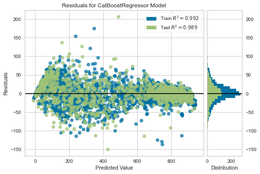
    


```python
plot_model(tuned_catboost, plot = 'error')
```


    
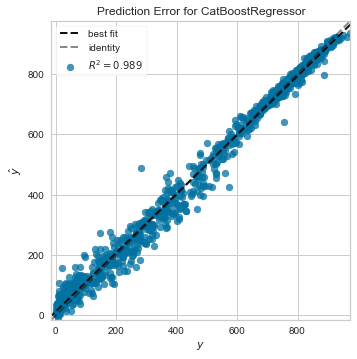
    


```python
plot_model(tuned_catboost, plot='feature')
```


    
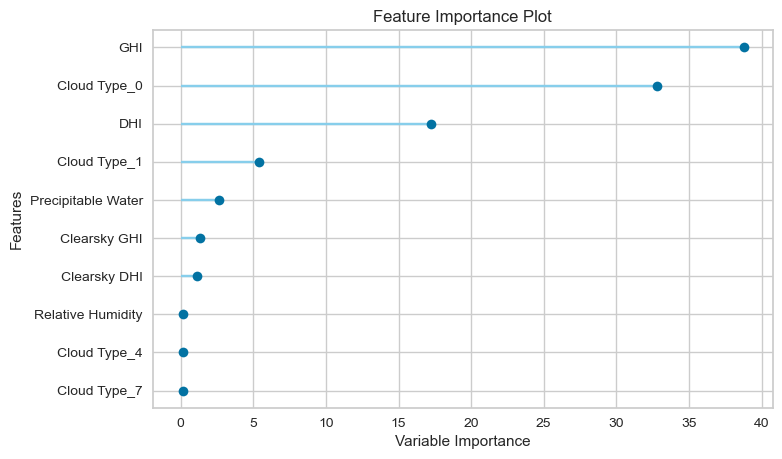
    


```python
evaluate_model(tuned_catboost)
```


    interactive(children=(ToggleButtons(description='Plot Type:', icons=('',), options=(('Hyperparameters', 'param…


```python
final_catboost = finalize_model(tuned_catboost)
```


```python
print(final_catboost.get_params())
```

    {'depth': 6, 'l2_leaf_reg': 20, 'loss_function': 'RMSE', 'border_count': 254, 'verbose': False, 'random_strength': 0.0, 'task_type': 'CPU', 'n_estimators': 250, 'random_state': 123}
    


```python
final_catboost.feature_names_
```


    ['Temperature',
     'Clearsky DHI',
     'Clearsky GHI',
     'Dew Point',
     'DHI',
     'GHI',
     'Ozone',
     'Relative Humidity',
     'Solar Zenith Angle',
     'Surface Albedo',
     'Pressure',
     'Precipitable Water',
     'Wind Direction',
     'Wind Speed',
     'Cloud Type_0',
     'Cloud Type_1',
     'Cloud Type_2',
     'Cloud Type_3',
     'Cloud Type_4',
     'Cloud Type_6',
     'Cloud Type_7',
     'Cloud Type_8',
     'Cloud Type_9',
     'Fill Flag_0',
     'Fill Flag_1',
     'Fill Flag_3',
     'Fill Flag_5']


```python
df1.columns
```


    Index(['Temperature', 'Clearsky DHI', 'Clearsky GHI', 'Cloud Type',
           'Dew Point', 'DHI', 'DNI', 'Fill Flag', 'GHI', 'Ozone',
           'Relative Humidity', 'Solar Zenith Angle', 'Surface Albedo', 'Pressure',
           'Precipitable Water', 'Wind Direction', 'Wind Speed'],
          dtype='object')


```python
predict_model(final_catboost)
```


<style  type="text/css" >
</style><table id="T_30fd5_" ><thead>    <tr>        <th class="blank level0" ></th>        <th class="col_heading level0 col0" >Model</th>        <th class="col_heading level0 col1" >MAE</th>        <th class="col_heading level0 col2" >MSE</th>        <th class="col_heading level0 col3" >RMSE</th>        <th class="col_heading level0 col4" >R2</th>        <th class="col_heading level0 col5" >RMSLE</th>        <th class="col_heading level0 col6" >MAPE</th>    </tr></thead><tbody>
                <tr>
                        <th id="T_30fd5_level0_row0" class="row_heading level0 row0" >0</th>
                        <td id="T_30fd5_row0_col0" class="data row0 col0" >CatBoost Regressor</td>
                        <td id="T_30fd5_row0_col1" class="data row0 col1" >19.4617</td>
                        <td id="T_30fd5_row0_col2" class="data row0 col2" >758.3194</td>
                        <td id="T_30fd5_row0_col3" class="data row0 col3" >27.5376</td>
                        <td id="T_30fd5_row0_col4" class="data row0 col4" >0.9920</td>
                        <td id="T_30fd5_row0_col5" class="data row0 col5" >0.3640</td>
                        <td id="T_30fd5_row0_col6" class="data row0 col6" >0.3170</td>
            </tr>
    </tbody></table>


<div>
<style scoped>
    .dataframe tbody tr th:only-of-type {
        vertical-align: middle;
    }

    .dataframe tbody tr th {
        vertical-align: top;
    }

    .dataframe thead th {
        text-align: right;
    }
</style>
<table border="1" class="dataframe">
  <thead>
    <tr style="text-align: right;">
      <th></th>
      <th>Temperature</th>
      <th>Clearsky DHI</th>
      <th>Clearsky GHI</th>
      <th>Dew Point</th>
      <th>DHI</th>
      <th>GHI</th>
      <th>Ozone</th>
      <th>Relative Humidity</th>
      <th>Solar Zenith Angle</th>
      <th>Surface Albedo</th>
      <th>...</th>
      <th>Cloud Type_6</th>
      <th>Cloud Type_7</th>
      <th>Cloud Type_8</th>
      <th>Cloud Type_9</th>
      <th>Fill Flag_0</th>
      <th>Fill Flag_1</th>
      <th>Fill Flag_3</th>
      <th>Fill Flag_5</th>
      <th>DNI</th>
      <th>Label</th>
    </tr>
  </thead>
  <tbody>
    <tr>
      <th>0</th>
      <td>0.510328</td>
      <td>-0.735537</td>
      <td>-0.667662</td>
      <td>0.416186</td>
      <td>-0.745076</td>
      <td>-0.407475</td>
      <td>-0.186775</td>
      <td>-0.417385</td>
      <td>0.668406</td>
      <td>-0.070252</td>
      <td>...</td>
      <td>0.0</td>
      <td>0.0</td>
      <td>0.0</td>
      <td>0.0</td>
      <td>1.0</td>
      <td>0.0</td>
      <td>0.0</td>
      <td>0.0</td>
      <td>666.0</td>
      <td>682.372875</td>
    </tr>
    <tr>
      <th>1</th>
      <td>-0.631819</td>
      <td>-0.992288</td>
      <td>-1.125245</td>
      <td>-0.671555</td>
      <td>-0.888602</td>
      <td>-0.882913</td>
      <td>-0.094229</td>
      <td>-0.036774</td>
      <td>1.074715</td>
      <td>-0.189000</td>
      <td>...</td>
      <td>0.0</td>
      <td>0.0</td>
      <td>0.0</td>
      <td>0.0</td>
      <td>1.0</td>
      <td>0.0</td>
      <td>0.0</td>
      <td>0.0</td>
      <td>551.0</td>
      <td>524.562847</td>
    </tr>
    <tr>
      <th>2</th>
      <td>-0.690391</td>
      <td>-0.020301</td>
      <td>-0.519939</td>
      <td>-0.603571</td>
      <td>0.187847</td>
      <td>-0.647066</td>
      <td>-0.711196</td>
      <td>0.279107</td>
      <td>0.541435</td>
      <td>-0.189000</td>
      <td>...</td>
      <td>0.0</td>
      <td>0.0</td>
      <td>0.0</td>
      <td>0.0</td>
      <td>1.0</td>
      <td>0.0</td>
      <td>0.0</td>
      <td>0.0</td>
      <td>223.0</td>
      <td>186.745187</td>
    </tr>
    <tr>
      <th>3</th>
      <td>0.173541</td>
      <td>0.328148</td>
      <td>1.559003</td>
      <td>0.110259</td>
      <td>-0.150466</td>
      <td>1.906072</td>
      <td>0.800372</td>
      <td>-0.292241</td>
      <td>-1.635594</td>
      <td>0.048496</td>
      <td>...</td>
      <td>0.0</td>
      <td>0.0</td>
      <td>0.0</td>
      <td>0.0</td>
      <td>1.0</td>
      <td>0.0</td>
      <td>0.0</td>
      <td>0.0</td>
      <td>888.0</td>
      <td>865.448062</td>
    </tr>
    <tr>
      <th>4</th>
      <td>-0.807534</td>
      <td>-0.992288</td>
      <td>-1.373854</td>
      <td>-0.484599</td>
      <td>-0.888602</td>
      <td>-1.141221</td>
      <td>-0.865437</td>
      <td>0.878072</td>
      <td>1.283159</td>
      <td>-0.189000</td>
      <td>...</td>
      <td>0.0</td>
      <td>0.0</td>
      <td>0.0</td>
      <td>0.0</td>
      <td>1.0</td>
      <td>0.0</td>
      <td>0.0</td>
      <td>0.0</td>
      <td>369.0</td>
      <td>397.079471</td>
    </tr>
    <tr>
      <th>...</th>
      <td>...</td>
      <td>...</td>
      <td>...</td>
      <td>...</td>
      <td>...</td>
      <td>...</td>
      <td>...</td>
      <td>...</td>
      <td>...</td>
      <td>...</td>
      <td>...</td>
      <td>...</td>
      <td>...</td>
      <td>...</td>
      <td>...</td>
      <td>...</td>
      <td>...</td>
      <td>...</td>
      <td>...</td>
      <td>...</td>
      <td>...</td>
    </tr>
    <tr>
      <th>946</th>
      <td>0.393184</td>
      <td>1.428511</td>
      <td>1.313997</td>
      <td>0.875077</td>
      <td>0.423640</td>
      <td>-0.875425</td>
      <td>1.047159</td>
      <td>0.913458</td>
      <td>-1.562585</td>
      <td>0.048496</td>
      <td>...</td>
      <td>0.0</td>
      <td>0.0</td>
      <td>0.0</td>
      <td>0.0</td>
      <td>1.0</td>
      <td>0.0</td>
      <td>0.0</td>
      <td>0.0</td>
      <td>8.0</td>
      <td>-4.853215</td>
    </tr>
    <tr>
      <th>947</th>
      <td>0.861757</td>
      <td>0.933347</td>
      <td>1.389661</td>
      <td>0.977053</td>
      <td>2.586790</td>
      <td>0.071706</td>
      <td>-0.310167</td>
      <td>-0.049720</td>
      <td>-1.609142</td>
      <td>-0.070252</td>
      <td>...</td>
      <td>0.0</td>
      <td>0.0</td>
      <td>0.0</td>
      <td>0.0</td>
      <td>1.0</td>
      <td>0.0</td>
      <td>0.0</td>
      <td>0.0</td>
      <td>54.0</td>
      <td>93.654709</td>
    </tr>
    <tr>
      <th>948</th>
      <td>-0.939320</td>
      <td>-1.505791</td>
      <td>-1.680110</td>
      <td>-0.093693</td>
      <td>-1.175655</td>
      <td>-1.459427</td>
      <td>0.985462</td>
      <td>2.454025</td>
      <td>1.549270</td>
      <td>-0.070252</td>
      <td>...</td>
      <td>0.0</td>
      <td>0.0</td>
      <td>0.0</td>
      <td>0.0</td>
      <td>1.0</td>
      <td>0.0</td>
      <td>0.0</td>
      <td>0.0</td>
      <td>82.0</td>
      <td>122.368046</td>
    </tr>
    <tr>
      <th>949</th>
      <td>0.466399</td>
      <td>-1.212361</td>
      <td>-1.334220</td>
      <td>0.620138</td>
      <td>-1.011625</td>
      <td>-1.100042</td>
      <td>-0.186775</td>
      <td>0.121167</td>
      <td>1.241365</td>
      <td>-0.070252</td>
      <td>...</td>
      <td>0.0</td>
      <td>0.0</td>
      <td>0.0</td>
      <td>0.0</td>
      <td>1.0</td>
      <td>0.0</td>
      <td>0.0</td>
      <td>0.0</td>
      <td>461.0</td>
      <td>440.624762</td>
    </tr>
    <tr>
      <th>950</th>
      <td>0.246755</td>
      <td>1.025044</td>
      <td>0.932078</td>
      <td>0.348202</td>
      <td>1.366814</td>
      <td>-0.497321</td>
      <td>0.862069</td>
      <td>0.056437</td>
      <td>-0.999679</td>
      <td>-0.070252</td>
      <td>...</td>
      <td>0.0</td>
      <td>0.0</td>
      <td>0.0</td>
      <td>0.0</td>
      <td>1.0</td>
      <td>0.0</td>
      <td>0.0</td>
      <td>0.0</td>
      <td>20.0</td>
      <td>23.367594</td>
    </tr>
  </tbody>
</table>
<p>951 rows × 29 columns</p>
</div>


```python
final_catboost.feature_names_ 
```


    ['Temperature',
     'Clearsky DHI',
     'Clearsky GHI',
     'Dew Point',
     'DHI',
     'GHI',
     'Ozone',
     'Relative Humidity',
     'Solar Zenith Angle',
     'Surface Albedo',
     'Pressure',
     'Precipitable Water',
     'Wind Direction',
     'Wind Speed',
     'Cloud Type_0',
     'Cloud Type_1',
     'Cloud Type_2',
     'Cloud Type_3',
     'Cloud Type_4',
     'Cloud Type_6',
     'Cloud Type_7',
     'Cloud Type_8',
     'Cloud Type_9',
     'Fill Flag_0',
     'Fill Flag_1',
     'Fill Flag_3',
     'Fill Flag_5']


```python
plot_model(final_catboost, plot='feature_all')
```


    
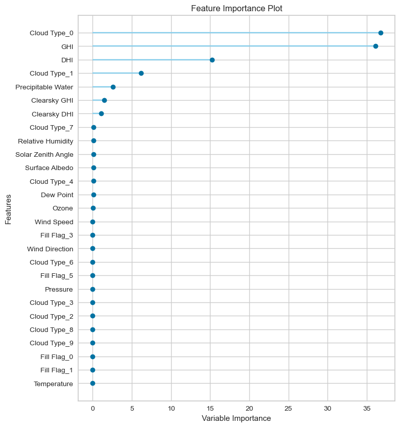
    


```python
df1.columns
```


    Index(['Temperature', 'Clearsky DHI', 'Clearsky GHI', 'Cloud Type',
           'Dew Point', 'DHI', 'DNI', 'Fill Flag', 'GHI', 'Ozone',
           'Relative Humidity', 'Solar Zenith Angle', 'Surface Albedo', 'Pressure',
           'Precipitable Water', 'Wind Direction', 'Wind Speed'],
          dtype='object')


```python
df2 = df1.drop(['Fill Flag','Temperature', 'Wind Direction','Wind Speed', 'Pressure'], 1)
```


```python
df2.shape
```


    (3167, 12)


```python
df2.columns
```


    Index(['Clearsky DHI', 'Clearsky GHI', 'Cloud Type', 'Dew Point', 'DHI', 'DNI',
           'GHI', 'Ozone', 'Relative Humidity', 'Solar Zenith Angle',
           'Surface Albedo', 'Precipitable Water'],
          dtype='object')


```python
reg = setup(data=df2,
           target='DNI', session_id = 123)
```


<style  type="text/css" >
</style><table id="T_5308a_" ><thead>    <tr>        <th class="blank level0" ></th>        <th class="col_heading level0 col0" >Description</th>        <th class="col_heading level0 col1" >Value</th>    </tr></thead><tbody>
                <tr>
                        <th id="T_5308a_level0_row0" class="row_heading level0 row0" >0</th>
                        <td id="T_5308a_row0_col0" class="data row0 col0" >session_id</td>
                        <td id="T_5308a_row0_col1" class="data row0 col1" >123</td>
            </tr>
            <tr>
                        <th id="T_5308a_level0_row1" class="row_heading level0 row1" >1</th>
                        <td id="T_5308a_row1_col0" class="data row1 col0" >Target</td>
                        <td id="T_5308a_row1_col1" class="data row1 col1" >DNI</td>
            </tr>
            <tr>
                        <th id="T_5308a_level0_row2" class="row_heading level0 row2" >2</th>
                        <td id="T_5308a_row2_col0" class="data row2 col0" >Original Data</td>
                        <td id="T_5308a_row2_col1" class="data row2 col1" >(3167, 12)</td>
            </tr>
            <tr>
                        <th id="T_5308a_level0_row3" class="row_heading level0 row3" >3</th>
                        <td id="T_5308a_row3_col0" class="data row3 col0" >Missing Values</td>
                        <td id="T_5308a_row3_col1" class="data row3 col1" >False</td>
            </tr>
            <tr>
                        <th id="T_5308a_level0_row4" class="row_heading level0 row4" >4</th>
                        <td id="T_5308a_row4_col0" class="data row4 col0" >Numeric Features</td>
                        <td id="T_5308a_row4_col1" class="data row4 col1" >10</td>
            </tr>
            <tr>
                        <th id="T_5308a_level0_row5" class="row_heading level0 row5" >5</th>
                        <td id="T_5308a_row5_col0" class="data row5 col0" >Categorical Features</td>
                        <td id="T_5308a_row5_col1" class="data row5 col1" >1</td>
            </tr>
            <tr>
                        <th id="T_5308a_level0_row6" class="row_heading level0 row6" >6</th>
                        <td id="T_5308a_row6_col0" class="data row6 col0" >Ordinal Features</td>
                        <td id="T_5308a_row6_col1" class="data row6 col1" >False</td>
            </tr>
            <tr>
                        <th id="T_5308a_level0_row7" class="row_heading level0 row7" >7</th>
                        <td id="T_5308a_row7_col0" class="data row7 col0" >High Cardinality Features</td>
                        <td id="T_5308a_row7_col1" class="data row7 col1" >False</td>
            </tr>
            <tr>
                        <th id="T_5308a_level0_row8" class="row_heading level0 row8" >8</th>
                        <td id="T_5308a_row8_col0" class="data row8 col0" >High Cardinality Method</td>
                        <td id="T_5308a_row8_col1" class="data row8 col1" >None</td>
            </tr>
            <tr>
                        <th id="T_5308a_level0_row9" class="row_heading level0 row9" >9</th>
                        <td id="T_5308a_row9_col0" class="data row9 col0" >Transformed Train Set</td>
                        <td id="T_5308a_row9_col1" class="data row9 col1" >(2216, 19)</td>
            </tr>
            <tr>
                        <th id="T_5308a_level0_row10" class="row_heading level0 row10" >10</th>
                        <td id="T_5308a_row10_col0" class="data row10 col0" >Transformed Test Set</td>
                        <td id="T_5308a_row10_col1" class="data row10 col1" >(951, 19)</td>
            </tr>
            <tr>
                        <th id="T_5308a_level0_row11" class="row_heading level0 row11" >11</th>
                        <td id="T_5308a_row11_col0" class="data row11 col0" >Shuffle Train-Test</td>
                        <td id="T_5308a_row11_col1" class="data row11 col1" >True</td>
            </tr>
            <tr>
                        <th id="T_5308a_level0_row12" class="row_heading level0 row12" >12</th>
                        <td id="T_5308a_row12_col0" class="data row12 col0" >Stratify Train-Test</td>
                        <td id="T_5308a_row12_col1" class="data row12 col1" >False</td>
            </tr>
            <tr>
                        <th id="T_5308a_level0_row13" class="row_heading level0 row13" >13</th>
                        <td id="T_5308a_row13_col0" class="data row13 col0" >Fold Generator</td>
                        <td id="T_5308a_row13_col1" class="data row13 col1" >KFold</td>
            </tr>
            <tr>
                        <th id="T_5308a_level0_row14" class="row_heading level0 row14" >14</th>
                        <td id="T_5308a_row14_col0" class="data row14 col0" >Fold Number</td>
                        <td id="T_5308a_row14_col1" class="data row14 col1" >10</td>
            </tr>
            <tr>
                        <th id="T_5308a_level0_row15" class="row_heading level0 row15" >15</th>
                        <td id="T_5308a_row15_col0" class="data row15 col0" >CPU Jobs</td>
                        <td id="T_5308a_row15_col1" class="data row15 col1" >-1</td>
            </tr>
            <tr>
                        <th id="T_5308a_level0_row16" class="row_heading level0 row16" >16</th>
                        <td id="T_5308a_row16_col0" class="data row16 col0" >Use GPU</td>
                        <td id="T_5308a_row16_col1" class="data row16 col1" >False</td>
            </tr>
            <tr>
                        <th id="T_5308a_level0_row17" class="row_heading level0 row17" >17</th>
                        <td id="T_5308a_row17_col0" class="data row17 col0" >Log Experiment</td>
                        <td id="T_5308a_row17_col1" class="data row17 col1" >False</td>
            </tr>
            <tr>
                        <th id="T_5308a_level0_row18" class="row_heading level0 row18" >18</th>
                        <td id="T_5308a_row18_col0" class="data row18 col0" >Experiment Name</td>
                        <td id="T_5308a_row18_col1" class="data row18 col1" >reg-default-name</td>
            </tr>
            <tr>
                        <th id="T_5308a_level0_row19" class="row_heading level0 row19" >19</th>
                        <td id="T_5308a_row19_col0" class="data row19 col0" >USI</td>
                        <td id="T_5308a_row19_col1" class="data row19 col1" >a432</td>
            </tr>
            <tr>
                        <th id="T_5308a_level0_row20" class="row_heading level0 row20" >20</th>
                        <td id="T_5308a_row20_col0" class="data row20 col0" >Imputation Type</td>
                        <td id="T_5308a_row20_col1" class="data row20 col1" >simple</td>
            </tr>
            <tr>
                        <th id="T_5308a_level0_row21" class="row_heading level0 row21" >21</th>
                        <td id="T_5308a_row21_col0" class="data row21 col0" >Iterative Imputation Iteration</td>
                        <td id="T_5308a_row21_col1" class="data row21 col1" >None</td>
            </tr>
            <tr>
                        <th id="T_5308a_level0_row22" class="row_heading level0 row22" >22</th>
                        <td id="T_5308a_row22_col0" class="data row22 col0" >Numeric Imputer</td>
                        <td id="T_5308a_row22_col1" class="data row22 col1" >mean</td>
            </tr>
            <tr>
                        <th id="T_5308a_level0_row23" class="row_heading level0 row23" >23</th>
                        <td id="T_5308a_row23_col0" class="data row23 col0" >Iterative Imputation Numeric Model</td>
                        <td id="T_5308a_row23_col1" class="data row23 col1" >None</td>
            </tr>
            <tr>
                        <th id="T_5308a_level0_row24" class="row_heading level0 row24" >24</th>
                        <td id="T_5308a_row24_col0" class="data row24 col0" >Categorical Imputer</td>
                        <td id="T_5308a_row24_col1" class="data row24 col1" >constant</td>
            </tr>
            <tr>
                        <th id="T_5308a_level0_row25" class="row_heading level0 row25" >25</th>
                        <td id="T_5308a_row25_col0" class="data row25 col0" >Iterative Imputation Categorical Model</td>
                        <td id="T_5308a_row25_col1" class="data row25 col1" >None</td>
            </tr>
            <tr>
                        <th id="T_5308a_level0_row26" class="row_heading level0 row26" >26</th>
                        <td id="T_5308a_row26_col0" class="data row26 col0" >Unknown Categoricals Handling</td>
                        <td id="T_5308a_row26_col1" class="data row26 col1" >least_frequent</td>
            </tr>
            <tr>
                        <th id="T_5308a_level0_row27" class="row_heading level0 row27" >27</th>
                        <td id="T_5308a_row27_col0" class="data row27 col0" >Normalize</td>
                        <td id="T_5308a_row27_col1" class="data row27 col1" >False</td>
            </tr>
            <tr>
                        <th id="T_5308a_level0_row28" class="row_heading level0 row28" >28</th>
                        <td id="T_5308a_row28_col0" class="data row28 col0" >Normalize Method</td>
                        <td id="T_5308a_row28_col1" class="data row28 col1" >None</td>
            </tr>
            <tr>
                        <th id="T_5308a_level0_row29" class="row_heading level0 row29" >29</th>
                        <td id="T_5308a_row29_col0" class="data row29 col0" >Transformation</td>
                        <td id="T_5308a_row29_col1" class="data row29 col1" >False</td>
            </tr>
            <tr>
                        <th id="T_5308a_level0_row30" class="row_heading level0 row30" >30</th>
                        <td id="T_5308a_row30_col0" class="data row30 col0" >Transformation Method</td>
                        <td id="T_5308a_row30_col1" class="data row30 col1" >None</td>
            </tr>
            <tr>
                        <th id="T_5308a_level0_row31" class="row_heading level0 row31" >31</th>
                        <td id="T_5308a_row31_col0" class="data row31 col0" >PCA</td>
                        <td id="T_5308a_row31_col1" class="data row31 col1" >False</td>
            </tr>
            <tr>
                        <th id="T_5308a_level0_row32" class="row_heading level0 row32" >32</th>
                        <td id="T_5308a_row32_col0" class="data row32 col0" >PCA Method</td>
                        <td id="T_5308a_row32_col1" class="data row32 col1" >None</td>
            </tr>
            <tr>
                        <th id="T_5308a_level0_row33" class="row_heading level0 row33" >33</th>
                        <td id="T_5308a_row33_col0" class="data row33 col0" >PCA Components</td>
                        <td id="T_5308a_row33_col1" class="data row33 col1" >None</td>
            </tr>
            <tr>
                        <th id="T_5308a_level0_row34" class="row_heading level0 row34" >34</th>
                        <td id="T_5308a_row34_col0" class="data row34 col0" >Ignore Low Variance</td>
                        <td id="T_5308a_row34_col1" class="data row34 col1" >False</td>
            </tr>
            <tr>
                        <th id="T_5308a_level0_row35" class="row_heading level0 row35" >35</th>
                        <td id="T_5308a_row35_col0" class="data row35 col0" >Combine Rare Levels</td>
                        <td id="T_5308a_row35_col1" class="data row35 col1" >False</td>
            </tr>
            <tr>
                        <th id="T_5308a_level0_row36" class="row_heading level0 row36" >36</th>
                        <td id="T_5308a_row36_col0" class="data row36 col0" >Rare Level Threshold</td>
                        <td id="T_5308a_row36_col1" class="data row36 col1" >None</td>
            </tr>
            <tr>
                        <th id="T_5308a_level0_row37" class="row_heading level0 row37" >37</th>
                        <td id="T_5308a_row37_col0" class="data row37 col0" >Numeric Binning</td>
                        <td id="T_5308a_row37_col1" class="data row37 col1" >False</td>
            </tr>
            <tr>
                        <th id="T_5308a_level0_row38" class="row_heading level0 row38" >38</th>
                        <td id="T_5308a_row38_col0" class="data row38 col0" >Remove Outliers</td>
                        <td id="T_5308a_row38_col1" class="data row38 col1" >False</td>
            </tr>
            <tr>
                        <th id="T_5308a_level0_row39" class="row_heading level0 row39" >39</th>
                        <td id="T_5308a_row39_col0" class="data row39 col0" >Outliers Threshold</td>
                        <td id="T_5308a_row39_col1" class="data row39 col1" >None</td>
            </tr>
            <tr>
                        <th id="T_5308a_level0_row40" class="row_heading level0 row40" >40</th>
                        <td id="T_5308a_row40_col0" class="data row40 col0" >Remove Multicollinearity</td>
                        <td id="T_5308a_row40_col1" class="data row40 col1" >False</td>
            </tr>
            <tr>
                        <th id="T_5308a_level0_row41" class="row_heading level0 row41" >41</th>
                        <td id="T_5308a_row41_col0" class="data row41 col0" >Multicollinearity Threshold</td>
                        <td id="T_5308a_row41_col1" class="data row41 col1" >None</td>
            </tr>
            <tr>
                        <th id="T_5308a_level0_row42" class="row_heading level0 row42" >42</th>
                        <td id="T_5308a_row42_col0" class="data row42 col0" >Clustering</td>
                        <td id="T_5308a_row42_col1" class="data row42 col1" >False</td>
            </tr>
            <tr>
                        <th id="T_5308a_level0_row43" class="row_heading level0 row43" >43</th>
                        <td id="T_5308a_row43_col0" class="data row43 col0" >Clustering Iteration</td>
                        <td id="T_5308a_row43_col1" class="data row43 col1" >None</td>
            </tr>
            <tr>
                        <th id="T_5308a_level0_row44" class="row_heading level0 row44" >44</th>
                        <td id="T_5308a_row44_col0" class="data row44 col0" >Polynomial Features</td>
                        <td id="T_5308a_row44_col1" class="data row44 col1" >False</td>
            </tr>
            <tr>
                        <th id="T_5308a_level0_row45" class="row_heading level0 row45" >45</th>
                        <td id="T_5308a_row45_col0" class="data row45 col0" >Polynomial Degree</td>
                        <td id="T_5308a_row45_col1" class="data row45 col1" >None</td>
            </tr>
            <tr>
                        <th id="T_5308a_level0_row46" class="row_heading level0 row46" >46</th>
                        <td id="T_5308a_row46_col0" class="data row46 col0" >Trignometry Features</td>
                        <td id="T_5308a_row46_col1" class="data row46 col1" >False</td>
            </tr>
            <tr>
                        <th id="T_5308a_level0_row47" class="row_heading level0 row47" >47</th>
                        <td id="T_5308a_row47_col0" class="data row47 col0" >Polynomial Threshold</td>
                        <td id="T_5308a_row47_col1" class="data row47 col1" >None</td>
            </tr>
            <tr>
                        <th id="T_5308a_level0_row48" class="row_heading level0 row48" >48</th>
                        <td id="T_5308a_row48_col0" class="data row48 col0" >Group Features</td>
                        <td id="T_5308a_row48_col1" class="data row48 col1" >False</td>
            </tr>
            <tr>
                        <th id="T_5308a_level0_row49" class="row_heading level0 row49" >49</th>
                        <td id="T_5308a_row49_col0" class="data row49 col0" >Feature Selection</td>
                        <td id="T_5308a_row49_col1" class="data row49 col1" >False</td>
            </tr>
            <tr>
                        <th id="T_5308a_level0_row50" class="row_heading level0 row50" >50</th>
                        <td id="T_5308a_row50_col0" class="data row50 col0" >Features Selection Threshold</td>
                        <td id="T_5308a_row50_col1" class="data row50 col1" >None</td>
            </tr>
            <tr>
                        <th id="T_5308a_level0_row51" class="row_heading level0 row51" >51</th>
                        <td id="T_5308a_row51_col0" class="data row51 col0" >Feature Interaction</td>
                        <td id="T_5308a_row51_col1" class="data row51 col1" >False</td>
            </tr>
            <tr>
                        <th id="T_5308a_level0_row52" class="row_heading level0 row52" >52</th>
                        <td id="T_5308a_row52_col0" class="data row52 col0" >Feature Ratio</td>
                        <td id="T_5308a_row52_col1" class="data row52 col1" >False</td>
            </tr>
            <tr>
                        <th id="T_5308a_level0_row53" class="row_heading level0 row53" >53</th>
                        <td id="T_5308a_row53_col0" class="data row53 col0" >Interaction Threshold</td>
                        <td id="T_5308a_row53_col1" class="data row53 col1" >None</td>
            </tr>
            <tr>
                        <th id="T_5308a_level0_row54" class="row_heading level0 row54" >54</th>
                        <td id="T_5308a_row54_col0" class="data row54 col0" >Transform Target</td>
                        <td id="T_5308a_row54_col1" class="data row54 col1" >False</td>
            </tr>
            <tr>
                        <th id="T_5308a_level0_row55" class="row_heading level0 row55" >55</th>
                        <td id="T_5308a_row55_col0" class="data row55 col0" >Transform Target Method</td>
                        <td id="T_5308a_row55_col1" class="data row55 col1" >box-cox</td>
            </tr>
    </tbody></table>


```python
best = compare_models(exclude=['huber'])
```


<style  type="text/css" >
    #T_6249c_ th {
          text-align: left;
    }#T_6249c_row0_col0,#T_6249c_row0_col5,#T_6249c_row0_col6,#T_6249c_row1_col0,#T_6249c_row1_col1,#T_6249c_row1_col2,#T_6249c_row1_col3,#T_6249c_row1_col4,#T_6249c_row1_col5,#T_6249c_row1_col6,#T_6249c_row2_col0,#T_6249c_row2_col1,#T_6249c_row2_col2,#T_6249c_row2_col3,#T_6249c_row2_col4,#T_6249c_row2_col5,#T_6249c_row3_col0,#T_6249c_row3_col1,#T_6249c_row3_col2,#T_6249c_row3_col3,#T_6249c_row3_col4,#T_6249c_row3_col6,#T_6249c_row4_col0,#T_6249c_row4_col1,#T_6249c_row4_col2,#T_6249c_row4_col3,#T_6249c_row4_col4,#T_6249c_row4_col5,#T_6249c_row4_col6,#T_6249c_row5_col0,#T_6249c_row5_col1,#T_6249c_row5_col2,#T_6249c_row5_col3,#T_6249c_row5_col4,#T_6249c_row5_col5,#T_6249c_row5_col6,#T_6249c_row6_col0,#T_6249c_row6_col1,#T_6249c_row6_col2,#T_6249c_row6_col3,#T_6249c_row6_col4,#T_6249c_row6_col5,#T_6249c_row6_col6,#T_6249c_row7_col0,#T_6249c_row7_col1,#T_6249c_row7_col2,#T_6249c_row7_col3,#T_6249c_row7_col4,#T_6249c_row7_col5,#T_6249c_row7_col6,#T_6249c_row8_col0,#T_6249c_row8_col1,#T_6249c_row8_col2,#T_6249c_row8_col3,#T_6249c_row8_col4,#T_6249c_row8_col5,#T_6249c_row8_col6,#T_6249c_row9_col0,#T_6249c_row9_col1,#T_6249c_row9_col2,#T_6249c_row9_col3,#T_6249c_row9_col4,#T_6249c_row9_col5,#T_6249c_row9_col6,#T_6249c_row10_col0,#T_6249c_row10_col1,#T_6249c_row10_col2,#T_6249c_row10_col3,#T_6249c_row10_col4,#T_6249c_row10_col5,#T_6249c_row10_col6,#T_6249c_row11_col0,#T_6249c_row11_col1,#T_6249c_row11_col2,#T_6249c_row11_col3,#T_6249c_row11_col4,#T_6249c_row11_col5,#T_6249c_row11_col6,#T_6249c_row12_col0,#T_6249c_row12_col1,#T_6249c_row12_col2,#T_6249c_row12_col3,#T_6249c_row12_col4,#T_6249c_row12_col5,#T_6249c_row12_col6,#T_6249c_row13_col0,#T_6249c_row13_col1,#T_6249c_row13_col2,#T_6249c_row13_col3,#T_6249c_row13_col4,#T_6249c_row13_col5,#T_6249c_row13_col6,#T_6249c_row14_col0,#T_6249c_row14_col1,#T_6249c_row14_col2,#T_6249c_row14_col3,#T_6249c_row14_col4,#T_6249c_row14_col5,#T_6249c_row14_col6,#T_6249c_row15_col0,#T_6249c_row15_col1,#T_6249c_row15_col2,#T_6249c_row15_col3,#T_6249c_row15_col4,#T_6249c_row15_col5,#T_6249c_row15_col6,#T_6249c_row16_col0,#T_6249c_row16_col1,#T_6249c_row16_col2,#T_6249c_row16_col3,#T_6249c_row16_col4,#T_6249c_row16_col5,#T_6249c_row16_col6,#T_6249c_row17_col0,#T_6249c_row17_col1,#T_6249c_row17_col2,#T_6249c_row17_col3,#T_6249c_row17_col4,#T_6249c_row17_col5,#T_6249c_row17_col6{
            text-align:  left;
            text-align:  left;
        }#T_6249c_row0_col1,#T_6249c_row0_col2,#T_6249c_row0_col3,#T_6249c_row0_col4,#T_6249c_row2_col6,#T_6249c_row3_col5{
            text-align:  left;
            text-align:  left;
            background-color:  yellow;
        }#T_6249c_row0_col7,#T_6249c_row1_col7,#T_6249c_row2_col7,#T_6249c_row3_col7,#T_6249c_row4_col7,#T_6249c_row5_col7,#T_6249c_row6_col7,#T_6249c_row7_col7,#T_6249c_row8_col7,#T_6249c_row9_col7,#T_6249c_row10_col7,#T_6249c_row11_col7,#T_6249c_row12_col7,#T_6249c_row13_col7,#T_6249c_row14_col7,#T_6249c_row15_col7,#T_6249c_row17_col7{
            text-align:  left;
            text-align:  left;
            background-color:  lightgrey;
        }#T_6249c_row16_col7{
            text-align:  left;
            text-align:  left;
            background-color:  yellow;
            background-color:  lightgrey;
        }</style><table id="T_6249c_" ><thead>    <tr>        <th class="blank level0" ></th>        <th class="col_heading level0 col0" >Model</th>        <th class="col_heading level0 col1" >MAE</th>        <th class="col_heading level0 col2" >MSE</th>        <th class="col_heading level0 col3" >RMSE</th>        <th class="col_heading level0 col4" >R2</th>        <th class="col_heading level0 col5" >RMSLE</th>        <th class="col_heading level0 col6" >MAPE</th>        <th class="col_heading level0 col7" >TT (Sec)</th>    </tr></thead><tbody>
                <tr>
                        <th id="T_6249c_level0_row0" class="row_heading level0 row0" >catboost</th>
                        <td id="T_6249c_row0_col0" class="data row0 col0" >CatBoost Regressor</td>
                        <td id="T_6249c_row0_col1" class="data row0 col1" >11.5324</td>
                        <td id="T_6249c_row0_col2" class="data row0 col2" >327.4865</td>
                        <td id="T_6249c_row0_col3" class="data row0 col3" >17.9968</td>
                        <td id="T_6249c_row0_col4" class="data row0 col4" >0.9965</td>
                        <td id="T_6249c_row0_col5" class="data row0 col5" >0.2710</td>
                        <td id="T_6249c_row0_col6" class="data row0 col6" >0.1993</td>
                        <td id="T_6249c_row0_col7" class="data row0 col7" >0.5300</td>
            </tr>
            <tr>
                        <th id="T_6249c_level0_row1" class="row_heading level0 row1" >et</th>
                        <td id="T_6249c_row1_col0" class="data row1 col0" >Extra Trees Regressor</td>
                        <td id="T_6249c_row1_col1" class="data row1 col1" >13.0266</td>
                        <td id="T_6249c_row1_col2" class="data row1 col2" >551.1380</td>
                        <td id="T_6249c_row1_col3" class="data row1 col3" >22.9297</td>
                        <td id="T_6249c_row1_col4" class="data row1 col4" >0.9941</td>
                        <td id="T_6249c_row1_col5" class="data row1 col5" >0.2799</td>
                        <td id="T_6249c_row1_col6" class="data row1 col6" >0.2131</td>
                        <td id="T_6249c_row1_col7" class="data row1 col7" >0.0700</td>
            </tr>
            <tr>
                        <th id="T_6249c_level0_row2" class="row_heading level0 row2" >lightgbm</th>
                        <td id="T_6249c_row2_col0" class="data row2 col0" >Light Gradient Boosting Machine</td>
                        <td id="T_6249c_row2_col1" class="data row2 col1" >15.3743</td>
                        <td id="T_6249c_row2_col2" class="data row2 col2" >585.6454</td>
                        <td id="T_6249c_row2_col3" class="data row2 col3" >23.9129</td>
                        <td id="T_6249c_row2_col4" class="data row2 col4" >0.9938</td>
                        <td id="T_6249c_row2_col5" class="data row2 col5" >0.2741</td>
                        <td id="T_6249c_row2_col6" class="data row2 col6" >0.1953</td>
                        <td id="T_6249c_row2_col7" class="data row2 col7" >0.1110</td>
            </tr>
            <tr>
                        <th id="T_6249c_level0_row3" class="row_heading level0 row3" >knn</th>
                        <td id="T_6249c_row3_col0" class="data row3 col0" >K Neighbors Regressor</td>
                        <td id="T_6249c_row3_col1" class="data row3 col1" >17.9399</td>
                        <td id="T_6249c_row3_col2" class="data row3 col2" >645.0640</td>
                        <td id="T_6249c_row3_col3" class="data row3 col3" >25.3550</td>
                        <td id="T_6249c_row3_col4" class="data row3 col4" >0.9932</td>
                        <td id="T_6249c_row3_col5" class="data row3 col5" >0.2608</td>
                        <td id="T_6249c_row3_col6" class="data row3 col6" >0.1975</td>
                        <td id="T_6249c_row3_col7" class="data row3 col7" >0.0070</td>
            </tr>
            <tr>
                        <th id="T_6249c_level0_row4" class="row_heading level0 row4" >xgboost</th>
                        <td id="T_6249c_row4_col0" class="data row4 col0" >Extreme Gradient Boosting</td>
                        <td id="T_6249c_row4_col1" class="data row4 col1" >17.0359</td>
                        <td id="T_6249c_row4_col2" class="data row4 col2" >738.2187</td>
                        <td id="T_6249c_row4_col3" class="data row4 col3" >26.9238</td>
                        <td id="T_6249c_row4_col4" class="data row4 col4" >0.9921</td>
                        <td id="T_6249c_row4_col5" class="data row4 col5" >0.2803</td>
                        <td id="T_6249c_row4_col6" class="data row4 col6" >0.2063</td>
                        <td id="T_6249c_row4_col7" class="data row4 col7" >0.0700</td>
            </tr>
            <tr>
                        <th id="T_6249c_level0_row5" class="row_heading level0 row5" >rf</th>
                        <td id="T_6249c_row5_col0" class="data row5 col0" >Random Forest Regressor</td>
                        <td id="T_6249c_row5_col1" class="data row5 col1" >17.5638</td>
                        <td id="T_6249c_row5_col2" class="data row5 col2" >930.4617</td>
                        <td id="T_6249c_row5_col3" class="data row5 col3" >29.9768</td>
                        <td id="T_6249c_row5_col4" class="data row5 col4" >0.9901</td>
                        <td id="T_6249c_row5_col5" class="data row5 col5" >0.2757</td>
                        <td id="T_6249c_row5_col6" class="data row5 col6" >0.2120</td>
                        <td id="T_6249c_row5_col7" class="data row5 col7" >0.0980</td>
            </tr>
            <tr>
                        <th id="T_6249c_level0_row6" class="row_heading level0 row6" >gbr</th>
                        <td id="T_6249c_row6_col0" class="data row6 col0" >Gradient Boosting Regressor</td>
                        <td id="T_6249c_row6_col1" class="data row6 col1" >25.2902</td>
                        <td id="T_6249c_row6_col2" class="data row6 col2" >1258.9417</td>
                        <td id="T_6249c_row6_col3" class="data row6 col3" >35.3003</td>
                        <td id="T_6249c_row6_col4" class="data row6 col4" >0.9867</td>
                        <td id="T_6249c_row6_col5" class="data row6 col5" >0.4421</td>
                        <td id="T_6249c_row6_col6" class="data row6 col6" >0.5107</td>
                        <td id="T_6249c_row6_col7" class="data row6 col7" >0.0470</td>
            </tr>
            <tr>
                        <th id="T_6249c_level0_row7" class="row_heading level0 row7" >dt</th>
                        <td id="T_6249c_row7_col0" class="data row7 col0" >Decision Tree Regressor</td>
                        <td id="T_6249c_row7_col1" class="data row7 col1" >26.6647</td>
                        <td id="T_6249c_row7_col2" class="data row7 col2" >1764.4717</td>
                        <td id="T_6249c_row7_col3" class="data row7 col3" >41.5975</td>
                        <td id="T_6249c_row7_col4" class="data row7 col4" >0.9813</td>
                        <td id="T_6249c_row7_col5" class="data row7 col5" >0.3178</td>
                        <td id="T_6249c_row7_col6" class="data row7 col6" >0.2207</td>
                        <td id="T_6249c_row7_col7" class="data row7 col7" >0.0060</td>
            </tr>
            <tr>
                        <th id="T_6249c_level0_row8" class="row_heading level0 row8" >ada</th>
                        <td id="T_6249c_row8_col0" class="data row8 col0" >AdaBoost Regressor</td>
                        <td id="T_6249c_row8_col1" class="data row8 col1" >63.9591</td>
                        <td id="T_6249c_row8_col2" class="data row8 col2" >5820.2959</td>
                        <td id="T_6249c_row8_col3" class="data row8 col3" >76.2043</td>
                        <td id="T_6249c_row8_col4" class="data row8 col4" >0.9385</td>
                        <td id="T_6249c_row8_col5" class="data row8 col5" >0.8059</td>
                        <td id="T_6249c_row8_col6" class="data row8 col6" >1.8132</td>
                        <td id="T_6249c_row8_col7" class="data row8 col7" >0.0300</td>
            </tr>
            <tr>
                        <th id="T_6249c_level0_row9" class="row_heading level0 row9" >lr</th>
                        <td id="T_6249c_row9_col0" class="data row9 col0" >Linear Regression</td>
                        <td id="T_6249c_row9_col1" class="data row9 col1" >64.5337</td>
                        <td id="T_6249c_row9_col2" class="data row9 col2" >6968.2661</td>
                        <td id="T_6249c_row9_col3" class="data row9 col3" >83.3288</td>
                        <td id="T_6249c_row9_col4" class="data row9 col4" >0.9265</td>
                        <td id="T_6249c_row9_col5" class="data row9 col5" >0.7139</td>
                        <td id="T_6249c_row9_col6" class="data row9 col6" >1.4252</td>
                        <td id="T_6249c_row9_col7" class="data row9 col7" >0.4240</td>
            </tr>
            <tr>
                        <th id="T_6249c_level0_row10" class="row_heading level0 row10" >ridge</th>
                        <td id="T_6249c_row10_col0" class="data row10 col0" >Ridge Regression</td>
                        <td id="T_6249c_row10_col1" class="data row10 col1" >64.4620</td>
                        <td id="T_6249c_row10_col2" class="data row10 col2" >6980.1972</td>
                        <td id="T_6249c_row10_col3" class="data row10 col3" >83.4115</td>
                        <td id="T_6249c_row10_col4" class="data row10 col4" >0.9264</td>
                        <td id="T_6249c_row10_col5" class="data row10 col5" >0.7071</td>
                        <td id="T_6249c_row10_col6" class="data row10 col6" >1.4215</td>
                        <td id="T_6249c_row10_col7" class="data row10 col7" >0.0050</td>
            </tr>
            <tr>
                        <th id="T_6249c_level0_row11" class="row_heading level0 row11" >br</th>
                        <td id="T_6249c_row11_col0" class="data row11 col0" >Bayesian Ridge</td>
                        <td id="T_6249c_row11_col1" class="data row11 col1" >64.4761</td>
                        <td id="T_6249c_row11_col2" class="data row11 col2" >6981.7737</td>
                        <td id="T_6249c_row11_col3" class="data row11 col3" >83.4191</td>
                        <td id="T_6249c_row11_col4" class="data row11 col4" >0.9264</td>
                        <td id="T_6249c_row11_col5" class="data row11 col5" >0.7110</td>
                        <td id="T_6249c_row11_col6" class="data row11 col6" >1.4217</td>
                        <td id="T_6249c_row11_col7" class="data row11 col7" >0.0050</td>
            </tr>
            <tr>
                        <th id="T_6249c_level0_row12" class="row_heading level0 row12" >lar</th>
                        <td id="T_6249c_row12_col0" class="data row12 col0" >Least Angle Regression</td>
                        <td id="T_6249c_row12_col1" class="data row12 col1" >64.6054</td>
                        <td id="T_6249c_row12_col2" class="data row12 col2" >6994.6271</td>
                        <td id="T_6249c_row12_col3" class="data row12 col3" >83.4719</td>
                        <td id="T_6249c_row12_col4" class="data row12 col4" >0.9262</td>
                        <td id="T_6249c_row12_col5" class="data row12 col5" >0.7157</td>
                        <td id="T_6249c_row12_col6" class="data row12 col6" >1.4432</td>
                        <td id="T_6249c_row12_col7" class="data row12 col7" >0.0050</td>
            </tr>
            <tr>
                        <th id="T_6249c_level0_row13" class="row_heading level0 row13" >lasso</th>
                        <td id="T_6249c_row13_col0" class="data row13 col0" >Lasso Regression</td>
                        <td id="T_6249c_row13_col1" class="data row13 col1" >66.1984</td>
                        <td id="T_6249c_row13_col2" class="data row13 col2" >7210.8609</td>
                        <td id="T_6249c_row13_col3" class="data row13 col3" >84.7871</td>
                        <td id="T_6249c_row13_col4" class="data row13 col4" >0.9240</td>
                        <td id="T_6249c_row13_col5" class="data row13 col5" >0.7130</td>
                        <td id="T_6249c_row13_col6" class="data row13 col6" >1.4987</td>
                        <td id="T_6249c_row13_col7" class="data row13 col7" >0.2890</td>
            </tr>
            <tr>
                        <th id="T_6249c_level0_row14" class="row_heading level0 row14" >en</th>
                        <td id="T_6249c_row14_col0" class="data row14 col0" >Elastic Net</td>
                        <td id="T_6249c_row14_col1" class="data row14 col1" >80.0502</td>
                        <td id="T_6249c_row14_col2" class="data row14 col2" >9680.3935</td>
                        <td id="T_6249c_row14_col3" class="data row14 col3" >98.2145</td>
                        <td id="T_6249c_row14_col4" class="data row14 col4" >0.8979</td>
                        <td id="T_6249c_row14_col5" class="data row14 col5" >0.8202</td>
                        <td id="T_6249c_row14_col6" class="data row14 col6" >2.0489</td>
                        <td id="T_6249c_row14_col7" class="data row14 col7" >0.0070</td>
            </tr>
            <tr>
                        <th id="T_6249c_level0_row15" class="row_heading level0 row15" >llar</th>
                        <td id="T_6249c_row15_col0" class="data row15 col0" >Lasso Least Angle Regression</td>
                        <td id="T_6249c_row15_col1" class="data row15 col1" >109.6085</td>
                        <td id="T_6249c_row15_col2" class="data row15 col2" >17876.2252</td>
                        <td id="T_6249c_row15_col3" class="data row15 col3" >133.6385</td>
                        <td id="T_6249c_row15_col4" class="data row15 col4" >0.8110</td>
                        <td id="T_6249c_row15_col5" class="data row15 col5" >0.9855</td>
                        <td id="T_6249c_row15_col6" class="data row15 col6" >3.0882</td>
                        <td id="T_6249c_row15_col7" class="data row15 col7" >0.0050</td>
            </tr>
            <tr>
                        <th id="T_6249c_level0_row16" class="row_heading level0 row16" >omp</th>
                        <td id="T_6249c_row16_col0" class="data row16 col0" >Orthogonal Matching Pursuit</td>
                        <td id="T_6249c_row16_col1" class="data row16 col1" >181.4986</td>
                        <td id="T_6249c_row16_col2" class="data row16 col2" >45989.3809</td>
                        <td id="T_6249c_row16_col3" class="data row16 col3" >214.3339</td>
                        <td id="T_6249c_row16_col4" class="data row16 col4" >0.5129</td>
                        <td id="T_6249c_row16_col5" class="data row16 col5" >1.1394</td>
                        <td id="T_6249c_row16_col6" class="data row16 col6" >4.1725</td>
                        <td id="T_6249c_row16_col7" class="data row16 col7" >0.0040</td>
            </tr>
            <tr>
                        <th id="T_6249c_level0_row17" class="row_heading level0 row17" >par</th>
                        <td id="T_6249c_row17_col0" class="data row17 col0" >Passive Aggressive Regressor</td>
                        <td id="T_6249c_row17_col1" class="data row17 col1" >249.3469</td>
                        <td id="T_6249c_row17_col2" class="data row17 col2" >141639.7365</td>
                        <td id="T_6249c_row17_col3" class="data row17 col3" >298.8402</td>
                        <td id="T_6249c_row17_col4" class="data row17 col4" >-0.4803</td>
                        <td id="T_6249c_row17_col5" class="data row17 col5" >1.0394</td>
                        <td id="T_6249c_row17_col6" class="data row17 col6" >3.4594</td>
                        <td id="T_6249c_row17_col7" class="data row17 col7" >0.0050</td>
            </tr>
    </tbody></table>


```python
plot_model(best, plot='feature_all')
```


    
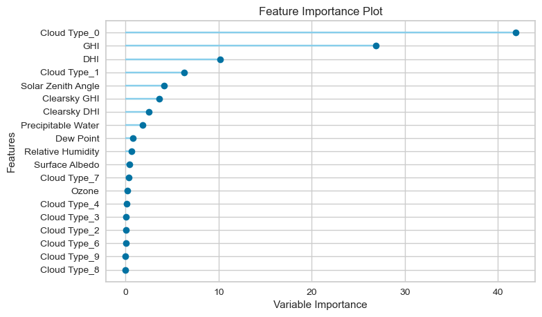
    


```python
plot_model(best)
```


    
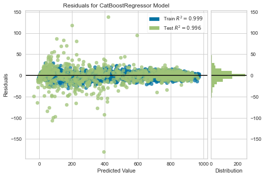
    


```python
plot_model(best, plot='error')
```


    
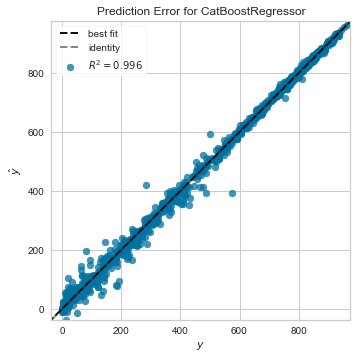
    


```python
evaluate_model(best)
```


    interactive(children=(ToggleButtons(description='Plot Type:', icons=('',), options=(('Hyperparameters', 'param…


```python
df3 = df2.copy()
```


```python
reg = setup(data=df3,
           target='DNI',
            normalize= True,
            session_id = 123)
```


<style  type="text/css" >
#T_3785b_row27_col1{
            background-color:  lightgreen;
        }</style><table id="T_3785b_" ><thead>    <tr>        <th class="blank level0" ></th>        <th class="col_heading level0 col0" >Description</th>        <th class="col_heading level0 col1" >Value</th>    </tr></thead><tbody>
                <tr>
                        <th id="T_3785b_level0_row0" class="row_heading level0 row0" >0</th>
                        <td id="T_3785b_row0_col0" class="data row0 col0" >session_id</td>
                        <td id="T_3785b_row0_col1" class="data row0 col1" >123</td>
            </tr>
            <tr>
                        <th id="T_3785b_level0_row1" class="row_heading level0 row1" >1</th>
                        <td id="T_3785b_row1_col0" class="data row1 col0" >Target</td>
                        <td id="T_3785b_row1_col1" class="data row1 col1" >DNI</td>
            </tr>
            <tr>
                        <th id="T_3785b_level0_row2" class="row_heading level0 row2" >2</th>
                        <td id="T_3785b_row2_col0" class="data row2 col0" >Original Data</td>
                        <td id="T_3785b_row2_col1" class="data row2 col1" >(3167, 12)</td>
            </tr>
            <tr>
                        <th id="T_3785b_level0_row3" class="row_heading level0 row3" >3</th>
                        <td id="T_3785b_row3_col0" class="data row3 col0" >Missing Values</td>
                        <td id="T_3785b_row3_col1" class="data row3 col1" >False</td>
            </tr>
            <tr>
                        <th id="T_3785b_level0_row4" class="row_heading level0 row4" >4</th>
                        <td id="T_3785b_row4_col0" class="data row4 col0" >Numeric Features</td>
                        <td id="T_3785b_row4_col1" class="data row4 col1" >10</td>
            </tr>
            <tr>
                        <th id="T_3785b_level0_row5" class="row_heading level0 row5" >5</th>
                        <td id="T_3785b_row5_col0" class="data row5 col0" >Categorical Features</td>
                        <td id="T_3785b_row5_col1" class="data row5 col1" >1</td>
            </tr>
            <tr>
                        <th id="T_3785b_level0_row6" class="row_heading level0 row6" >6</th>
                        <td id="T_3785b_row6_col0" class="data row6 col0" >Ordinal Features</td>
                        <td id="T_3785b_row6_col1" class="data row6 col1" >False</td>
            </tr>
            <tr>
                        <th id="T_3785b_level0_row7" class="row_heading level0 row7" >7</th>
                        <td id="T_3785b_row7_col0" class="data row7 col0" >High Cardinality Features</td>
                        <td id="T_3785b_row7_col1" class="data row7 col1" >False</td>
            </tr>
            <tr>
                        <th id="T_3785b_level0_row8" class="row_heading level0 row8" >8</th>
                        <td id="T_3785b_row8_col0" class="data row8 col0" >High Cardinality Method</td>
                        <td id="T_3785b_row8_col1" class="data row8 col1" >None</td>
            </tr>
            <tr>
                        <th id="T_3785b_level0_row9" class="row_heading level0 row9" >9</th>
                        <td id="T_3785b_row9_col0" class="data row9 col0" >Transformed Train Set</td>
                        <td id="T_3785b_row9_col1" class="data row9 col1" >(2216, 19)</td>
            </tr>
            <tr>
                        <th id="T_3785b_level0_row10" class="row_heading level0 row10" >10</th>
                        <td id="T_3785b_row10_col0" class="data row10 col0" >Transformed Test Set</td>
                        <td id="T_3785b_row10_col1" class="data row10 col1" >(951, 19)</td>
            </tr>
            <tr>
                        <th id="T_3785b_level0_row11" class="row_heading level0 row11" >11</th>
                        <td id="T_3785b_row11_col0" class="data row11 col0" >Shuffle Train-Test</td>
                        <td id="T_3785b_row11_col1" class="data row11 col1" >True</td>
            </tr>
            <tr>
                        <th id="T_3785b_level0_row12" class="row_heading level0 row12" >12</th>
                        <td id="T_3785b_row12_col0" class="data row12 col0" >Stratify Train-Test</td>
                        <td id="T_3785b_row12_col1" class="data row12 col1" >False</td>
            </tr>
            <tr>
                        <th id="T_3785b_level0_row13" class="row_heading level0 row13" >13</th>
                        <td id="T_3785b_row13_col0" class="data row13 col0" >Fold Generator</td>
                        <td id="T_3785b_row13_col1" class="data row13 col1" >KFold</td>
            </tr>
            <tr>
                        <th id="T_3785b_level0_row14" class="row_heading level0 row14" >14</th>
                        <td id="T_3785b_row14_col0" class="data row14 col0" >Fold Number</td>
                        <td id="T_3785b_row14_col1" class="data row14 col1" >10</td>
            </tr>
            <tr>
                        <th id="T_3785b_level0_row15" class="row_heading level0 row15" >15</th>
                        <td id="T_3785b_row15_col0" class="data row15 col0" >CPU Jobs</td>
                        <td id="T_3785b_row15_col1" class="data row15 col1" >-1</td>
            </tr>
            <tr>
                        <th id="T_3785b_level0_row16" class="row_heading level0 row16" >16</th>
                        <td id="T_3785b_row16_col0" class="data row16 col0" >Use GPU</td>
                        <td id="T_3785b_row16_col1" class="data row16 col1" >False</td>
            </tr>
            <tr>
                        <th id="T_3785b_level0_row17" class="row_heading level0 row17" >17</th>
                        <td id="T_3785b_row17_col0" class="data row17 col0" >Log Experiment</td>
                        <td id="T_3785b_row17_col1" class="data row17 col1" >False</td>
            </tr>
            <tr>
                        <th id="T_3785b_level0_row18" class="row_heading level0 row18" >18</th>
                        <td id="T_3785b_row18_col0" class="data row18 col0" >Experiment Name</td>
                        <td id="T_3785b_row18_col1" class="data row18 col1" >reg-default-name</td>
            </tr>
            <tr>
                        <th id="T_3785b_level0_row19" class="row_heading level0 row19" >19</th>
                        <td id="T_3785b_row19_col0" class="data row19 col0" >USI</td>
                        <td id="T_3785b_row19_col1" class="data row19 col1" >818a</td>
            </tr>
            <tr>
                        <th id="T_3785b_level0_row20" class="row_heading level0 row20" >20</th>
                        <td id="T_3785b_row20_col0" class="data row20 col0" >Imputation Type</td>
                        <td id="T_3785b_row20_col1" class="data row20 col1" >simple</td>
            </tr>
            <tr>
                        <th id="T_3785b_level0_row21" class="row_heading level0 row21" >21</th>
                        <td id="T_3785b_row21_col0" class="data row21 col0" >Iterative Imputation Iteration</td>
                        <td id="T_3785b_row21_col1" class="data row21 col1" >None</td>
            </tr>
            <tr>
                        <th id="T_3785b_level0_row22" class="row_heading level0 row22" >22</th>
                        <td id="T_3785b_row22_col0" class="data row22 col0" >Numeric Imputer</td>
                        <td id="T_3785b_row22_col1" class="data row22 col1" >mean</td>
            </tr>
            <tr>
                        <th id="T_3785b_level0_row23" class="row_heading level0 row23" >23</th>
                        <td id="T_3785b_row23_col0" class="data row23 col0" >Iterative Imputation Numeric Model</td>
                        <td id="T_3785b_row23_col1" class="data row23 col1" >None</td>
            </tr>
            <tr>
                        <th id="T_3785b_level0_row24" class="row_heading level0 row24" >24</th>
                        <td id="T_3785b_row24_col0" class="data row24 col0" >Categorical Imputer</td>
                        <td id="T_3785b_row24_col1" class="data row24 col1" >constant</td>
            </tr>
            <tr>
                        <th id="T_3785b_level0_row25" class="row_heading level0 row25" >25</th>
                        <td id="T_3785b_row25_col0" class="data row25 col0" >Iterative Imputation Categorical Model</td>
                        <td id="T_3785b_row25_col1" class="data row25 col1" >None</td>
            </tr>
            <tr>
                        <th id="T_3785b_level0_row26" class="row_heading level0 row26" >26</th>
                        <td id="T_3785b_row26_col0" class="data row26 col0" >Unknown Categoricals Handling</td>
                        <td id="T_3785b_row26_col1" class="data row26 col1" >least_frequent</td>
            </tr>
            <tr>
                        <th id="T_3785b_level0_row27" class="row_heading level0 row27" >27</th>
                        <td id="T_3785b_row27_col0" class="data row27 col0" >Normalize</td>
                        <td id="T_3785b_row27_col1" class="data row27 col1" >True</td>
            </tr>
            <tr>
                        <th id="T_3785b_level0_row28" class="row_heading level0 row28" >28</th>
                        <td id="T_3785b_row28_col0" class="data row28 col0" >Normalize Method</td>
                        <td id="T_3785b_row28_col1" class="data row28 col1" >zscore</td>
            </tr>
            <tr>
                        <th id="T_3785b_level0_row29" class="row_heading level0 row29" >29</th>
                        <td id="T_3785b_row29_col0" class="data row29 col0" >Transformation</td>
                        <td id="T_3785b_row29_col1" class="data row29 col1" >False</td>
            </tr>
            <tr>
                        <th id="T_3785b_level0_row30" class="row_heading level0 row30" >30</th>
                        <td id="T_3785b_row30_col0" class="data row30 col0" >Transformation Method</td>
                        <td id="T_3785b_row30_col1" class="data row30 col1" >None</td>
            </tr>
            <tr>
                        <th id="T_3785b_level0_row31" class="row_heading level0 row31" >31</th>
                        <td id="T_3785b_row31_col0" class="data row31 col0" >PCA</td>
                        <td id="T_3785b_row31_col1" class="data row31 col1" >False</td>
            </tr>
            <tr>
                        <th id="T_3785b_level0_row32" class="row_heading level0 row32" >32</th>
                        <td id="T_3785b_row32_col0" class="data row32 col0" >PCA Method</td>
                        <td id="T_3785b_row32_col1" class="data row32 col1" >None</td>
            </tr>
            <tr>
                        <th id="T_3785b_level0_row33" class="row_heading level0 row33" >33</th>
                        <td id="T_3785b_row33_col0" class="data row33 col0" >PCA Components</td>
                        <td id="T_3785b_row33_col1" class="data row33 col1" >None</td>
            </tr>
            <tr>
                        <th id="T_3785b_level0_row34" class="row_heading level0 row34" >34</th>
                        <td id="T_3785b_row34_col0" class="data row34 col0" >Ignore Low Variance</td>
                        <td id="T_3785b_row34_col1" class="data row34 col1" >False</td>
            </tr>
            <tr>
                        <th id="T_3785b_level0_row35" class="row_heading level0 row35" >35</th>
                        <td id="T_3785b_row35_col0" class="data row35 col0" >Combine Rare Levels</td>
                        <td id="T_3785b_row35_col1" class="data row35 col1" >False</td>
            </tr>
            <tr>
                        <th id="T_3785b_level0_row36" class="row_heading level0 row36" >36</th>
                        <td id="T_3785b_row36_col0" class="data row36 col0" >Rare Level Threshold</td>
                        <td id="T_3785b_row36_col1" class="data row36 col1" >None</td>
            </tr>
            <tr>
                        <th id="T_3785b_level0_row37" class="row_heading level0 row37" >37</th>
                        <td id="T_3785b_row37_col0" class="data row37 col0" >Numeric Binning</td>
                        <td id="T_3785b_row37_col1" class="data row37 col1" >False</td>
            </tr>
            <tr>
                        <th id="T_3785b_level0_row38" class="row_heading level0 row38" >38</th>
                        <td id="T_3785b_row38_col0" class="data row38 col0" >Remove Outliers</td>
                        <td id="T_3785b_row38_col1" class="data row38 col1" >False</td>
            </tr>
            <tr>
                        <th id="T_3785b_level0_row39" class="row_heading level0 row39" >39</th>
                        <td id="T_3785b_row39_col0" class="data row39 col0" >Outliers Threshold</td>
                        <td id="T_3785b_row39_col1" class="data row39 col1" >None</td>
            </tr>
            <tr>
                        <th id="T_3785b_level0_row40" class="row_heading level0 row40" >40</th>
                        <td id="T_3785b_row40_col0" class="data row40 col0" >Remove Multicollinearity</td>
                        <td id="T_3785b_row40_col1" class="data row40 col1" >False</td>
            </tr>
            <tr>
                        <th id="T_3785b_level0_row41" class="row_heading level0 row41" >41</th>
                        <td id="T_3785b_row41_col0" class="data row41 col0" >Multicollinearity Threshold</td>
                        <td id="T_3785b_row41_col1" class="data row41 col1" >None</td>
            </tr>
            <tr>
                        <th id="T_3785b_level0_row42" class="row_heading level0 row42" >42</th>
                        <td id="T_3785b_row42_col0" class="data row42 col0" >Clustering</td>
                        <td id="T_3785b_row42_col1" class="data row42 col1" >False</td>
            </tr>
            <tr>
                        <th id="T_3785b_level0_row43" class="row_heading level0 row43" >43</th>
                        <td id="T_3785b_row43_col0" class="data row43 col0" >Clustering Iteration</td>
                        <td id="T_3785b_row43_col1" class="data row43 col1" >None</td>
            </tr>
            <tr>
                        <th id="T_3785b_level0_row44" class="row_heading level0 row44" >44</th>
                        <td id="T_3785b_row44_col0" class="data row44 col0" >Polynomial Features</td>
                        <td id="T_3785b_row44_col1" class="data row44 col1" >False</td>
            </tr>
            <tr>
                        <th id="T_3785b_level0_row45" class="row_heading level0 row45" >45</th>
                        <td id="T_3785b_row45_col0" class="data row45 col0" >Polynomial Degree</td>
                        <td id="T_3785b_row45_col1" class="data row45 col1" >None</td>
            </tr>
            <tr>
                        <th id="T_3785b_level0_row46" class="row_heading level0 row46" >46</th>
                        <td id="T_3785b_row46_col0" class="data row46 col0" >Trignometry Features</td>
                        <td id="T_3785b_row46_col1" class="data row46 col1" >False</td>
            </tr>
            <tr>
                        <th id="T_3785b_level0_row47" class="row_heading level0 row47" >47</th>
                        <td id="T_3785b_row47_col0" class="data row47 col0" >Polynomial Threshold</td>
                        <td id="T_3785b_row47_col1" class="data row47 col1" >None</td>
            </tr>
            <tr>
                        <th id="T_3785b_level0_row48" class="row_heading level0 row48" >48</th>
                        <td id="T_3785b_row48_col0" class="data row48 col0" >Group Features</td>
                        <td id="T_3785b_row48_col1" class="data row48 col1" >False</td>
            </tr>
            <tr>
                        <th id="T_3785b_level0_row49" class="row_heading level0 row49" >49</th>
                        <td id="T_3785b_row49_col0" class="data row49 col0" >Feature Selection</td>
                        <td id="T_3785b_row49_col1" class="data row49 col1" >False</td>
            </tr>
            <tr>
                        <th id="T_3785b_level0_row50" class="row_heading level0 row50" >50</th>
                        <td id="T_3785b_row50_col0" class="data row50 col0" >Features Selection Threshold</td>
                        <td id="T_3785b_row50_col1" class="data row50 col1" >None</td>
            </tr>
            <tr>
                        <th id="T_3785b_level0_row51" class="row_heading level0 row51" >51</th>
                        <td id="T_3785b_row51_col0" class="data row51 col0" >Feature Interaction</td>
                        <td id="T_3785b_row51_col1" class="data row51 col1" >False</td>
            </tr>
            <tr>
                        <th id="T_3785b_level0_row52" class="row_heading level0 row52" >52</th>
                        <td id="T_3785b_row52_col0" class="data row52 col0" >Feature Ratio</td>
                        <td id="T_3785b_row52_col1" class="data row52 col1" >False</td>
            </tr>
            <tr>
                        <th id="T_3785b_level0_row53" class="row_heading level0 row53" >53</th>
                        <td id="T_3785b_row53_col0" class="data row53 col0" >Interaction Threshold</td>
                        <td id="T_3785b_row53_col1" class="data row53 col1" >None</td>
            </tr>
            <tr>
                        <th id="T_3785b_level0_row54" class="row_heading level0 row54" >54</th>
                        <td id="T_3785b_row54_col0" class="data row54 col0" >Transform Target</td>
                        <td id="T_3785b_row54_col1" class="data row54 col1" >False</td>
            </tr>
            <tr>
                        <th id="T_3785b_level0_row55" class="row_heading level0 row55" >55</th>
                        <td id="T_3785b_row55_col0" class="data row55 col0" >Transform Target Method</td>
                        <td id="T_3785b_row55_col1" class="data row55 col1" >box-cox</td>
            </tr>
    </tbody></table>


```python
best = compare_models(exclude=['huber'])
```


<style  type="text/css" >
    #T_7e3a6_ th {
          text-align: left;
    }#T_7e3a6_row0_col0,#T_7e3a6_row0_col6,#T_7e3a6_row1_col0,#T_7e3a6_row1_col1,#T_7e3a6_row1_col2,#T_7e3a6_row1_col3,#T_7e3a6_row1_col4,#T_7e3a6_row1_col5,#T_7e3a6_row1_col6,#T_7e3a6_row2_col0,#T_7e3a6_row2_col1,#T_7e3a6_row2_col2,#T_7e3a6_row2_col3,#T_7e3a6_row2_col4,#T_7e3a6_row2_col5,#T_7e3a6_row3_col0,#T_7e3a6_row3_col1,#T_7e3a6_row3_col2,#T_7e3a6_row3_col3,#T_7e3a6_row3_col4,#T_7e3a6_row3_col5,#T_7e3a6_row3_col6,#T_7e3a6_row4_col0,#T_7e3a6_row4_col1,#T_7e3a6_row4_col2,#T_7e3a6_row4_col3,#T_7e3a6_row4_col4,#T_7e3a6_row4_col5,#T_7e3a6_row4_col6,#T_7e3a6_row5_col0,#T_7e3a6_row5_col1,#T_7e3a6_row5_col2,#T_7e3a6_row5_col3,#T_7e3a6_row5_col4,#T_7e3a6_row5_col5,#T_7e3a6_row5_col6,#T_7e3a6_row6_col0,#T_7e3a6_row6_col1,#T_7e3a6_row6_col2,#T_7e3a6_row6_col3,#T_7e3a6_row6_col4,#T_7e3a6_row6_col5,#T_7e3a6_row6_col6,#T_7e3a6_row7_col0,#T_7e3a6_row7_col1,#T_7e3a6_row7_col2,#T_7e3a6_row7_col3,#T_7e3a6_row7_col4,#T_7e3a6_row7_col5,#T_7e3a6_row7_col6,#T_7e3a6_row8_col0,#T_7e3a6_row8_col1,#T_7e3a6_row8_col2,#T_7e3a6_row8_col3,#T_7e3a6_row8_col4,#T_7e3a6_row8_col5,#T_7e3a6_row8_col6,#T_7e3a6_row9_col0,#T_7e3a6_row9_col1,#T_7e3a6_row9_col2,#T_7e3a6_row9_col3,#T_7e3a6_row9_col4,#T_7e3a6_row9_col5,#T_7e3a6_row9_col6,#T_7e3a6_row10_col0,#T_7e3a6_row10_col1,#T_7e3a6_row10_col2,#T_7e3a6_row10_col3,#T_7e3a6_row10_col4,#T_7e3a6_row10_col5,#T_7e3a6_row10_col6,#T_7e3a6_row11_col0,#T_7e3a6_row11_col1,#T_7e3a6_row11_col2,#T_7e3a6_row11_col3,#T_7e3a6_row11_col4,#T_7e3a6_row11_col5,#T_7e3a6_row11_col6,#T_7e3a6_row12_col0,#T_7e3a6_row12_col1,#T_7e3a6_row12_col2,#T_7e3a6_row12_col3,#T_7e3a6_row12_col4,#T_7e3a6_row12_col5,#T_7e3a6_row12_col6,#T_7e3a6_row13_col0,#T_7e3a6_row13_col1,#T_7e3a6_row13_col2,#T_7e3a6_row13_col3,#T_7e3a6_row13_col4,#T_7e3a6_row13_col5,#T_7e3a6_row13_col6,#T_7e3a6_row14_col0,#T_7e3a6_row14_col1,#T_7e3a6_row14_col2,#T_7e3a6_row14_col3,#T_7e3a6_row14_col4,#T_7e3a6_row14_col5,#T_7e3a6_row14_col6,#T_7e3a6_row15_col0,#T_7e3a6_row15_col1,#T_7e3a6_row15_col2,#T_7e3a6_row15_col3,#T_7e3a6_row15_col4,#T_7e3a6_row15_col5,#T_7e3a6_row15_col6,#T_7e3a6_row16_col0,#T_7e3a6_row16_col1,#T_7e3a6_row16_col2,#T_7e3a6_row16_col3,#T_7e3a6_row16_col4,#T_7e3a6_row16_col5,#T_7e3a6_row16_col6,#T_7e3a6_row17_col0,#T_7e3a6_row17_col1,#T_7e3a6_row17_col2,#T_7e3a6_row17_col3,#T_7e3a6_row17_col4,#T_7e3a6_row17_col5,#T_7e3a6_row17_col6{
            text-align:  left;
            text-align:  left;
        }#T_7e3a6_row0_col1,#T_7e3a6_row0_col2,#T_7e3a6_row0_col3,#T_7e3a6_row0_col4,#T_7e3a6_row0_col5,#T_7e3a6_row2_col6{
            text-align:  left;
            text-align:  left;
            background-color:  yellow;
        }#T_7e3a6_row0_col7,#T_7e3a6_row1_col7,#T_7e3a6_row2_col7,#T_7e3a6_row3_col7,#T_7e3a6_row4_col7,#T_7e3a6_row5_col7,#T_7e3a6_row6_col7,#T_7e3a6_row7_col7,#T_7e3a6_row8_col7,#T_7e3a6_row9_col7,#T_7e3a6_row11_col7,#T_7e3a6_row12_col7,#T_7e3a6_row13_col7,#T_7e3a6_row14_col7,#T_7e3a6_row15_col7,#T_7e3a6_row16_col7,#T_7e3a6_row17_col7{
            text-align:  left;
            text-align:  left;
            background-color:  lightgrey;
        }#T_7e3a6_row10_col7{
            text-align:  left;
            text-align:  left;
            background-color:  yellow;
            background-color:  lightgrey;
        }</style><table id="T_7e3a6_" ><thead>    <tr>        <th class="blank level0" ></th>        <th class="col_heading level0 col0" >Model</th>        <th class="col_heading level0 col1" >MAE</th>        <th class="col_heading level0 col2" >MSE</th>        <th class="col_heading level0 col3" >RMSE</th>        <th class="col_heading level0 col4" >R2</th>        <th class="col_heading level0 col5" >RMSLE</th>        <th class="col_heading level0 col6" >MAPE</th>        <th class="col_heading level0 col7" >TT (Sec)</th>    </tr></thead><tbody>
                <tr>
                        <th id="T_7e3a6_level0_row0" class="row_heading level0 row0" >catboost</th>
                        <td id="T_7e3a6_row0_col0" class="data row0 col0" >CatBoost Regressor</td>
                        <td id="T_7e3a6_row0_col1" class="data row0 col1" >11.5329</td>
                        <td id="T_7e3a6_row0_col2" class="data row0 col2" >327.4705</td>
                        <td id="T_7e3a6_row0_col3" class="data row0 col3" >17.9970</td>
                        <td id="T_7e3a6_row0_col4" class="data row0 col4" >0.9965</td>
                        <td id="T_7e3a6_row0_col5" class="data row0 col5" >0.2710</td>
                        <td id="T_7e3a6_row0_col6" class="data row0 col6" >0.1993</td>
                        <td id="T_7e3a6_row0_col7" class="data row0 col7" >0.4810</td>
            </tr>
            <tr>
                        <th id="T_7e3a6_level0_row1" class="row_heading level0 row1" >et</th>
                        <td id="T_7e3a6_row1_col0" class="data row1 col0" >Extra Trees Regressor</td>
                        <td id="T_7e3a6_row1_col1" class="data row1 col1" >13.0266</td>
                        <td id="T_7e3a6_row1_col2" class="data row1 col2" >551.1380</td>
                        <td id="T_7e3a6_row1_col3" class="data row1 col3" >22.9297</td>
                        <td id="T_7e3a6_row1_col4" class="data row1 col4" >0.9941</td>
                        <td id="T_7e3a6_row1_col5" class="data row1 col5" >0.2799</td>
                        <td id="T_7e3a6_row1_col6" class="data row1 col6" >0.2131</td>
                        <td id="T_7e3a6_row1_col7" class="data row1 col7" >0.0710</td>
            </tr>
            <tr>
                        <th id="T_7e3a6_level0_row2" class="row_heading level0 row2" >lightgbm</th>
                        <td id="T_7e3a6_row2_col0" class="data row2 col0" >Light Gradient Boosting Machine</td>
                        <td id="T_7e3a6_row2_col1" class="data row2 col1" >15.4027</td>
                        <td id="T_7e3a6_row2_col2" class="data row2 col2" >578.9760</td>
                        <td id="T_7e3a6_row2_col3" class="data row2 col3" >23.7426</td>
                        <td id="T_7e3a6_row2_col4" class="data row2 col4" >0.9938</td>
                        <td id="T_7e3a6_row2_col5" class="data row2 col5" >0.2762</td>
                        <td id="T_7e3a6_row2_col6" class="data row2 col6" >0.1950</td>
                        <td id="T_7e3a6_row2_col7" class="data row2 col7" >0.0860</td>
            </tr>
            <tr>
                        <th id="T_7e3a6_level0_row3" class="row_heading level0 row3" >xgboost</th>
                        <td id="T_7e3a6_row3_col0" class="data row3 col0" >Extreme Gradient Boosting</td>
                        <td id="T_7e3a6_row3_col1" class="data row3 col1" >17.0261</td>
                        <td id="T_7e3a6_row3_col2" class="data row3 col2" >737.6618</td>
                        <td id="T_7e3a6_row3_col3" class="data row3 col3" >26.9150</td>
                        <td id="T_7e3a6_row3_col4" class="data row3 col4" >0.9921</td>
                        <td id="T_7e3a6_row3_col5" class="data row3 col5" >0.2797</td>
                        <td id="T_7e3a6_row3_col6" class="data row3 col6" >0.2056</td>
                        <td id="T_7e3a6_row3_col7" class="data row3 col7" >0.0540</td>
            </tr>
            <tr>
                        <th id="T_7e3a6_level0_row4" class="row_heading level0 row4" >rf</th>
                        <td id="T_7e3a6_row4_col0" class="data row4 col0" >Random Forest Regressor</td>
                        <td id="T_7e3a6_row4_col1" class="data row4 col1" >17.5957</td>
                        <td id="T_7e3a6_row4_col2" class="data row4 col2" >929.8408</td>
                        <td id="T_7e3a6_row4_col3" class="data row4 col3" >29.9803</td>
                        <td id="T_7e3a6_row4_col4" class="data row4 col4" >0.9901</td>
                        <td id="T_7e3a6_row4_col5" class="data row4 col5" >0.2756</td>
                        <td id="T_7e3a6_row4_col6" class="data row4 col6" >0.2122</td>
                        <td id="T_7e3a6_row4_col7" class="data row4 col7" >0.0940</td>
            </tr>
            <tr>
                        <th id="T_7e3a6_level0_row5" class="row_heading level0 row5" >gbr</th>
                        <td id="T_7e3a6_row5_col0" class="data row5 col0" >Gradient Boosting Regressor</td>
                        <td id="T_7e3a6_row5_col1" class="data row5 col1" >25.2961</td>
                        <td id="T_7e3a6_row5_col2" class="data row5 col2" >1258.6755</td>
                        <td id="T_7e3a6_row5_col3" class="data row5 col3" >35.2961</td>
                        <td id="T_7e3a6_row5_col4" class="data row5 col4" >0.9867</td>
                        <td id="T_7e3a6_row5_col5" class="data row5 col5" >0.4420</td>
                        <td id="T_7e3a6_row5_col6" class="data row5 col6" >0.5107</td>
                        <td id="T_7e3a6_row5_col7" class="data row5 col7" >0.0450</td>
            </tr>
            <tr>
                        <th id="T_7e3a6_level0_row6" class="row_heading level0 row6" >dt</th>
                        <td id="T_7e3a6_row6_col0" class="data row6 col0" >Decision Tree Regressor</td>
                        <td id="T_7e3a6_row6_col1" class="data row6 col1" >26.6837</td>
                        <td id="T_7e3a6_row6_col2" class="data row6 col2" >1767.0293</td>
                        <td id="T_7e3a6_row6_col3" class="data row6 col3" >41.6436</td>
                        <td id="T_7e3a6_row6_col4" class="data row6 col4" >0.9813</td>
                        <td id="T_7e3a6_row6_col5" class="data row6 col5" >0.3180</td>
                        <td id="T_7e3a6_row6_col6" class="data row6 col6" >0.2209</td>
                        <td id="T_7e3a6_row6_col7" class="data row6 col7" >0.0060</td>
            </tr>
            <tr>
                        <th id="T_7e3a6_level0_row7" class="row_heading level0 row7" >knn</th>
                        <td id="T_7e3a6_row7_col0" class="data row7 col0" >K Neighbors Regressor</td>
                        <td id="T_7e3a6_row7_col1" class="data row7 col1" >48.0742</td>
                        <td id="T_7e3a6_row7_col2" class="data row7 col2" >5205.1886</td>
                        <td id="T_7e3a6_row7_col3" class="data row7 col3" >71.7139</td>
                        <td id="T_7e3a6_row7_col4" class="data row7 col4" >0.9451</td>
                        <td id="T_7e3a6_row7_col5" class="data row7 col5" >0.6378</td>
                        <td id="T_7e3a6_row7_col6" class="data row7 col6" >1.0559</td>
                        <td id="T_7e3a6_row7_col7" class="data row7 col7" >0.0070</td>
            </tr>
            <tr>
                        <th id="T_7e3a6_level0_row8" class="row_heading level0 row8" >ada</th>
                        <td id="T_7e3a6_row8_col0" class="data row8 col0" >AdaBoost Regressor</td>
                        <td id="T_7e3a6_row8_col1" class="data row8 col1" >64.7185</td>
                        <td id="T_7e3a6_row8_col2" class="data row8 col2" >5964.7354</td>
                        <td id="T_7e3a6_row8_col3" class="data row8 col3" >77.0876</td>
                        <td id="T_7e3a6_row8_col4" class="data row8 col4" >0.9371</td>
                        <td id="T_7e3a6_row8_col5" class="data row8 col5" >0.8052</td>
                        <td id="T_7e3a6_row8_col6" class="data row8 col6" >1.8114</td>
                        <td id="T_7e3a6_row8_col7" class="data row8 col7" >0.0300</td>
            </tr>
            <tr>
                        <th id="T_7e3a6_level0_row9" class="row_heading level0 row9" >lr</th>
                        <td id="T_7e3a6_row9_col0" class="data row9 col0" >Linear Regression</td>
                        <td id="T_7e3a6_row9_col1" class="data row9 col1" >64.5337</td>
                        <td id="T_7e3a6_row9_col2" class="data row9 col2" >6968.2657</td>
                        <td id="T_7e3a6_row9_col3" class="data row9 col3" >83.3288</td>
                        <td id="T_7e3a6_row9_col4" class="data row9 col4" >0.9265</td>
                        <td id="T_7e3a6_row9_col5" class="data row9 col5" >0.7139</td>
                        <td id="T_7e3a6_row9_col6" class="data row9 col6" >1.4252</td>
                        <td id="T_7e3a6_row9_col7" class="data row9 col7" >0.0050</td>
            </tr>
            <tr>
                        <th id="T_7e3a6_level0_row10" class="row_heading level0 row10" >ridge</th>
                        <td id="T_7e3a6_row10_col0" class="data row10 col0" >Ridge Regression</td>
                        <td id="T_7e3a6_row10_col1" class="data row10 col1" >64.6414</td>
                        <td id="T_7e3a6_row10_col2" class="data row10 col2" >6971.9559</td>
                        <td id="T_7e3a6_row10_col3" class="data row10 col3" >83.3494</td>
                        <td id="T_7e3a6_row10_col4" class="data row10 col4" >0.9265</td>
                        <td id="T_7e3a6_row10_col5" class="data row10 col5" >0.7146</td>
                        <td id="T_7e3a6_row10_col6" class="data row10 col6" >1.4191</td>
                        <td id="T_7e3a6_row10_col7" class="data row10 col7" >0.0040</td>
            </tr>
            <tr>
                        <th id="T_7e3a6_level0_row11" class="row_heading level0 row11" >br</th>
                        <td id="T_7e3a6_row11_col0" class="data row11 col0" >Bayesian Ridge</td>
                        <td id="T_7e3a6_row11_col1" class="data row11 col1" >64.5799</td>
                        <td id="T_7e3a6_row11_col2" class="data row11 col2" >6969.0334</td>
                        <td id="T_7e3a6_row11_col3" class="data row11 col3" >83.3327</td>
                        <td id="T_7e3a6_row11_col4" class="data row11 col4" >0.9265</td>
                        <td id="T_7e3a6_row11_col5" class="data row11 col5" >0.7140</td>
                        <td id="T_7e3a6_row11_col6" class="data row11 col6" >1.4220</td>
                        <td id="T_7e3a6_row11_col7" class="data row11 col7" >0.0050</td>
            </tr>
            <tr>
                        <th id="T_7e3a6_level0_row12" class="row_heading level0 row12" >lar</th>
                        <td id="T_7e3a6_row12_col0" class="data row12 col0" >Least Angle Regression</td>
                        <td id="T_7e3a6_row12_col1" class="data row12 col1" >64.5989</td>
                        <td id="T_7e3a6_row12_col2" class="data row12 col2" >6991.2746</td>
                        <td id="T_7e3a6_row12_col3" class="data row12 col3" >83.4538</td>
                        <td id="T_7e3a6_row12_col4" class="data row12 col4" >0.9263</td>
                        <td id="T_7e3a6_row12_col5" class="data row12 col5" >0.7156</td>
                        <td id="T_7e3a6_row12_col6" class="data row12 col6" >1.4416</td>
                        <td id="T_7e3a6_row12_col7" class="data row12 col7" >0.0050</td>
            </tr>
            <tr>
                        <th id="T_7e3a6_level0_row13" class="row_heading level0 row13" >lasso</th>
                        <td id="T_7e3a6_row13_col0" class="data row13 col0" >Lasso Regression</td>
                        <td id="T_7e3a6_row13_col1" class="data row13 col1" >67.5455</td>
                        <td id="T_7e3a6_row13_col2" class="data row13 col2" >7413.6131</td>
                        <td id="T_7e3a6_row13_col3" class="data row13 col3" >85.9338</td>
                        <td id="T_7e3a6_row13_col4" class="data row13 col4" >0.9219</td>
                        <td id="T_7e3a6_row13_col5" class="data row13 col5" >0.7046</td>
                        <td id="T_7e3a6_row13_col6" class="data row13 col6" >1.4392</td>
                        <td id="T_7e3a6_row13_col7" class="data row13 col7" >0.0050</td>
            </tr>
            <tr>
                        <th id="T_7e3a6_level0_row14" class="row_heading level0 row14" >par</th>
                        <td id="T_7e3a6_row14_col0" class="data row14 col0" >Passive Aggressive Regressor</td>
                        <td id="T_7e3a6_row14_col1" class="data row14 col1" >64.1608</td>
                        <td id="T_7e3a6_row14_col2" class="data row14 col2" >8115.4656</td>
                        <td id="T_7e3a6_row14_col3" class="data row14 col3" >89.6116</td>
                        <td id="T_7e3a6_row14_col4" class="data row14 col4" >0.9146</td>
                        <td id="T_7e3a6_row14_col5" class="data row14 col5" >0.7392</td>
                        <td id="T_7e3a6_row14_col6" class="data row14 col6" >1.6138</td>
                        <td id="T_7e3a6_row14_col7" class="data row14 col7" >0.0050</td>
            </tr>
            <tr>
                        <th id="T_7e3a6_level0_row15" class="row_heading level0 row15" >llar</th>
                        <td id="T_7e3a6_row15_col0" class="data row15 col0" >Lasso Least Angle Regression</td>
                        <td id="T_7e3a6_row15_col1" class="data row15 col1" >109.6085</td>
                        <td id="T_7e3a6_row15_col2" class="data row15 col2" >17876.2268</td>
                        <td id="T_7e3a6_row15_col3" class="data row15 col3" >133.6385</td>
                        <td id="T_7e3a6_row15_col4" class="data row15 col4" >0.8110</td>
                        <td id="T_7e3a6_row15_col5" class="data row15 col5" >0.9855</td>
                        <td id="T_7e3a6_row15_col6" class="data row15 col6" >3.0882</td>
                        <td id="T_7e3a6_row15_col7" class="data row15 col7" >0.0050</td>
            </tr>
            <tr>
                        <th id="T_7e3a6_level0_row16" class="row_heading level0 row16" >en</th>
                        <td id="T_7e3a6_row16_col0" class="data row16 col0" >Elastic Net</td>
                        <td id="T_7e3a6_row16_col1" class="data row16 col1" >120.4953</td>
                        <td id="T_7e3a6_row16_col2" class="data row16 col2" >20219.6137</td>
                        <td id="T_7e3a6_row16_col3" class="data row16 col3" >142.0775</td>
                        <td id="T_7e3a6_row16_col4" class="data row16 col4" >0.7867</td>
                        <td id="T_7e3a6_row16_col5" class="data row16 col5" >1.0603</td>
                        <td id="T_7e3a6_row16_col6" class="data row16 col6" >4.0121</td>
                        <td id="T_7e3a6_row16_col7" class="data row16 col7" >0.0050</td>
            </tr>
            <tr>
                        <th id="T_7e3a6_level0_row17" class="row_heading level0 row17" >omp</th>
                        <td id="T_7e3a6_row17_col0" class="data row17 col0" >Orthogonal Matching Pursuit</td>
                        <td id="T_7e3a6_row17_col1" class="data row17 col1" >181.4986</td>
                        <td id="T_7e3a6_row17_col2" class="data row17 col2" >45989.3809</td>
                        <td id="T_7e3a6_row17_col3" class="data row17 col3" >214.3339</td>
                        <td id="T_7e3a6_row17_col4" class="data row17 col4" >0.5129</td>
                        <td id="T_7e3a6_row17_col5" class="data row17 col5" >1.1394</td>
                        <td id="T_7e3a6_row17_col6" class="data row17 col6" >4.1725</td>
                        <td id="T_7e3a6_row17_col7" class="data row17 col7" >0.0050</td>
            </tr>
    </tbody></table>


```python
catboost = create_model('catboost')
```


<style  type="text/css" >
#T_84a91_row10_col0,#T_84a91_row10_col1,#T_84a91_row10_col2,#T_84a91_row10_col3,#T_84a91_row10_col4,#T_84a91_row10_col5{
            background:  yellow;
        }</style><table id="T_84a91_" ><thead>    <tr>        <th class="blank level0" ></th>        <th class="col_heading level0 col0" >MAE</th>        <th class="col_heading level0 col1" >MSE</th>        <th class="col_heading level0 col2" >RMSE</th>        <th class="col_heading level0 col3" >R2</th>        <th class="col_heading level0 col4" >RMSLE</th>        <th class="col_heading level0 col5" >MAPE</th>    </tr></thead><tbody>
                <tr>
                        <th id="T_84a91_level0_row0" class="row_heading level0 row0" >0</th>
                        <td id="T_84a91_row0_col0" class="data row0 col0" >12.8522</td>
                        <td id="T_84a91_row0_col1" class="data row0 col1" >343.0956</td>
                        <td id="T_84a91_row0_col2" class="data row0 col2" >18.5228</td>
                        <td id="T_84a91_row0_col3" class="data row0 col3" >0.9964</td>
                        <td id="T_84a91_row0_col4" class="data row0 col4" >0.2798</td>
                        <td id="T_84a91_row0_col5" class="data row0 col5" >0.1963</td>
            </tr>
            <tr>
                        <th id="T_84a91_level0_row1" class="row_heading level0 row1" >1</th>
                        <td id="T_84a91_row1_col0" class="data row1 col0" >9.7485</td>
                        <td id="T_84a91_row1_col1" class="data row1 col1" >195.8468</td>
                        <td id="T_84a91_row1_col2" class="data row1 col2" >13.9945</td>
                        <td id="T_84a91_row1_col3" class="data row1 col3" >0.9980</td>
                        <td id="T_84a91_row1_col4" class="data row1 col4" >0.2125</td>
                        <td id="T_84a91_row1_col5" class="data row1 col5" >0.1243</td>
            </tr>
            <tr>
                        <th id="T_84a91_level0_row2" class="row_heading level0 row2" >2</th>
                        <td id="T_84a91_row2_col0" class="data row2 col0" >11.8512</td>
                        <td id="T_84a91_row2_col1" class="data row2 col1" >402.1758</td>
                        <td id="T_84a91_row2_col2" class="data row2 col2" >20.0543</td>
                        <td id="T_84a91_row2_col3" class="data row2 col3" >0.9959</td>
                        <td id="T_84a91_row2_col4" class="data row2 col4" >0.2791</td>
                        <td id="T_84a91_row2_col5" class="data row2 col5" >0.1877</td>
            </tr>
            <tr>
                        <th id="T_84a91_level0_row3" class="row_heading level0 row3" >3</th>
                        <td id="T_84a91_row3_col0" class="data row3 col0" >12.0446</td>
                        <td id="T_84a91_row3_col1" class="data row3 col1" >340.6123</td>
                        <td id="T_84a91_row3_col2" class="data row3 col2" >18.4557</td>
                        <td id="T_84a91_row3_col3" class="data row3 col3" >0.9966</td>
                        <td id="T_84a91_row3_col4" class="data row3 col4" >0.3842</td>
                        <td id="T_84a91_row3_col5" class="data row3 col5" >0.3659</td>
            </tr>
            <tr>
                        <th id="T_84a91_level0_row4" class="row_heading level0 row4" >4</th>
                        <td id="T_84a91_row4_col0" class="data row4 col0" >12.2746</td>
                        <td id="T_84a91_row4_col1" class="data row4 col1" >365.3548</td>
                        <td id="T_84a91_row4_col2" class="data row4 col2" >19.1143</td>
                        <td id="T_84a91_row4_col3" class="data row4 col3" >0.9960</td>
                        <td id="T_84a91_row4_col4" class="data row4 col4" >0.2469</td>
                        <td id="T_84a91_row4_col5" class="data row4 col5" >0.1888</td>
            </tr>
            <tr>
                        <th id="T_84a91_level0_row5" class="row_heading level0 row5" >5</th>
                        <td id="T_84a91_row5_col0" class="data row5 col0" >12.0373</td>
                        <td id="T_84a91_row5_col1" class="data row5 col1" >356.5462</td>
                        <td id="T_84a91_row5_col2" class="data row5 col2" >18.8824</td>
                        <td id="T_84a91_row5_col3" class="data row5 col3" >0.9961</td>
                        <td id="T_84a91_row5_col4" class="data row5 col4" >0.2899</td>
                        <td id="T_84a91_row5_col5" class="data row5 col5" >0.2498</td>
            </tr>
            <tr>
                        <th id="T_84a91_level0_row6" class="row_heading level0 row6" >6</th>
                        <td id="T_84a91_row6_col0" class="data row6 col0" >11.0552</td>
                        <td id="T_84a91_row6_col1" class="data row6 col1" >292.0580</td>
                        <td id="T_84a91_row6_col2" class="data row6 col2" >17.0897</td>
                        <td id="T_84a91_row6_col3" class="data row6 col3" >0.9968</td>
                        <td id="T_84a91_row6_col4" class="data row6 col4" >0.2485</td>
                        <td id="T_84a91_row6_col5" class="data row6 col5" >0.1452</td>
            </tr>
            <tr>
                        <th id="T_84a91_level0_row7" class="row_heading level0 row7" >7</th>
                        <td id="T_84a91_row7_col0" class="data row7 col0" >10.2905</td>
                        <td id="T_84a91_row7_col1" class="data row7 col1" >268.3931</td>
                        <td id="T_84a91_row7_col2" class="data row7 col2" >16.3827</td>
                        <td id="T_84a91_row7_col3" class="data row7 col3" >0.9973</td>
                        <td id="T_84a91_row7_col4" class="data row7 col4" >0.3320</td>
                        <td id="T_84a91_row7_col5" class="data row7 col5" >0.2332</td>
            </tr>
            <tr>
                        <th id="T_84a91_level0_row8" class="row_heading level0 row8" >8</th>
                        <td id="T_84a91_row8_col0" class="data row8 col0" >11.6972</td>
                        <td id="T_84a91_row8_col1" class="data row8 col1" >432.5882</td>
                        <td id="T_84a91_row8_col2" class="data row8 col2" >20.7988</td>
                        <td id="T_84a91_row8_col3" class="data row8 col3" >0.9951</td>
                        <td id="T_84a91_row8_col4" class="data row8 col4" >0.1642</td>
                        <td id="T_84a91_row8_col5" class="data row8 col5" >0.0905</td>
            </tr>
            <tr>
                        <th id="T_84a91_level0_row9" class="row_heading level0 row9" >9</th>
                        <td id="T_84a91_row9_col0" class="data row9 col0" >11.4775</td>
                        <td id="T_84a91_row9_col1" class="data row9 col1" >278.0342</td>
                        <td id="T_84a91_row9_col2" class="data row9 col2" >16.6744</td>
                        <td id="T_84a91_row9_col3" class="data row9 col3" >0.9972</td>
                        <td id="T_84a91_row9_col4" class="data row9 col4" >0.2727</td>
                        <td id="T_84a91_row9_col5" class="data row9 col5" >0.2117</td>
            </tr>
            <tr>
                        <th id="T_84a91_level0_row10" class="row_heading level0 row10" >Mean</th>
                        <td id="T_84a91_row10_col0" class="data row10 col0" >11.5329</td>
                        <td id="T_84a91_row10_col1" class="data row10 col1" >327.4705</td>
                        <td id="T_84a91_row10_col2" class="data row10 col2" >17.9970</td>
                        <td id="T_84a91_row10_col3" class="data row10 col3" >0.9965</td>
                        <td id="T_84a91_row10_col4" class="data row10 col4" >0.2710</td>
                        <td id="T_84a91_row10_col5" class="data row10 col5" >0.1993</td>
            </tr>
            <tr>
                        <th id="T_84a91_level0_row11" class="row_heading level0 row11" >SD</th>
                        <td id="T_84a91_row11_col0" class="data row11 col0" >0.8885</td>
                        <td id="T_84a91_row11_col1" class="data row11 col1" >66.2126</td>
                        <td id="T_84a91_row11_col2" class="data row11 col2" >1.8921</td>
                        <td id="T_84a91_row11_col3" class="data row11 col3" >0.0008</td>
                        <td id="T_84a91_row11_col4" class="data row11 col4" >0.0574</td>
                        <td id="T_84a91_row11_col5" class="data row11 col5" >0.0723</td>
            </tr>
    </tbody></table>


```python
print(catboost.feature_names_ )
```

    ['Clearsky DHI', 'Clearsky GHI', 'Dew Point', 'DHI', 'GHI', 'Ozone', 'Relative Humidity', 'Solar Zenith Angle', 'Surface Albedo', 'Precipitable Water', 'Cloud Type_0', 'Cloud Type_1', 'Cloud Type_2', 'Cloud Type_3', 'Cloud Type_4', 'Cloud Type_6', 'Cloud Type_7', 'Cloud Type_8', 'Cloud Type_9']
    


```python
tuned_catboost = tune_model(catboost)
```


<style  type="text/css" >
#T_71f81_row10_col0,#T_71f81_row10_col1,#T_71f81_row10_col2,#T_71f81_row10_col3,#T_71f81_row10_col4,#T_71f81_row10_col5{
            background:  yellow;
        }</style><table id="T_71f81_" ><thead>    <tr>        <th class="blank level0" ></th>        <th class="col_heading level0 col0" >MAE</th>        <th class="col_heading level0 col1" >MSE</th>        <th class="col_heading level0 col2" >RMSE</th>        <th class="col_heading level0 col3" >R2</th>        <th class="col_heading level0 col4" >RMSLE</th>        <th class="col_heading level0 col5" >MAPE</th>    </tr></thead><tbody>
                <tr>
                        <th id="T_71f81_level0_row0" class="row_heading level0 row0" >0</th>
                        <td id="T_71f81_row0_col0" class="data row0 col0" >23.9663</td>
                        <td id="T_71f81_row0_col1" class="data row0 col1" >1088.8584</td>
                        <td id="T_71f81_row0_col2" class="data row0 col2" >32.9979</td>
                        <td id="T_71f81_row0_col3" class="data row0 col3" >0.9886</td>
                        <td id="T_71f81_row0_col4" class="data row0 col4" >0.4621</td>
                        <td id="T_71f81_row0_col5" class="data row0 col5" >0.5429</td>
            </tr>
            <tr>
                        <th id="T_71f81_level0_row1" class="row_heading level0 row1" >1</th>
                        <td id="T_71f81_row1_col0" class="data row1 col0" >19.6084</td>
                        <td id="T_71f81_row1_col1" class="data row1 col1" >724.1219</td>
                        <td id="T_71f81_row1_col2" class="data row1 col2" >26.9095</td>
                        <td id="T_71f81_row1_col3" class="data row1 col3" >0.9924</td>
                        <td id="T_71f81_row1_col4" class="data row1 col4" >0.2809</td>
                        <td id="T_71f81_row1_col5" class="data row1 col5" >0.2123</td>
            </tr>
            <tr>
                        <th id="T_71f81_level0_row2" class="row_heading level0 row2" >2</th>
                        <td id="T_71f81_row2_col0" class="data row2 col0" >25.7542</td>
                        <td id="T_71f81_row2_col1" class="data row2 col1" >1351.9674</td>
                        <td id="T_71f81_row2_col2" class="data row2 col2" >36.7691</td>
                        <td id="T_71f81_row2_col3" class="data row2 col3" >0.9863</td>
                        <td id="T_71f81_row2_col4" class="data row2 col4" >0.4577</td>
                        <td id="T_71f81_row2_col5" class="data row2 col5" >0.5234</td>
            </tr>
            <tr>
                        <th id="T_71f81_level0_row3" class="row_heading level0 row3" >3</th>
                        <td id="T_71f81_row3_col0" class="data row3 col0" >25.3881</td>
                        <td id="T_71f81_row3_col1" class="data row3 col1" >1242.4023</td>
                        <td id="T_71f81_row3_col2" class="data row3 col2" >35.2477</td>
                        <td id="T_71f81_row3_col3" class="data row3 col3" >0.9875</td>
                        <td id="T_71f81_row3_col4" class="data row3 col4" >0.5401</td>
                        <td id="T_71f81_row3_col5" class="data row3 col5" >0.7567</td>
            </tr>
            <tr>
                        <th id="T_71f81_level0_row4" class="row_heading level0 row4" >4</th>
                        <td id="T_71f81_row4_col0" class="data row4 col0" >29.1785</td>
                        <td id="T_71f81_row4_col1" class="data row4 col1" >1785.1102</td>
                        <td id="T_71f81_row4_col2" class="data row4 col2" >42.2506</td>
                        <td id="T_71f81_row4_col3" class="data row4 col3" >0.9803</td>
                        <td id="T_71f81_row4_col4" class="data row4 col4" >0.4501</td>
                        <td id="T_71f81_row4_col5" class="data row4 col5" >0.4978</td>
            </tr>
            <tr>
                        <th id="T_71f81_level0_row5" class="row_heading level0 row5" >5</th>
                        <td id="T_71f81_row5_col0" class="data row5 col0" >21.7208</td>
                        <td id="T_71f81_row5_col1" class="data row5 col1" >979.1534</td>
                        <td id="T_71f81_row5_col2" class="data row5 col2" >31.2914</td>
                        <td id="T_71f81_row5_col3" class="data row5 col3" >0.9892</td>
                        <td id="T_71f81_row5_col4" class="data row5 col4" >0.4537</td>
                        <td id="T_71f81_row5_col5" class="data row5 col5" >0.4896</td>
            </tr>
            <tr>
                        <th id="T_71f81_level0_row6" class="row_heading level0 row6" >6</th>
                        <td id="T_71f81_row6_col0" class="data row6 col0" >23.8525</td>
                        <td id="T_71f81_row6_col1" class="data row6 col1" >1072.5619</td>
                        <td id="T_71f81_row6_col2" class="data row6 col2" >32.7500</td>
                        <td id="T_71f81_row6_col3" class="data row6 col3" >0.9881</td>
                        <td id="T_71f81_row6_col4" class="data row6 col4" >0.3847</td>
                        <td id="T_71f81_row6_col5" class="data row6 col5" >0.3489</td>
            </tr>
            <tr>
                        <th id="T_71f81_level0_row7" class="row_heading level0 row7" >7</th>
                        <td id="T_71f81_row7_col0" class="data row7 col0" >23.1446</td>
                        <td id="T_71f81_row7_col1" class="data row7 col1" >1031.6794</td>
                        <td id="T_71f81_row7_col2" class="data row7 col2" >32.1198</td>
                        <td id="T_71f81_row7_col3" class="data row7 col3" >0.9894</td>
                        <td id="T_71f81_row7_col4" class="data row7 col4" >0.4731</td>
                        <td id="T_71f81_row7_col5" class="data row7 col5" >0.5301</td>
            </tr>
            <tr>
                        <th id="T_71f81_level0_row8" class="row_heading level0 row8" >8</th>
                        <td id="T_71f81_row8_col0" class="data row8 col0" >24.8249</td>
                        <td id="T_71f81_row8_col1" class="data row8 col1" >1395.9381</td>
                        <td id="T_71f81_row8_col2" class="data row8 col2" >37.3623</td>
                        <td id="T_71f81_row8_col3" class="data row8 col3" >0.9843</td>
                        <td id="T_71f81_row8_col4" class="data row8 col4" >0.3079</td>
                        <td id="T_71f81_row8_col5" class="data row8 col5" >0.2279</td>
            </tr>
            <tr>
                        <th id="T_71f81_level0_row9" class="row_heading level0 row9" >9</th>
                        <td id="T_71f81_row9_col0" class="data row9 col0" >21.9289</td>
                        <td id="T_71f81_row9_col1" class="data row9 col1" >863.4493</td>
                        <td id="T_71f81_row9_col2" class="data row9 col2" >29.3845</td>
                        <td id="T_71f81_row9_col3" class="data row9 col3" >0.9913</td>
                        <td id="T_71f81_row9_col4" class="data row9 col4" >0.3695</td>
                        <td id="T_71f81_row9_col5" class="data row9 col5" >0.3197</td>
            </tr>
            <tr>
                        <th id="T_71f81_level0_row10" class="row_heading level0 row10" >Mean</th>
                        <td id="T_71f81_row10_col0" class="data row10 col0" >23.9367</td>
                        <td id="T_71f81_row10_col1" class="data row10 col1" >1153.5242</td>
                        <td id="T_71f81_row10_col2" class="data row10 col2" >33.7083</td>
                        <td id="T_71f81_row10_col3" class="data row10 col3" >0.9878</td>
                        <td id="T_71f81_row10_col4" class="data row10 col4" >0.4180</td>
                        <td id="T_71f81_row10_col5" class="data row10 col5" >0.4449</td>
            </tr>
            <tr>
                        <th id="T_71f81_level0_row11" class="row_heading level0 row11" >SD</th>
                        <td id="T_71f81_row11_col0" class="data row11 col0" >2.4897</td>
                        <td id="T_71f81_row11_col1" class="data row11 col1" >288.0038</td>
                        <td id="T_71f81_row11_col2" class="data row11 col2" >4.1565</td>
                        <td id="T_71f81_row11_col3" class="data row11 col3" >0.0033</td>
                        <td id="T_71f81_row11_col4" class="data row11 col4" >0.0763</td>
                        <td id="T_71f81_row11_col5" class="data row11 col5" >0.1585</td>
            </tr>
    </tbody></table>


```python
print(tuned_catboost.get_params())
```

    {'depth': 6, 'l2_leaf_reg': 20, 'loss_function': 'RMSE', 'border_count': 254, 'verbose': False, 'random_strength': 0.0, 'task_type': 'CPU', 'n_estimators': 250, 'random_state': 123}
    


```python
plot_model(tuned_catboost)
```


    
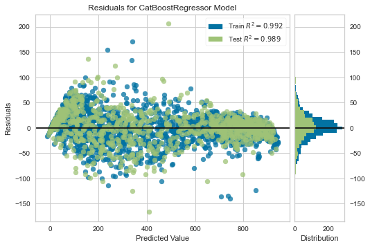
    


```python
plot_model(tuned_catboost, plot = 'error')
```


    
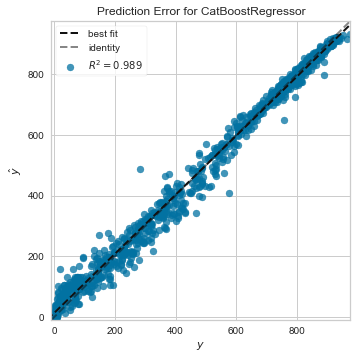
    


```python
final_catboost = finalize_model(tuned_catboost)
```


```python
import pickle
model =final_catboost
```


```python
final_catboost.feature_names_
```


    ['Clearsky DHI',
     'Clearsky GHI',
     'Dew Point',
     'DHI',
     'GHI',
     'Ozone',
     'Relative Humidity',
     'Solar Zenith Angle',
     'Surface Albedo',
     'Precipitable Water',
     'Cloud Type_0',
     'Cloud Type_1',
     'Cloud Type_2',
     'Cloud Type_3',
     'Cloud Type_4',
     'Cloud Type_6',
     'Cloud Type_7',
     'Cloud Type_8',
     'Cloud Type_9']


```python
print(final_catboost.get_params())
```

    {'depth': 6, 'l2_leaf_reg': 20, 'loss_function': 'RMSE', 'border_count': 254, 'verbose': False, 'random_strength': 0.0, 'task_type': 'CPU', 'n_estimators': 250, 'random_state': 123}
    


```python
with open ('Lastversion','wb') as file:
  pickle.dump(model, file)
```


```python

```


```python

```


```python

```


```python

```


```python

```


```python

```
